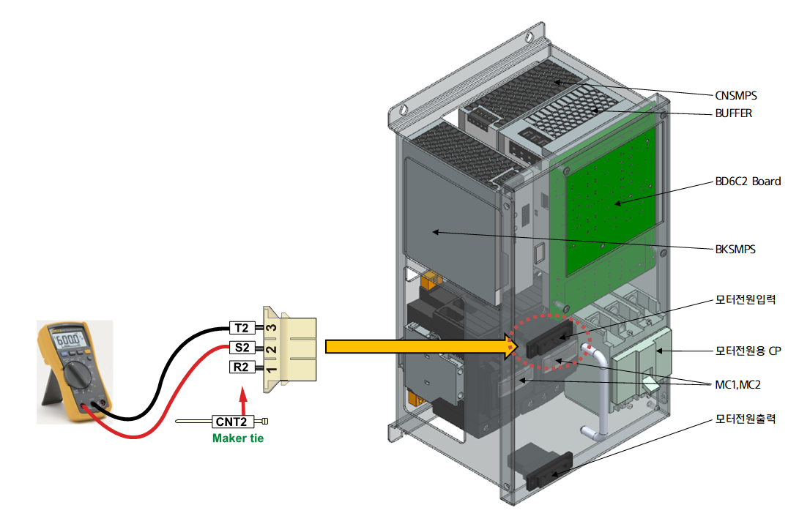

# 전압점검1 – Hi6-N 제어기 내부 3상 전압 점검절차

(1) 제어기 내부의 3상 전원 전압을 확인하십시오.

제어기 전면에 부착된 전장모듈(PSM)은 각종 전원의 분배 및 중계를 담당하고 있으며, 3상 전원은 전장모듈 내 마그네트 스위치를 통하여 온/오프 됩니다. 모터 오프 상태에서 전장모듈에 입력되는 전압이 AC 220V 기준으로 오차범위가 10%이내인지 점검합니다. 만약 측정된 전압이 허용 범위를 벗어나는 경우에는 아래와 같이 점검하십시오.

그림 1.1 전장모듈에 입력되는 3상 전원
  



경고(Warning)

고전압 측정 시 주변 부품 및 상간 단락 가능성이 있으므로 주의하십시오.


  

1)	제어기 명판의 전압이 220V 인 경우
제어기 입력 전압이 AC 220V인 경우에는 외부에서 전원 스위치 또는 터미널 블록으로 입력되는 전압과 내부의 전장모듈에 측정된 전압이 동일해야 합니다. 만약 차이가 있다면 3상 전원 배선을 점검하시기 바랍니다.

2)	제어기 명판의 전압이 220V가 아닌 경우
제어기 입력전원이 AC 220V 사양이 아닌 경우에는 내장된 트랜스포머를 사용하여 3상 전원을 AC220V로 변환하여 전장모듈에 연결됩니다. 전장모듈 측에서 측정된 전압이 AC 220V 기준으로 오차범위가 10%이내인지 점검합니다. 만약 측정된 전압이 허용 범위를 벗어나는 경우에는 내장된 트랜스포머의 입력과 출력 단자의 연결 상태를 점검하십시오. 내장된 트랜스포머의 1차단은 제어기 명판에 표기된 전압으로 연결되어야 합니다. 트랜스포머의 2차단은 항상 AC 3상 220V로 설정되어 있습니다. 입력단자와 출력단자가 올바르게 연결된 상태에서도 출력단자에서 AC 3상 220V가 정상적으로 출력되지 않으면 트랜스포머 불량입니다. 이때의 트랜스포머의 출력전압 오차는 5% 이내이어야 합니다.
