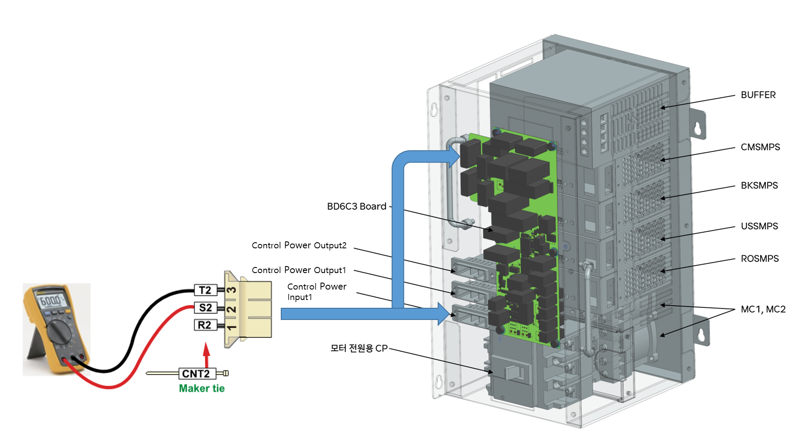

## 1.1. Voltage Check 1 - Internal 3-Phase Voltage Test for Hi7-N Controller

(1) Verify the 3-phase power voltage inside the controller.

The Power Supply Module (PSM) mounted on the front of the controller is responsible for distributing and relaying various power sources. The 3-phase power is switched ON/OFF via a magnetic switch within the PSM. With the motor in the OFF state, check whether the input voltage to the PSM is within a 10% tolerance range based on AC 220V. If the measured voltage is outside the allowable range, perform the following inspections.

 
Figure 1.1 3-phase power input to the PSM (Power Supply Module)


Warning
Exercise caution when measuring high voltage, as there is a risk of short circuits between phases or with surrounding components."


1)  Case where the controller nameplate voltage is 220V 
If the controller input voltage is 220V AC, the voltage input from the external power switch or terminal block must be identical to the voltage measured at the internal PSM (Power Supply Module). If there is a discrepancy, please inspect the 3-phase power wiring.

2)	Case where the controller nameplate voltage is NOT 220V 
If the controller input power is not a 220V AC specification, the 3-phase power is converted to 220V AC using an internal transformer and then connected to the PSM. Check whether the voltage measured at the PSM is within a 10% tolerance range based on 220V AC.
If the measured voltage is outside the allowable range, inspect the connection status of the input and output terminals of the internal transformer. The primary side of the internal transformer must be connected to the voltage indicated on the controller nameplate. The secondary side of the transformer is always set to 3-phase 220V AC.
If 3-phase 220V AC is not output correctly from the output terminal despite the input and output terminals being properly connected, the transformer is defective. In this case, the output voltage tolerance of the transformer must be within 5%.
