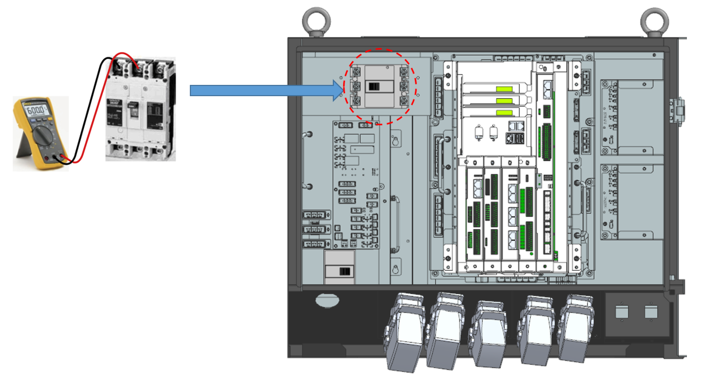

## 1.2. 电压检查 2 – Hi7-N 控制器输入三相电压检查程序

(1) 验证控制器铭牌上的电压和实际输入电压。

检查实际供给控制器的电压是否在铭牌所示电压的允许范围内。输入电压的允许范围在铭牌标示值的±10%之内，并且必须根据220V AC标准至少为198V AC。

下图说明了控制器输入电压的测量方法。如果测量电压超出允许范围，请检查电源设施。

*	在前开关的电源线侧进行测量

 
(a) Hi7-N 控制器 
图 1.2 电源开关电源线侧的测量


在测量高电压时请小心，因为存在相间短路或与周围组件短路的风险。
