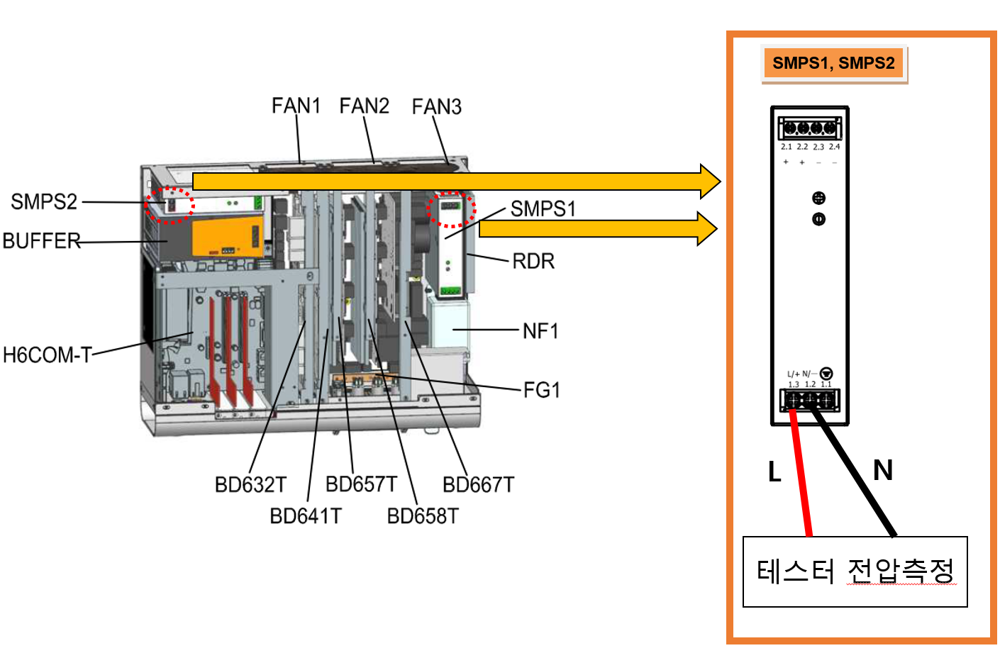

# 전압점검3 – Hi6-T 제어기 입력 단상 전압 점검 절차

(1)	제어기에 부착된 명판의 전압과 실제 입력전압을 확인하십시오.

제어기에 실제로 공급되는 전압이 명판에 표기된 전압의 허용 범위 이내인지를 확인하십시오. 입력전압의 허용 범위는 명판에 표기된 값의 10% 이내이고, AC 220V 기준으로 AC 198V 이상이어야 합니다. 아래의 그림은 제어기의 입력전압의 측정방법을 나타낸 것입니다. 측정된 전압이 허용 범위를 벗어나는 경우에는 전원 설비를 점검하여 주십시오.
  



경고(Warning)

고전압 측정 시 주변 부품 및 상간 단락 가능성이 있으므로 주의하십시오.


  

그림 1.3 H6-T15 제어기의 단상 전원입력 SMPS 터미널 블록
