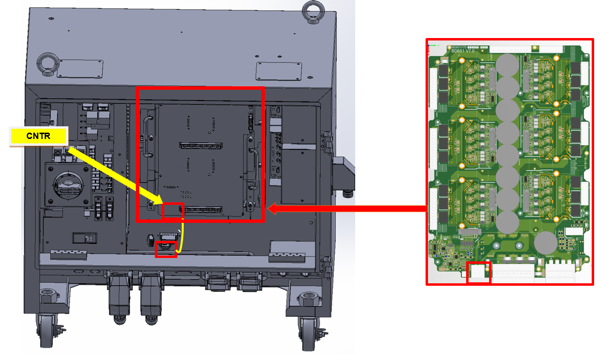
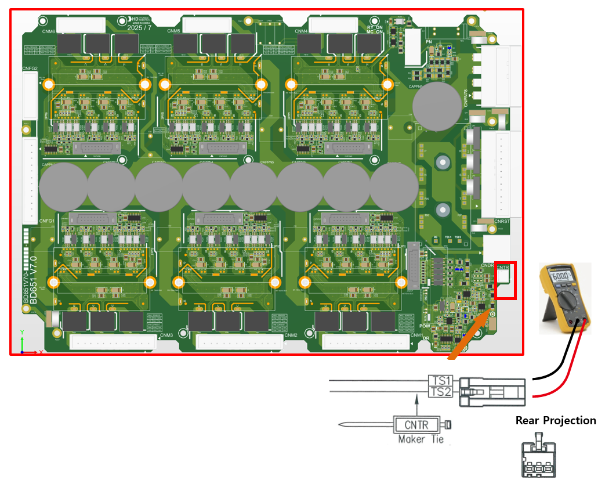

## 2.3. E02502 AMP Regenerative Discharge Resistor Detection Circuit Error

### 1. Overview

This error relates to the overheating of the resistor used to dissipate regenerative power generated during robot deceleration or downward movement in the direction of gravity. It is typically caused by a failure in the overheat detection sensor circuit or a cable-related issue.

### 2. Causes and Inspection Methods



An anomaly has occurred in the path used to detect overheat errors, or the resistance value has changed.

* < If the error consistently occurs even when the motor is OFF >

(1)	Inspect the cables related to overheat error detection.

-> Check the resistance of the CNTR cable.

(2)	Inspect the components related to overheat error detection.

-> Hi7-N Controller: Replace the Control Module (including the BD642 board) and verify if the error persists.

-> Hi7-T Controller: (To be included in the future)

-> Servo Drive Unit: Replace the servo drive unit and verify if the error persists.



(1)	Please inspect the overheat error detection cable.

The regenerative resistor overheat error is detected by the servo drive unit by monitoring the ON/OFF status of the overheat sensor attached to the resistor via the CNTR connector. In the Hi7-N controller, the detected error signal is transmitted from the BD651/BD653 board through the BD652/BD654 and is finally processed by the software on the BD642 board.

Figure 2.3.1. Component Layout for Regenerative Resistor Overheat Error (Hi7-N Controller)

* CNTR Cable Inspection

Check for any anomalies in the sensor at the CNTR connector that connects to the overheat detection sensor. Under normal conditions, the sensor resistance should measure less than 0.1 ohm.

Figure 2.3.2. Measuring Resistance at the CNTR Connector (Hi7-N Controller)

(2)	Please inspect the components related to overheat error detection.
	
* Servo Control Board Replacement Inspection

Replace the servo control board with a known functional unit. If the error does not recur, the original board is defective. Please replace it with a normal part for continued use.

-> Hi7-N Controller: BD642

-> Hi7-T Controller: To be included in the future (TBD)

-> Hi7-NX Controller: To be included in the future (TBD)

* Replacement Inspection of the Servo Drive Unit

The modules responsible for detecting the regenerative discharge resistor overheat error are as follows.

-> Hi7-N Controller: H7D6X for mid-sized robots, H7D6A for small-sized robots (excluding the servo board).

-> Hi7-T Controller: To be included in the future (TBD).

-> Hi7-NX Controller: To be included in the future (TBD).

Please identify the specific components installed in your current controller before proceeding with the inspection. Replace the unit with a known functional part and verify whether the error recurs.
