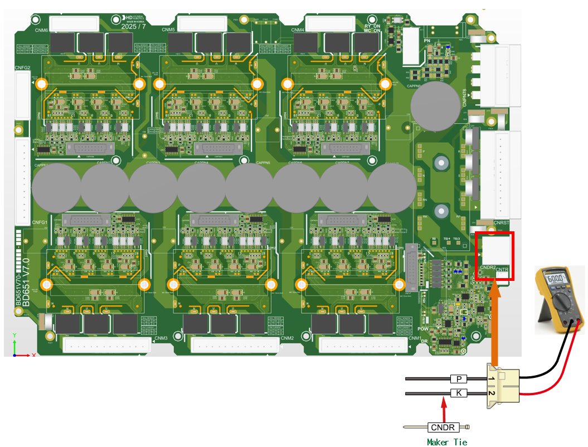

## 2.4. E02503 AMP PN 过电压生成

### 1. 概述

驱动电机的伺服驱动单元的直流链路电压 (P-N) 超过了预设阈值。

### 2. 原因和检测方法



当机器人的运动突然变化或再生放电电阻的电阻值增加时，可能会发生此错误。

* < 如果错误发生在特定步骤，取决于机器人的播放速度 >

(1)	通过调整机器人的播放速度来验证错误。

(2)	检查再生放电电阻的电阻值。



(1)	请根据机器人的播放速度验证错误发生情况。

在重力方向上快速减速或高速下落可能会触发过电压错误。请验证错误是否根据机器人的播放速度而发生。AMP过电压错误也可能由有缺陷的再生放电电阻或再生放电控制系统的异常引起。

* 更改机器人播放速度

如果机器人运动产生的再生功率超过控制器的设计规范，则可能会发生过电压错误。请在发生错误的步骤降低速度后操作机器人，并验证错误是否仍然存在。如果在较低速度下没有发生错误，请在进一步使用前调整该步骤的教导速度。

(2)	请根据机器人的播放速度验证错误发生情况。

* 检查再生放电电阻值

如果电阻值高于规格，再生放电将无法顺利进行，这可能导致过电压错误。再生电阻的规格可能因控制器型号而异。请参考购买时提供的手册和控制器检查表。如果测得的电阻值偏离规格超过10%，请更换电阻。

(2)-1. Hi7-N 控制器

-> 中型机器人 (Hi7-N00-00, H7D6X) 的电阻值：5 欧姆 (N00)

-> 大型机器人 (Hi7-N00-80, H7D6X) 的电阻值：4 欧姆 (N80)

-> 小型机器人 (Hi7-N00-30, H7D6A) 的电阻值：15 欧姆 (N30)

(2)-2 Hi7-T 控制器

-> 待添加 (TBD)

(2)-3 Hi7-NX 控制器 

-> 待添加 (TBD)

图 2.4.1. 在 CNDR 连接器处测量电阻 (Hi7-N 控制器)