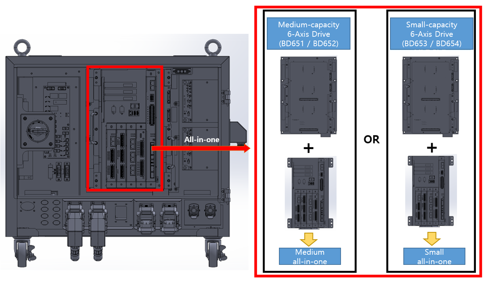

## 2.9. E02508 AMP PN Undervoltage Detection Path Error or Discharge Error

Former Error Code: E0033 AMP PN Undervoltage Generated

### 1. Overview

The DC link voltage (P-N) of the servo drive unit that powers the motors has been measured below the preset undervoltage threshold.

### 2. Causes and Inspection Methods



A problem has occurred in the path used to detect PN voltage drops starting from the diode module. Alternatively, an anomaly has occurred in the PN discharge circuit.

* < If the error occurs even when the motor is OFF >

  * Hi7-N Controller

     (1)	Inspect the components related to undervoltage error detection.
     
     -> Replace the BD642 board and verify if the error persists.

     ->	Replace the servo drive unit and verify if the error persists.

    
  * Hi7-T Controller (To be included in the future)

     (2)	Inspect the components related to undervoltage error detection.
     
     -> To be included in the future (TBD)



(1)	Please inspect the components related to undervoltage error detection.

* Replacement Inspection of the BD642 Board

   Replace the BD642 board with a known functional unit. If the error does not recur, the original board is defective and should be replaced.

* Replacement Inspection of the Servo Drive Unit

   The modules responsible for detecting the AMP undervoltage error are as follows:

  -> Hi7-N Controller: H7D6X (for mid-sized robots) or H7D6A (for small-sized robots), excluding the servo board.

  Please verify the specific components installed in your current controller before proceeding with the inspection. Replace the unit with a known functional part and verify whether the error recurs.

Figure 1.1 Replacement of Control Module and Servo Drive Unit

 

(2) Please inspect the components related to undervoltage error detection.

-> To be included in the future (TBD)
