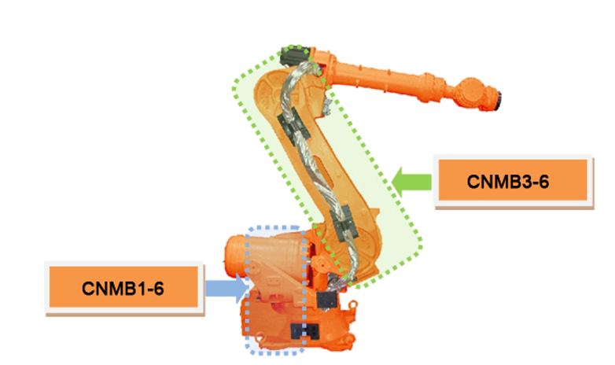

## 2.10. E02522 (Axis ○) IPM故障 – 特定步骤

### 1. 概述

来自IPM（智能电源模块）的故障输出已被触发，IPM是驱动单元中的开关元件，为电机供电。IPM故障可能由散热器温度升高、IPM控制电压下降或过电流输出引起。

### 2. 原因和检查方法



* < 如果错误发生在特定步骤 >

(1)	检查错误发生的步骤中的机器人。

->  检查触发错误时机器人的接线位置。

->  通过降低机器人的播放速度来验证错误。

->  在更改所教步骤的插补后验证错误。



(1)	请检查错误发生的步骤中的机器人。

特定步骤中发生的IPM故障可能在该特定所教位置内部接线损坏变得更加明显时，或者在所教程序中的姿态转换期间轴速度发生剧烈变化时触发。

->  检查错误发生位置的内部接线。

检查与相应轴电机连接的内部机器人接线的状态。在检查期间，关闭控制器电源，断开伺服驱动单元的输出连接器，并测量电缆侧每个相与地之间的电阻，以检查是否短路。

图2.10.1. HS165的轴内部接线检查点

->  通过降低机器人的播放速度验证错误

如果错误发生在由于姿态变化导致轴速度突然波动的步骤中，请降低播放速度以验证错误。如果在降低播放速度后错误得到解决，请调整该特定步骤的教导速度，并在进一步使用前保存任务程序。

->  通过更改所教步骤的插补验证错误

如果在将播放速度降低至75%或更低之后，轴速度仍然剧烈波动，请将所教步骤的插补更改为'P'（PTP: 点对点），并验证错误。如果在相同播放速度下通过更改插补解决了错误，请相应修改教导点。