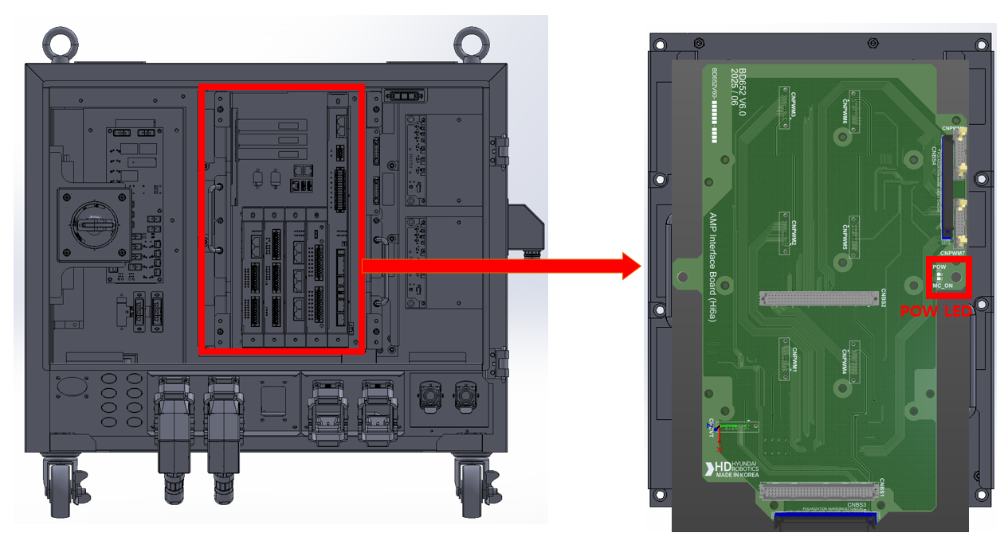

## 2.11. E02541 Drive Unit Control Voltage Low

### 1. Overview

The +15V control power supplied to the servo drive unit has dropped below the threshold. This error is detected through different paths depending on the controller model and then transmitted to the servo board.

*   Hi7-N: Detected directly by the servo drive unit.

### 2. Causes and Inspection Methods



*   < Checking the Power LEDs >

    (1)	Please inspect the power status LEDs.

    ->  Hi7-N: Check the 'POW' LED located on the servo drive unit.

    ->  Hi7-T: To be included in the future (TBD)
    
    ->  Hi7-NX: To be included in the future (TBD)

    ->  Check the 24V control power voltage at the PSM (Power Supply Module).

*   < If both the Board LEDs and PSM LEDs are OFF >

    (2)	Please inspect the output of the control power supply (PSM).

    -> Hi7-N Controller

    *  Disconnect the CN24VB1 connector connected to the BD604 of the Control Module, then check the 24V output status LED on the PSM.

    *   Remove the BD642 board, then check if the 'POW' LED on the servo drive unit lights up.

    ->  Hi7-T Controller: To be included in the future (TBD)

    -> Hi7-NX Controller: To be included in the future (TBD)

    (3)	Please inspect the control power supply unit (CMSMPS).

    ->  Check the input voltage supplied to the CMSMPS.

    ->  Replace the CMSMPS and check the status LEDs.

    * < If only the Board LEDs are OFF >

    (4)	Replace the relevant components and check the power status LEDs.

    -> Hi7-N Controller

    * Replace the CN24VB1 cable that connects the PSM and the Control Module, then check the LEDs.

    * Replace the servo board (BD642) and check the LEDs.

    * Replace the servo drive unit and check the LEDs.

    ->  Hi7-T : To be included in the future (TBD)

    ->  Hi7-NX : To be included in the future (TBD)



(1)	Please inspect the power status LEDs.

The drive unit control voltage low error is triggered when the +15V control power drops. This fault is detected through different paths depending on the controller model and is then transmitted to the servo board.

*   Hi7-N: Detected directly by the servo drive unit.

*   Hi7-T : To be included in the future (TBD)

*   Hi7-NX : To be included in the future (TBD)

Figure 1.1 Location of Controller Power LEDs (Location of the ‘POW LED’ on the Hi7-N Servo Drive Unit)

 

(2)	Please inspect the output of the control power supply (PSM).

->  Hi7-N Controller

*   Disconnect the CN24VB1 connector from the BD642 board, then check the 'SMPS OK' LED on the PSM.

*   Remove the BD642 board, then check the 'POW' LED on the servo drive unit.

->  Hi7-T : To be included in the future (TBD)

->  Hi7-NX : To be included in the future (TBD)

(3)	Check the control power supply unit.

->  Check the input voltage supplied to the CMSMPS.

->  Replace the CMSMPS and verify the status of the LED.

(4)	Replace related components and check the power indicator LED.

->  Hi7-N

*   Replace the CN24VB1 cable connecting the PSM and BD604 of the Control Module, then check the LED.

*   Replace the Servo Board and check the LED.

*   Replace the Servo Drive Unit and check the LED.

->  Hi7-T : To be included in the future (TBD)

->  Hi7-NX : To be included in the future (TBD)

