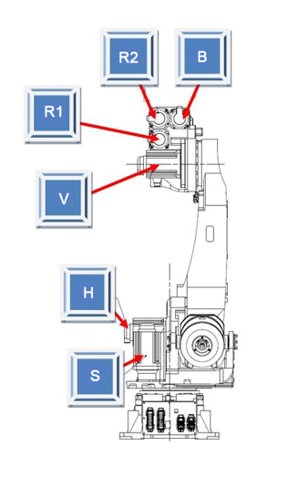

## 2.12. E50300 (Axis ○) IPM Fault

### 1. Overview

An IPM (Intelligent Power Module) fault output has occurred within the switching element of the servo drive unit that operates the motor. An IPM fault can be triggered by an increase in heat sink temperature, a drop in the IPM control voltage, or an overcurrent output.

### 2. Causes and Inspection Procedures



* <If the error occurs at the moment the motor is turned on or occurs intermittently>

(1)	Inspect the motor drive components.

->	Check the output cables connected to the servo drive unit.

->	Inspect the terminals of the switching elements inside the servo drive unit.

->	Replace the servo board and verify if the error persists.

*	Hi7-N Controller : BD642

*	Hi7-T Controller : To be included in the future (TBD)

*	Hi7-NX Controller : To be included in the future (TBD)

->	서보 구동장치를 교체한 후 에러를 확인하여 주십시오.

*	Hi7-N Controller : 중형 H7D6X, 소형 : H7D6A (서보보드 제외)

*	Hi7-T Controller : To be included in the future (TBD)

*	Hi7-NX Controller : To be included in the future (TBD)

->	Replace the servo motor and verify if the error persists.

<If the error occurs after the robot has been operating for 5 minutes or longer>

(2)	Inspect the controller's cooling fans.

->	Check the operating status of each fan.

->	Check the power supply voltage of the fans.



(1)	Inspect the motor drive components.

The servo drive unit that operates the motor receives commands from the servo board (BD642) through a direct board-to-board connector. The current output from the internal amplification circuit is then delivered to the motor via the wiring connected to each axis connector.

->	Inspect the output cables connected to the servo drive unit.

Check the condition of the wiring connecting the servo drive unit to the motor. When inspecting, ensure the controller power is OFF, then disconnect the connector from the servo drive unit. Measure the resistance between each phase and the ground on the cable side to check for any short circuits.

Figure 1.1 Inspection of the output cable for the Hi7-N controller servo drive unit

 

->	Inspect the switching elements of the servo drive unit.

The switching elements of the servo drive unit output AC current for each phase by switching the DC voltage supplied from the diode module. If a short circuit occurs at the internal terminals of the switching element, overcurrent flows, triggering an IPM fault error. With the connectors disconnected, check for a short circuit between the output terminals (U, V, or W) and the P or N terminals of the switching element. If a short circuit is confirmed, the servo drive unit must be replaced, and the cable connecting the servo drive unit to the motor should also be inspected.

*	Hi7-N Controller

    -	Servo drive unit for mid-sized robots: H7D6X

    -	Servo drive unit for small-sized robots: H7D6A 

*	Hi6-T제어기 (To be included in the future)

*	Hi6-NX제어기 (To be included in the future)

Figure 1.2 Inspection for short circuits in the switching elements of the Hi7-N controller

 

->	Replacement and inspection of the servo board.

If the error does not recur after replacing the servo board, the original servo board is defective. Please replace the servo board with a known-good unit.

*	Hi7-N Controller: BD642

*	Hi7-T Controller : To be included in the future

*	Hi7-NX Controller : To be included in the future

->	Replacement and inspection of the servo drive unit.

If the error does not recur after replacing the servo drive unit, the original servo drive unit is defective. Please replace the servo drive unit with a known-good unit.

*	Hi7-N Controller

    -	Servo drive unit for mid-sized robots: H7D6X

    -	Servo drive unit for small-sized robots: H7D6A 

*	Hi7-T Controller : To be included in the future

*	Hi7-NX Controller : To be included in the future

->	Replacement and inspection of the servo motor.

If the error does not recur after replacing the servo motor, the original servo motor is defective. Please replace the servo motor with a known-good unit. The figure below shows the location of the motors for each axis of the HS165 robot. For other robot models, please refer to the corresponding mechanical maintenance manual for replacement.

Figure 1.3 Servo motor locations for each axis of the HS165 robot

 

(2)	Inspect the controller’s cooling fans.

If an IPM fault error occurs after the robot has been operating for 5 minutes or longer, it indicates that the controller's cooling system is malfunctioning, causing the IPM to exceed its specified operating temperature range. The rear of the controller is equipped with fans to cool the heat sinks of the servo drive units and the regenerative discharge resistors.

 

Table 1-1 Installation locations of Hi6 controller fans

->	Check the operating status of each fan.

If a fan is not rotating or the rotation speed is abnormally low, please replace the affected fan. The lifespan of a fan varies depending on the operating environment and total usage hours.

->	Check the fan power supply voltage.

If all fans are not operating, please check the input voltage supplied to the fans. The input voltage for the fans is set to 220V AC, with an allowable tolerance of within 10% of the rated voltage. If the voltage is more than 10% lower than the rating, the cooling efficiency will decrease due to the reduced fan rotation speed. If the voltage is low, please check the power connector for the rear cooling fans and the main input voltage of the controller.
