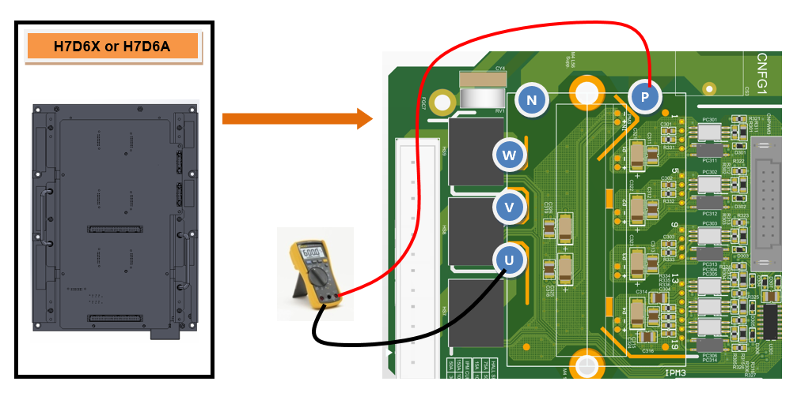
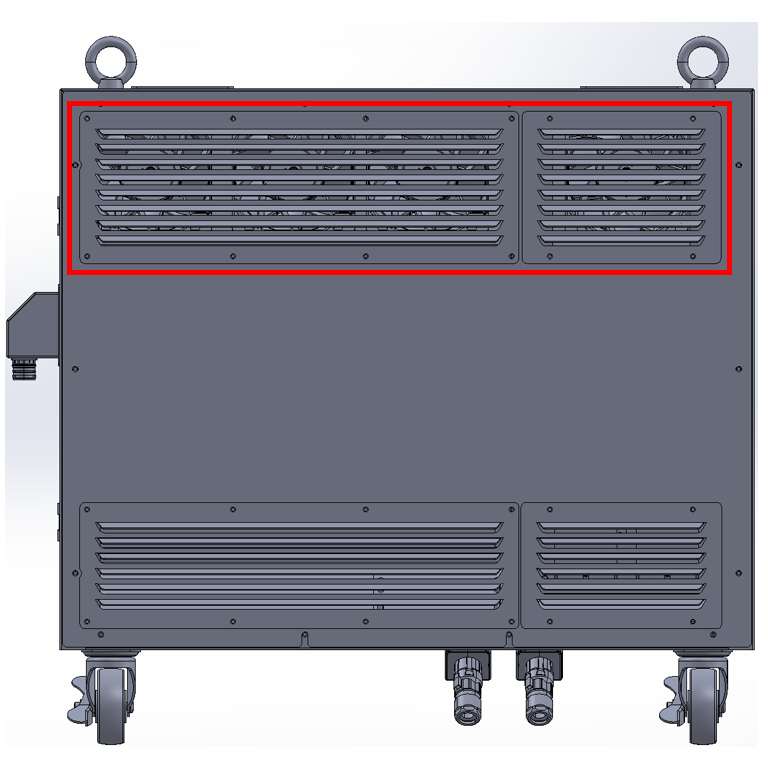

## 2.12. E50300 (Axis o) IPM 故障

### 1. 概述

在操作电机的伺服驱动单元的开关元件内发生了 IPM (智能功率模块) 故障输出。IPM 故障可由散热器温度升高、IPM 控制电压下降或过电流输出引发。

### 2. 原因和检查程序



* < 如果错误发生在电机启动时或间歇性发生 >

(1) 检查电机驱动组件。

-> 检查连接到伺服驱动单元的输出电缆。

-> 检查伺服驱动单元内部开关元件的端子。

-> 更换伺服板，并验证错误是否持续。

* Hi7-N 控制器 : BD642

* Hi7-T 控制器 : 将来包括 (TBD)

* Hi7-NX 控制器 : 将来包括 (TBD)

-> 请在更换伺服驱动后检查错误。

* Hi7-N 控制器 : 中型 H7D6X，小型: H7D6A (不包括伺服板)

* Hi7-T 控制器 : 将来包括 (TBD)

* Hi7-NX 控制器 : 将来包括 (TBD)

-> 更换伺服电机，并验证错误是否持续。

< 如果错误在机器人运行 5 分钟或更长时间后发生 >

(2) 检查控制器的冷却风扇。

-> 检查每个风扇的工作状态。

-> 检查风扇的电源电压。



(1) 检查电机驱动组件。

操作电机的伺服驱动单元通过直接的板对板连接接收来自伺服板 (BD642) 的命令。然后，内部放大电路的电流输出通过连接到每个轴连接器的接线传递给电机。

-> 检查连接到伺服驱动单元的输出电缆。

检查连接伺服驱动单元与电机的接线状况。检查时，请确保控制器电源关闭，然后从伺服驱动单元断开连接器。测量电缆侧各相与地之间的电阻，以检查是否存在短路。

图 2.12.1. Hi7-N 控制器伺服驱动单元的输出电缆检查

 

-> 检查伺服驱动单元的开关元件。

伺服驱动单元的开关元件通过切换来自二极管模块的直流电压输出每个相的交流电流。如果开关元件的内部端子发生短路，过电流则会流动，从而引发 IPM 故障错误。断开连接器后，检查输出端子 (U、V 或 W) 与开关元件的 P 或 N 端子之间是否存在短路。如果确认存在短路，则必须更换伺服驱动单元，并检查连接伺服驱动单元与电机的电缆。

* Hi7-N 控制器

    - 中型机器人伺服驱动单元: H7D6X

    - 小型机器人伺服驱动单元: H7D6A 

* Hi7-T 控制器 (将来包括)

* Hi7-NX 控制器 (将来包括)

图 2.12.2. Hi7-N 控制器开关元件的短路检查

 

-> 更换和检查伺服板。

如果在更换伺服板后错误不再发生，则原伺服板存在缺陷。请用已知良好的单元更换伺服板。

* Hi7-N 控制器: BD642

* Hi7-T 控制器 : 将来包括

* Hi7-NX 控制器 : 将来包括

-> 更换和检查伺服驱动单元。

如果在更换伺服驱动单元后错误不再发生，则原伺服驱动单元存在缺陷。请用已知良好的单元更换伺服驱动单元。

* Hi7-N 控制器

    - 中型机器人伺服驱动单元: H7D6X

    - 小型机器人伺服驱动单元: H7D6A 

* Hi7-T 控制器 : 将来包括

* Hi7-NX 控制器 : 将来包括

-> 更换和检查伺服电机。

如果在更换伺服电机后错误不再发生，则原伺服电机存在缺陷。请用已知良好的单元更换伺服电机。下图显示了机器人每个轴的电机位置。有关其他机器人型号的信息，请参阅相应的机械维护手册以进行更换。

图 2.12.3. 机器人每个轴的伺服电机位置

 

(2) 检查控制器的冷却风扇。

如果在机器人运行 5 分钟或更长时间后发生 IPM 故障错误，则表明控制器的冷却系统发生故障，导致 IPM 超过其规定的工作温度范围。控制器的背面配备有风扇，用于冷却伺服驱动单元的散热器和再生放电电阻器。

 

图 2.12.4. Hi7 控制器风扇的安装位置

-> 检查每个风扇的工作状态。

如果风扇没有旋转或旋转速度异常低，请更换该风扇。风扇的使用寿命因工作环境和总使用时间而异。

-> 检查风扇电源电压。

如果所有风扇都不工作，请检查供应给风扇的输入电压。风扇的输入电压设定为 220V AC，允许的公差在额定电压的 10% 以内。如果电压低于额定值的 10%，则由于风扇转速降低，冷却效率会降低。如果电压低，请检查后冷却风扇的电源连接器和控制器的主输入电压。