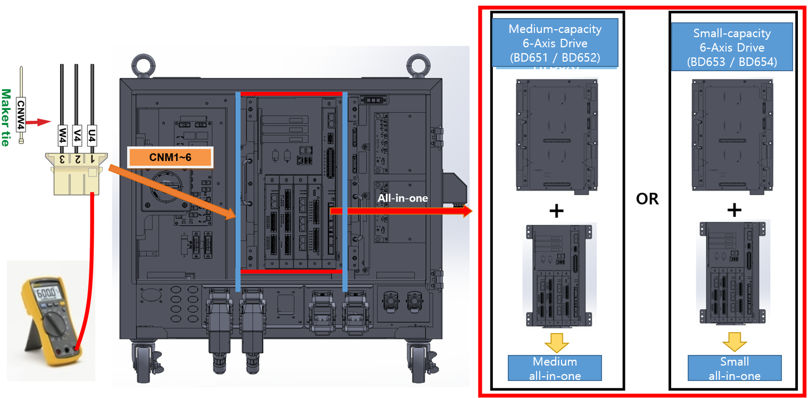

## 2.13. E50301 (Axis ○) IPM故障 - 驱动电源欠压

### 1. 概述

在操作电机的伺服驱动单元的开关元件中发生了IPM（智能功率模块）故障输出。虽然IPM故障可能是由散热器温度升高、IPM控制电压下降或过电流输出引起的，但此特定错误是在伺服处于关闭状态时检测到的。因为系统仅在伺服关闭时监测控制电压的下降，所以必须检查与放大器的驱动电源相关的项目。

### 2. 原因和检查程序



* < 如果在伺服关闭状态下发生IPM故障错误 >

(1) 检查电机驱动组件。

-> 检查连接到伺服驱动单元的输出电缆。

-> 更换伺服驱动单元并验证错误是否仍然存在。

-> 更换伺服板并验证错误是否仍然存在。



(1) 检查电机驱动组件。

操作电机的伺服驱动单元通过接口板和板对板连接器从伺服板接收命令。然后，内部放大电路的电流输出通过连接到各轴连接器的接线传递给电机。

-> 检查连接到伺服驱动单元的输出电缆。

检查连接伺服驱动单元和电机的接线状态。在检查过程中，确保控制器电源关闭，然后从伺服驱动单元断开连接器。测量电缆侧每个相位与接地之间的电阻，以检查是否存在短路。

图2.13.1. Hi7-N控制器伺服驱动单元输出电缆的检查

 

-> 更换和检查伺服驱动单元。

如果更换伺服驱动单元后错误不再出现，则原伺服驱动单元存在缺陷。请用已知良好的单元更换伺服驱动单元。

* Hi7-N控制器

    - 中型机器人的伺服驱动单元：H7D6X
    - 小型机器人的伺服驱动单元：H7D6A

* Hi7-T控制器：将来包含

* Hi7-NX控制器：将来包含

-> 更换和检查伺服板。

如果更换伺服板后错误不再出现，则原伺服板存在缺陷。请用已知良好的单元更换伺服板。

* Hi7-N控制器：BD642
* Hi7-T控制器：将来包含
* Hi7-NX控制器：将来包含