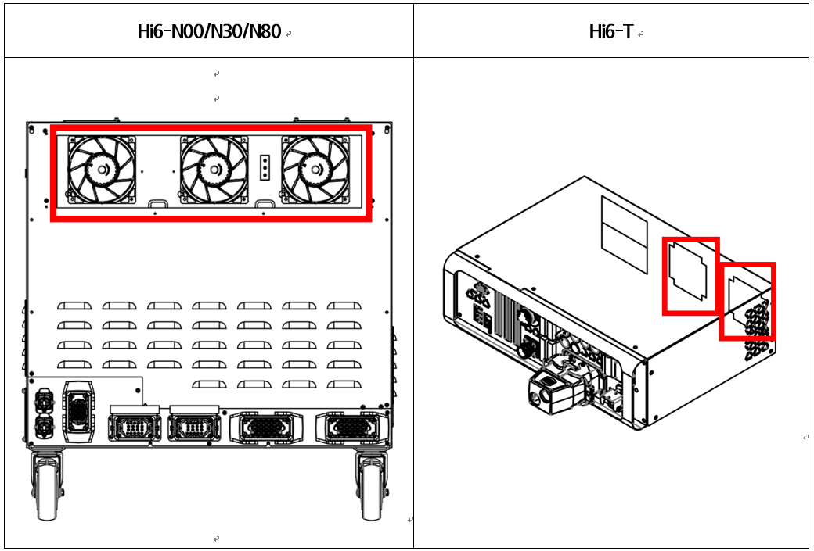

# E02500 AMP의 회생방전 저항 과열

## 1. 개요

로봇의 감속 또는 중력방향으로 하강 시 발생한 회생전력을 저항을 통하여 방전하는데 이 저항의 과열에 관련한 에러입니다. 
냉각용 팬의 성능저하, 일시적인 급격한 동작 및 지속적인 로봇 동작에 의한 회생방전 용량의 초과로 발생할 수 있습니다.

## 2. 원인



회생방전 저항의 온도가 기준치 이상으로 상승하였습니다. 과도한 로봇 재생속도 또는 냉각시스템에 문제가 있습니다.

* <로봇의 재생 속도에 따라 특정 스텝에서 발생하는 경우>

(1)	로봇의 재생 속도를 변경하여 에러를 확인하여 주십시오.

(2)	회생방전 저항값을 점검하여 주십시오.

* <로봇의 기동 이후 5분 이상 경과한 상태에서 발생하는 경우>

(3)	제어기의 냉각시스템 및 회생 전력량을 점검하여 주십시오.

->	각 팬의 동작 상태를 점검하여 주십시오.

->	팬의 전원 전압을 점검하여 주십시오.

(4)	로봇의 회생 전력량을 점검하여 주십시오.

->	로봇의 재생 속도를 낮추어 에러를 확인하여 주십시오.



(1)	로봇의 재생 속도를 변경하여 에러를 확인하여 주십시오.

로봇의 감속이나 중력방향으로 하강 시에는 서보 구동장치의 직류 전압이 상승하게 되고, 전압 상승에 의한 부품의 손상을 방지하기 위해서 회생방전 저항을 통해서 전력을 소모합니다. 
로봇의 동작이 급격한 감속을 하거나 중력방향으로 빠른 속도로 이동하는 경우 에러의 원인이 됩니다. 로봇의 재생 속도에 따른 에러의 발생 여부를 확인하여 주십시오.

* 로봇 재생 속도의 변경

로봇 동작에 의한 회생 전력이 제어기의 설계 사양을 초과하는 경우 회생저항 과열 에러가 발생할 수 있습니다. 
에러가 발생하는 스텝의 속도를 낮추어 동작시킨 후 에러의 발생 여부를 확인하여 주시기 바랍니다.

(2)	회생방전 저항값을 점검하여 주십시오.

* 회생방전 저항 값의 점검

CNDR 케이블의 끝 단에서 측정된 저항값이 매뉴얼에 표기된 값을 10% 이상 벗어나는 경우에는 저항의 불량입니다. 
저항을 교체하여 주십시오. 측정방법은 이전 페이지를 참고하십시오.

 (2)-1. Hi6-N제어기 

-> 중형용(H6D6X) 회생방전 저항 값: 5옴(N00)

-> 대형용(H6D6X) 회생방전 저항 값 : 4옴(N80)

-> 소형용(H6D6A) 회생방전 저항 값: 15옴(N30)

(2)-2. Hi6-T제어기

-> 회생방전 저항 값 : 20옴

(3)	제어기의 냉각 조건 및 회생 전력량을 점검하여 주십시오.

로봇 기동 후 5분 이상 경과한 후에 회생저항 과열 에러가 발생하는 경우에는 제어기 냉각시스템의 이상이 발생하였거나 로봇의 재생 속도가 제어기 설계 사양을 초과하는 경우입니다. 
제어기의 후면에는 서보 구동장치의 방열판과 회생방전 저항의 냉각을 위해 팬을 사용하고 있습니다. 

표 1-1 Hi6 제어기 팬 설치 위치

* 각 팬의 동작 상태 점검

회전하지 않거나 속도가 비정상적으로 낮은 경우에는 해당 팬을 교체하여 주시기 바랍니다. 팬의 수명은 동작 환경 및 시간에 따라 변동됩니다.

* 팬 전원 전압의 점검

모든 팬이 동작하지 않는 경우에는 팬의 입력 전압을 확인하여 주십시오. 팬의 입력 전압은 AC 220V로 설정되어 있으며, 허용 범위는 정격의 10% 이내입니다. 
전압이 10% 이상 낮을 경우에는 팬의 낮은 회전 속도로 인하여 냉각 효과가 저하됩니다. 
전압이 낮은 경우에는 팬 전원용 커넥터(CNFN2)와 제어기의 입력전압을 확인하여 주십시오.

(4)	로봇의 회생 전력량을 점검하여 주십시오.

* 로봇의 재생 속도에 따른 에러 발생을 확인하여 주십시오.

5분 이상 연속 재생 중 과열 에러가 발생하는 경우에는 제어기 냉각 능력을 초과하는 로봇의 동작이 반복되었기 때문입니다. 
로봇의 재생 속도를 낮추어 에러의 발생 여부를 확인하시기 바랍니다. 
속도를 낮추어서 회생저항 과열 에러는 발생하지 않지만 원하는 작업 속도를 달성하지 못하는 경우에는 당사에 문의하시기 바랍니다.
