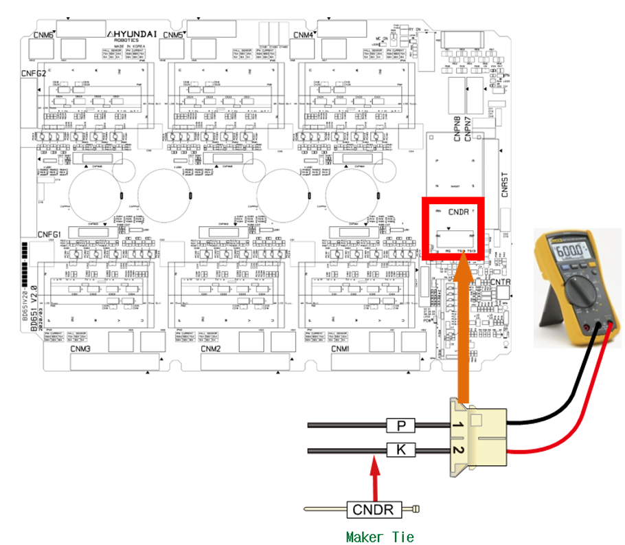
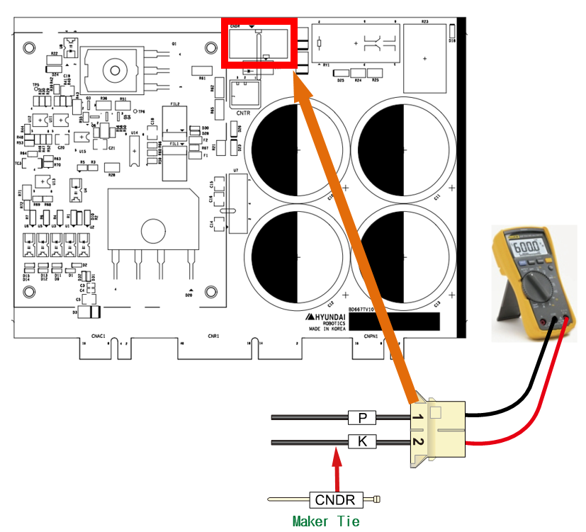

# E02503 AMP PN 과전압 발생

## 1. 개요

모터를 구동하는 서보 구동장치의 직류 전압(P-N)이 설정치를 초과하였습니다.

## 2. 원인 및 점검방법



로봇의 동작이 급격하게 변화 시 발생할 수 있습니다. 회생방전 저항 값이 상승하여 발생할 수 있습니다.

* <로봇의 재생 속도에 따라 특정 스텝에서 발생하는 경우>

(1)	로봇의 재생 속도를 변경하여 에러를 확인하여 주십시오.

(2)	회생방전 저항 값을 점검하여 주십시오.



(1)	로봇의 재생 속도에 따른 에러 발생을 점검하여 주십시오.

로봇이 급격한 감속을 하거나 중력방향으로 빠른 속도로 하강하는 경우에도 과전압 발생 에러의 원인이 됩니다. 
로봇의 재생 속도에 따른 에러의 발생 여부를 확인하여 주십시오. 
AMP의 과전압 발생 에러는 회생방전 저항 값의 불량이나 회생방전 제어 이상의 경우에도 발생합니다. 

* 로봇 재생 속도의 변경

로봇 동작에 의한 회생 전력이 제어기의 설계 사양을 초과하는 경우에 과전압 에러가 발생할 수 있습니다. 
에러가 발생하는 스텝의 속도를 낮추어 동작시킨 후 에러의 발생 여부를 확인하여 주시기 바랍니다. 
속도가 낮은 상태에서 에러가 발생하지 않으면 스텝 속도를 변경하여 사용하시기 바랍니다.

(2)	로봇의 재생 속도에 따른 에러 발생을 점검하여 주십시오.

* 회생방전 저항 값의 점검

회생저항의 값이 사양보다 큰 경우에는 회생방전이 원활하게 이루어지지 않기 때문에 과전압 에러가 발생할 수 있습니다. 
회생저항의 사양은 제어기의 사양에 따라 변경될 수 있습니다. 
구매 시 동봉된 매뉴얼 및 제어기 check sheet를 참조하십시오. 저항값이 사양의 10%을 벗어나는 경우 교체하여 주십시오.

(2)-1. Hi6-N제어기 

-> 중형용(Hi6-N00, H6D6X) 회생방전 저항 값: 5옴(N00)

-> 대형용(Hi6-N80, H6D6X) 회생방전 저항 값 : 4옴(N80)

-> 소형용(Hi6-N30, H6D6A) 회생방전 저항 값: 15옴(N30)

(2)-2 Hi6-T제어기 

-> 회생방전 저항 값 : 20옴

(a) Hi6-N 제어기

(b) Hi6-T 제어기

그림 1.1 CNDR에서 저항 값 측정