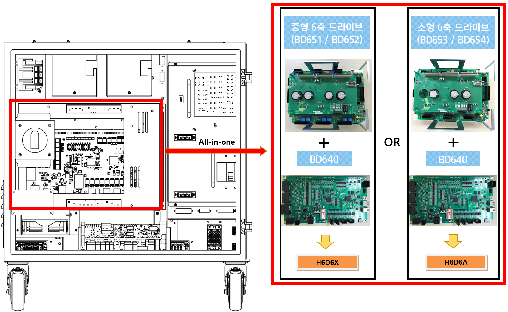
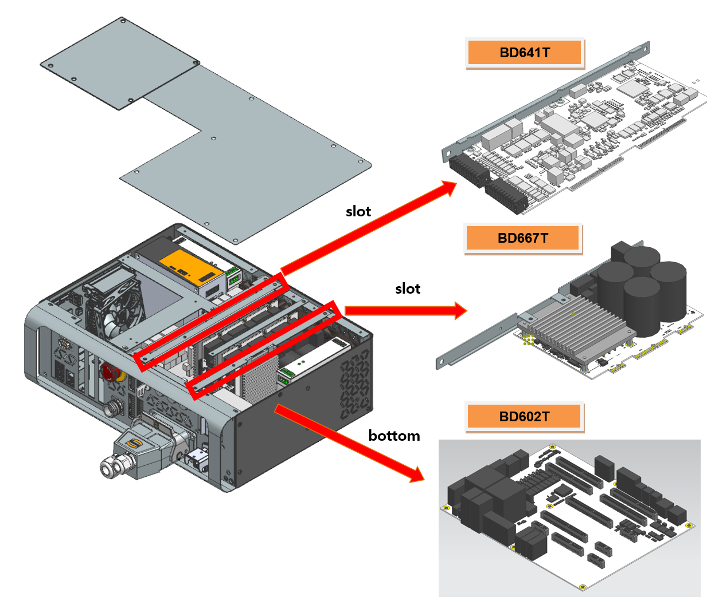

# E02505 AMP PN 과전압 검지경로 이상 또는 방전 이상

기존 에러코드: E0011 AMP의 과전압(P-N) 발생

## 1. 개요

모터를 구동하는 서보 구동장치의 직류 전압(P-N)이 설정치를 초과하였습니다.

## 2. 원인 및 점검방법



다이오드 모듈에서부터 PN전압 저하를 검지하는 경로 또는 PN방전회로에 이상이 발생하였습니다.

* <모터 오프 상태에서도 항상 발생하는 경우>

(1)	Hi6-N 제어기

-> BD640 보드를 교체한 후 점검하여 주십시오.

->	서보 구동장치를 교체한 후 점검하여 주십시오.

(2)	Hi6-T 제어기

->	BD641T 보드를 교체한 후 점검하여 주십시오.

->	BD602T 보드를 교체한 후 점검하여 주십시오.

->	BD667T 보드를 교체한 후 점검하여 주십시오.



(1)	Hi6-N 제어기

Hi6-N 제어기 AMP의 과전압 발생 에러는 서보 구동장치에 공급되는 직류 전원 (P-N)이 설정된 레벨을 초과하는 경우에 서보 구동장치에서 검지합니다. 발생된 에러는 AMP 보드(BD651/BD652/BD653/BD654)를 통하여 BD640보드에서 처리합니다.

-> BD640 교체 점검

BD640을 정상품과 교체하여 에러가 발생하지 않으면 해당 보드의 불량입니다. BD640을 정상품으로 교체하여 사용하시기 바랍니다.

-> 서보 구동장치의 교체 점검

AMP의 과전압 발생 에러를 검지하는 모듈은 다음과 같습니다.

* Hi6-N 제어기 : 중형용 H6D6X, 소형용 H6D6A (서보보드 제외)

현재 사용 중인 제어기의 구성품을 확인하신 후 점검하시기 바랍니다. 정상품과 교체하여 에러 재발 여부를 확인하여 주십시오.

그림 1.1 Hi6-N 제어기 과전압 발생 에러 관련 부품 배치

 

(2)	Hi6-T 제어기

Hi6-T 제어기 AMP의 과전압 발생 에러는 서보 구동장치에 공급되는 직류 전원 (P-N)이 설정된 레벨을 초과하는 경우에 서보 구동장치에서 검지합니다. 발생된 에러는 BD667T에서 BD602T 보드를 통하여 BD641T보드에서 처리합니다.

-> BD641T 교체 점검

BD641T를 정상품과 교체하여 에러가 발생하지 않으면 해당 보드의 불량입니다. BD641T를 정상품으로 교체하여 사용하시기 바랍니다.

-> BD602T 교체 점검

BD602T를 정상품과 교체하여 에러가 발생하지 않으면 해당 보드의 불량입니다. BD602T를 정상품으로 교체하여 사용하시기 바랍니다.

-> BD667T 교체 점검

BD667T를 정상품과 교체하여 에러가 발생하지 않으면 해당 보드의 불량입니다. BD667T를 정상품으로 교체하여 사용하시기 바랍니다.

현재 사용 중인 제어기의 구성품을 확인하신 후 점검하시기 바랍니다. 정상품과 교체하여 에러 재발 여부를 확인하여 주십시오.

그림 1.2 Hi6-T 제어기 과전압 발생 에러 관련 부품 배치