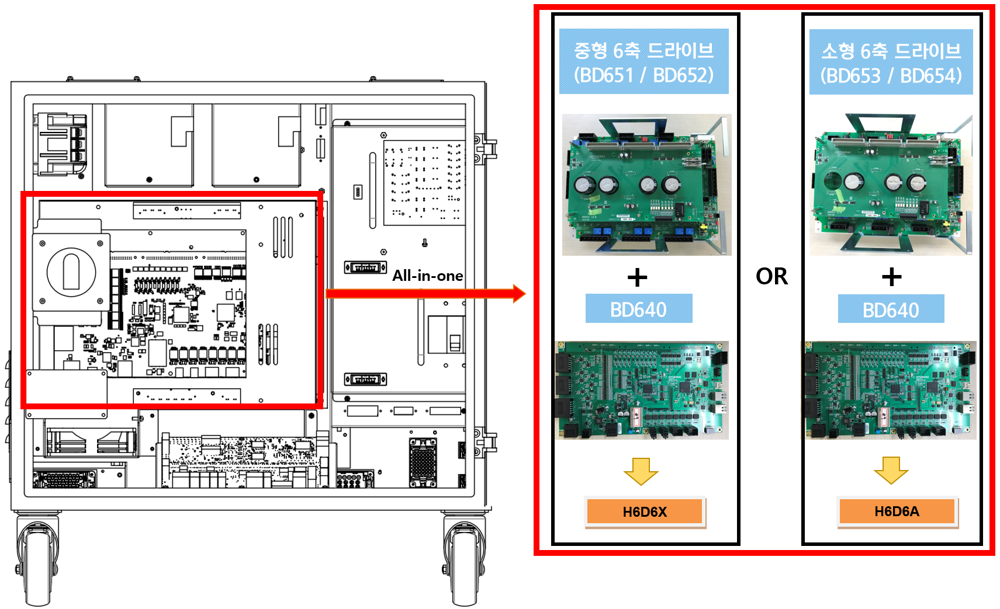
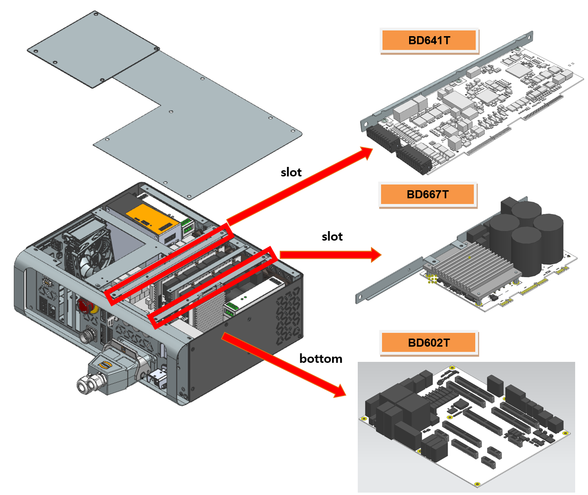

# E02508 AMP PN 저전압 검지경로 이상 또는 방전 이상

기존 에러코드: E0033 AMP PN 저전압 발생

## 1. 개요

모터를 구동하는 서보 구동장치의 직류 전압(P-N)이 저전압 설정치를 이하로 측정되었습니다.

## 2. 원인 및 점검방법



다이오드 모듈에서부터 PN전압 저하를 검지하는 경로에 문제가 발생하였습니다. 또는 PN방전회로에 이상이 발생하였습니다.

* <모터 오프 상태에서도 발생하는 경우>

  * Hi6-N 제어기

     (1)	저전압 에러 검지 관련 부품을 점검하여 주십시오.
     
     -> BD640 보드를 교체한 후 점검하여 주십시오.

     ->	서보 구동장치를 교체한 후 점검하여 주십시오.

    
  * Hi6-T 제어기

     (2)	저전압 에러 검지 관련 부품을 점검하여 주십시오.
     
     -> BD641T 보드를 교체한 후 점검하여 주십시오.

     ->	BD602T 보드를 교체한 후 점검하여 주십시오.

     ->	BD667T를 교체한 후 점검하여 주십시오.



(1)	저전압 에러 검지 관련 부품을 점검하여 주십시오.

* BD640의 교체 점검

   BD640을 정상품과 교체하여 에러가 발생하지 않으면 해당 보드의 불량입니다. 

* 서보 구동장치의 교체 점검

   AMP의 저전압 에러를 검지하는 모듈은 다음과 같습니다.

  -> Hi6-N 제어기 : 중형용 H6D6X, 소형용 H6D6A (서보보드 제외)

  현재 사용 중인 제어기의 구성품을 확인하신 후 점검하시기 바랍니다. 정상품과 교체하여 에러 재발 여부를 확인하여 주십시오.

그림 1.1 BD640 및 서보구동장치의 교체

 

(2)	저전압 에러 검지 관련 부품을 점검하여 주십시오.

*  BD641T의 교체 점검

   BD641T을 정상품과 교체하여 에러가 발생하지 않으면 해당 보드의 불량입니다. 

*  BD602T의 교체 점검

   BD602T을 정상품과 교체하여 에러가 발생하지 않으면 해당 보드의 불량입니다. 

*  BD667T의 교체 점검

   AMP의 저전압 에러를 검지하는 모듈인 BD667T을 정상품과 교체하여 에러가 발생하지 않으면 해당 보드의 불량입니다. 

   현재 사용 중인 제어기의 구성품을 확인하신 후 점검하시기 바랍니다. 정상품과 교체하여 에러 재발 여부를 확인하여 주십시오.

그림 1.1 BD641T, BD602T, BD667T의 교체
