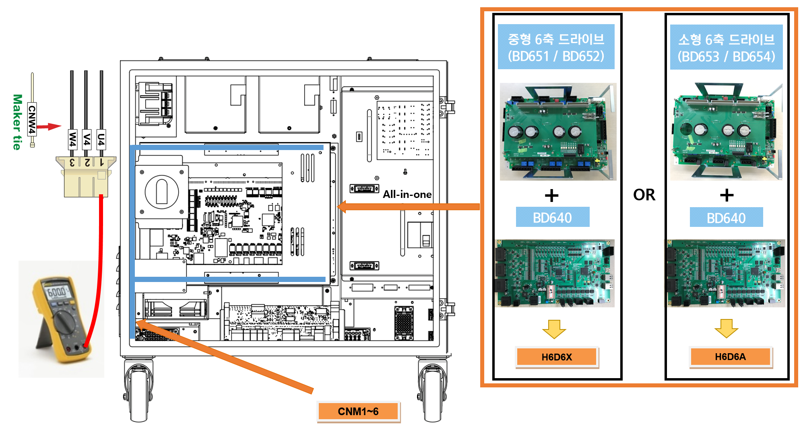
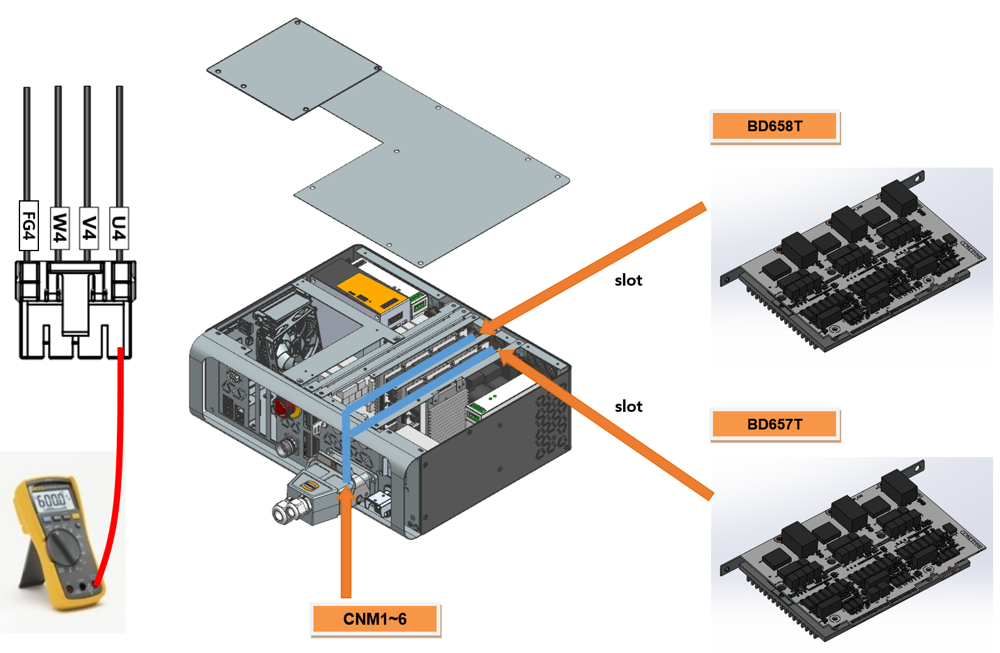
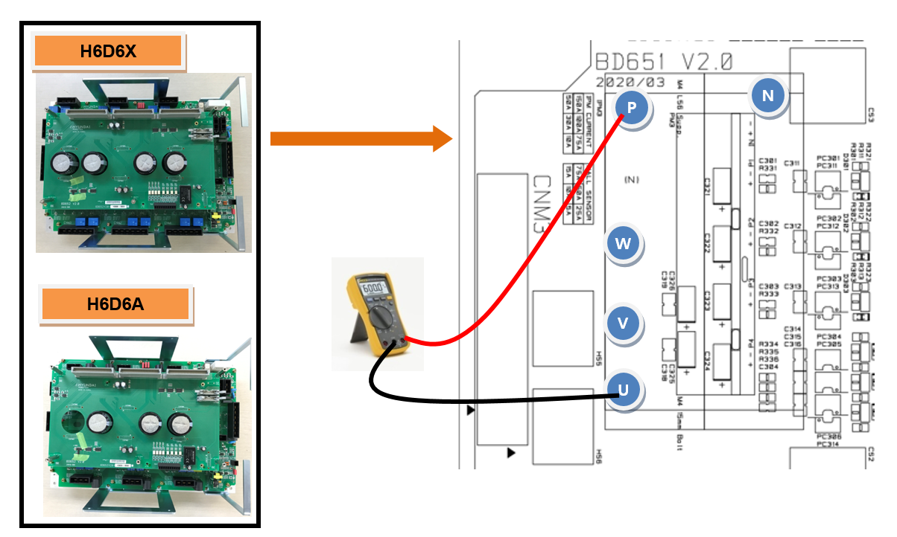
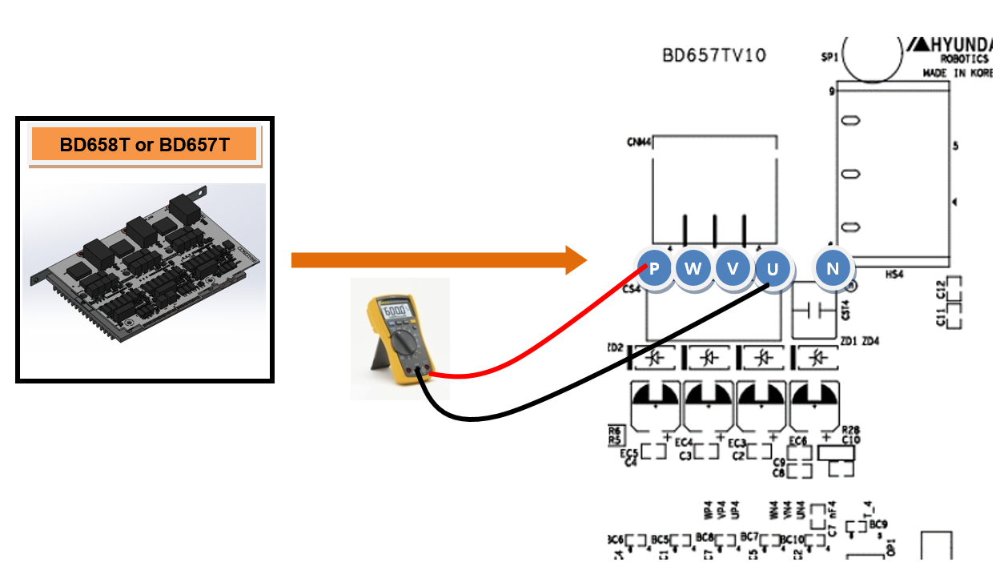

# E02520 (○축) IPM 폴트

## 1. 개요

모터를 구동하는 서보 구동장치 내의 스위칭 소자인 IPM(Intelligent Power Module)에서 폴트 출력이 발생하였습니다. IPM 폴트는 방열판의 온도 상승, IPM의 제어전압 저하 및 과전류 출력에 의해 발생할 수 있습니다.

## 2. 원인 및 점검방법



* <모터 On 하는 순간 또는 비주기적으로 에러가 발생하는 경우>

(1)	모터 구동용 부품을 점검하여 주십시오.

->	서보 구동장치에 접속하는 출력 케이블을 점검하여 주십시오.

->	서보 구동장치 내 스위칭 소자의 단자를 점검하여 주십시오.

->	서보보드를 교체한 후 에러를 확인하여 주십시오.

*	Hi6-N 제어기 : BD640

*	Hi6-T 제어기 : BD641T

->	서보 구동장치를 교체한 후 에러를 확인하여 주십시오.

*	Hi6-N 제어기 : 중형 H6D6X, 소형 : H6D6A (서보보드 제외)

*	Hi6-T 제어기 : BD657T, BD658T

->	서보 모터를 교체한 후 에러를 확인하여 주십시오.

<로봇 기동 이후 5분 이상 경과한 상태에서 발생하는 경우>

(2)	제어기의 냉각 팬을 점검하여 주십시오.

->	각 팬의 동작 상태를 점검하여 주십시오.

->	팬의 전원 전압을 점검하여 주십시오.



(1)	모터 구동용 부품을 점검하여 주십시오.

모터를 구동하는 서보 구동장치는 보드 to 보드 직결커넥터를 통해 서보 보드(BD640)에서 지령을 입력받고, 내부의 증폭회로 전류 출력은 각 축별 커넥터로 연결된 배선에 의해 모터에 전달됩니다.

->	서보 구동장치에 접속하는 출력 케이블 점검

서보 구동장치에서 모터로 연결되는 배선의 상태를 점검합니다. 점검 시에는 제어기의 전원을 OFF한 상태에서 커넥터를 서보 구동장치에서 분리한 후 케이블 측의 각 상과 접지간 저항 값을 측청하여 단락여부를 확인하여 주십시오.

(a) Hi6-N 제어기

(b) Hi6-T 제어기

그림 1.1 서보 구동장치 출력 케이블 점검

 

->	서보 구동장치의 스위칭 소자 점검

서보 구동장치의 스위칭 소자는 다이오드 모듈에서 공급된 직류 전압을 스위칭하여 각 상별로 교류 전류를 출력합니다. 만약 스위칭 소자의 내부 단자에서 단락이 발생하면 과전류가 흘러서 IPM 폴트 에러가 발생합니다. 커넥터를 분리한 상태에서 서보 구동장치의 스위칭 소자의 출력단자(U 또는 V 또는 W)와 P 또는 N간 단락여부를 확인하여 주십시오. 만약 단락이 확인되면 서보 구동장치의 교체가 필요하고, 서보 구동장치에서 모터로 연결하는 케이블의 점검도 필요합니다.

*	Hi6-N제어기 

    -	중형 로봇용 서보 구동장치: H6D6X (서보보드 제외)

    -	소형 로봇용 서보 구동장치: H6D6A (서보보드 제외)

*	Hi6-T제어기 

    -	주축 서보 구동장치 : BD658T

    -	수축 서보 구동장치 : BD657T

(a) Hi6-N 제어기 (H6D6X/H6D6A)

(b) Hi6-T 제어기 (BD658T/BD657T)

그림 1.2 스위칭 소자 단락 점검

 

->	서보 보드의 교체 점검

서보 보드를 교체한 후 에러가 발생하지 않으면 서보 보드의 불량입니다. 서보 보드를 정상품으로 교체하여 주십시오.

*	Hi6-N제어기 : BD640 

*	Hi6-N제어기 : BD641T 

->	서보 구동장치의 교체 점검

서보 구동장치를 교체한 후 에러가 발생하지 않으면 서보 구동장치의 불량입니다. 서보 구동장치를 정상품으로 교체하여 주십시오.

*	Hi6-N 제어기 

    -	중형 로봇용 서보 구동장치: H6D6X (서보보드 제외)

    -	소형 로봇용 서보 구동장치: H6D6A (서보보드 제외)

*	Hi6-T 제어기 

    -	주축 서보 구동장치: BD658T

    -	수축 서보 구동장치: BD657T

->	서보 모터의 교체 점검

서보 모터를 교체한 후 에러가 발생하지 않으면 서보 모터의 불량입니다. 서보 모터를 정상품으로 교체하여 주십시오. 아래 그림은 HS165 로봇의 각 축 모터의 위치를 나타내고 있으며, 다른 로봇은 해당 기구 보수설명서를 참고하여 교체하시기 바랍니다.

그림 1.3 HS165 로봇의 각 축 모터 위치

 

(2)	제어기의 냉각 팬을 점검하여 주십시오.

로봇 기동 이후 5분 이상 경과한 후에 IPM 폴트 에러가 발생하는 경우에는 제어기 냉각 시스템의 이상이 발생하여 IPM의 동작 허용온도 사양을 초과하는 경우입니다. 제어기의 후면에는 서보 구동장치의 방열판과 회생방전 저항의 냉각을 위해 팬을 사용하고 있습니다.

 

표 1-1 Hi6 제어기 팬 설치위치

->	각 팬의 동작 상태 점검

팬이 회전하지 않거나 속도가 비정상적으로 낮은 경우에는 해당 팬을 교체하여 주시기 바랍니다. 팬의 수명은 동작 환경 및 시간에 따라 변동됩니다.

->	팬 전원 전압의 점검

모든 팬이 동작하지 않는 경우에는 팬의 입력 전압을 확인하여 주십시오. 팬의 입력 전압은 AC 220V로 설정되어 있으며, 허용 범위는 정격의 10% 이내입니다. 전압이 10% 이상 낮을 경우에는 팬의 낮은 회전 속도로 인하여 냉각 효과가 저하됩니다. 전압이 낮은 경우에는 후면 냉각 팬 전원용 커넥터와 제어기의 입력 전압을 확인하여 주십시오.
