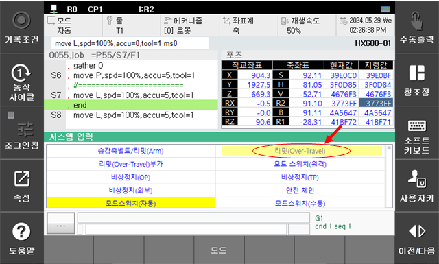
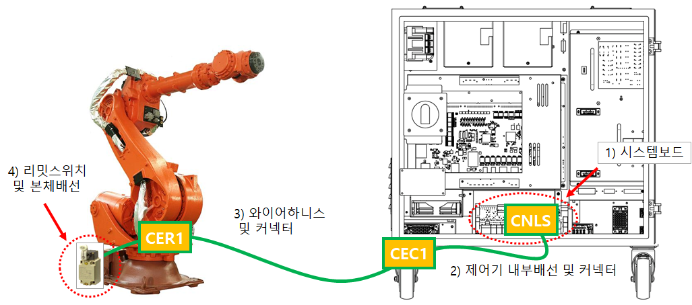
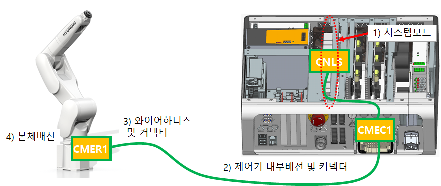
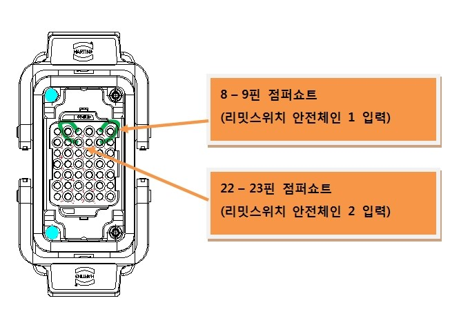

# E00002 주축 리밋 스위치 작동중

## 1. 개요

로봇 각 축의 동작영역 끝에 설치한 리밋스위치가 작동하였습니다. 안전을 위하여 로봇은 즉각적으로 정지하며 적절한 방법으로 안전한 동작영역으로 이동할 때까지는 정상적인 운전을 할 수 없습니다.

## 2. 원인 및 점검



(1)	실제로 동작영역을 이탈한 것인지 확인하십시오.
* 동작영역 이탈시의 복구방법

(2)	동작영역 이탈이 아님에도 불구하고 에러가 발생하는 경우 
* 시스템보드 커넥터(CNLS)에서 점검하는 방법
* 와이어 하니스(C(M)ER1 또는 C(M)EC1)에서 점검하는 방법
* 리밋스위치 및 본체 내부 배선을 점검하는 방법
* 안전보드(BD632)를 점검하는 방법

(3) 주축 리밋 스위치 회로의 배선 또는 접점에 이상이 발생한 경우

(4) 주축 리밋 스위치에 대한 안전 입력 할당이 설정되지 않은 경우



(1)	실제로 동작영역을 이탈한 것인지 확인하십시오.

실제로 로봇이 동작영역 밖으로 벗어났는지 확인하십시오. 소프트리밋 에러도 동시에 발생하였다면 로봇은동작영역을 이탈한 것입니다. 적절한 조작으로 로봇을 동작영역 안으로 이동시키십시오. 동작영역은 로봇 모델에 따라 다릅니다. 따라서, 리밋스위치의 설치위치도 다를 수 있으므로 해당 로봇의 보수설명서에서 “동작범위 제한” 부분을 참조하십시오.

 
그림 1 하드웨어 리밋스위치 설치 위치의 예(HS165/HS200 로봇)

 
그림 2 하드웨어 리밋스위치 작동 범위의 예(HS165/HS200 S축)

### [동작영역 이탈시의 복구방법]

하드웨어 리밋스위치가 걸려있는 상태에서 로봇을 움직이기 위해서는 다음과 같은 조건과 순서로 실행해야 합니다.

A)	수동모드에서 시스템 모드로 진입합니다.  
B)	티치펜던트에서 인에이블링스위치를 잡습니다. 

『수동모드』+ 『시스템』+ 『TP의 인에이블링 스위치 ON』

C)	이 상태에서 모터 ON 시킵니다. 
D)	조그키를 사용하여 로봇을 동작영역 안으로 이동시킵니다. 

(2)	동작영역 이탈이 아님에도 불구하고 에러가 발생하는 경우

우선 티칭펜던트의 전용 입력신호 창에서 리밋(Over-Travel) 항목이 계속 입력되고 있는지를 확인합니다. 이 창은 “『창조정』→『선택』→『시스템입력』”를 선택하면 볼 수 있습니다. 리밋(Over-Travel) 항목이 황색 표시가 되어 있는면 에러발생를 나타냅니다.

### [주의]
수동모드에서는 티칭펜던트의 인에이블링 스위치를 ON 시켜야 모니터링이 됩니다. 자동모드에서는 인에이블링 스위치 상태와 관계없이 모니터링 됩니다.

 
그림 3 시스템 입력창에서 리밋(Over-Travel) 모니터링 표시

이와 같은 경우는 리밋스위치와 관계된 구성품들에서 원인을 찾을 수 있습니다. 리밋스위치는 다음 그림과 같이 본체로부터 Hi6-N 경우, “CEC1 – CER1” Hi6-T 경우, “CMEC1 – CMER1” 케이블을 통하여 제어기의 시스템 보드에 연결됩니다.

 
그림 4 하드웨어 리밋SW 배선 구조

주요 점검표인트와 순서는 

A)	시스템 보드 
B)	제어기 내부의 배선 및 커넥터 
C)	와이어하니스 및 커넥터 
D)	리밋스위치 및 본체배선 

이며, 적절한 부위에서 리밋스위치의 입력선을 점퍼하여 모니터링 창에서 리밋(Over-Travel) 항목이 백색으로 변화하는지를 확인해야 합니다.

다음의 순서에 따라 진행하십시오.

### [시스템보드 커넥터(CNLS)에서 점검하는 방법]



경고(Warning)
케이블의 연결 및 제거 시에는 반드시 제어기의 전원이 꺼진 상태에서 실행하십시오. 전기적 위험은 인명사고 및 재산사고를 일으킬 수 있습니다.



시스템보드의 CNLS 커넥터를 통해서 보드의 고장인지를 판단하는 것입니다. 아래의 그림과 같이 CNLS 커넥터에서 리밋SW 입력과 관련된 핀을 점퍼쇼트 하십시오. 이 상태에서 전용입력신호 모니터링 창을 통하여 리밋(Over-Travel) 항목을 확인하십시오.

①	백색으로 바뀌었다면, 시스템보드의 고장입니다. 보드를 교체하십시오. 
②	황색으로 여전히 에러상태라면, 시스템보드 이후 본체 리밋스위치까지의 영역에서 고장을 체크하십시오. 

 
그림 5 Hi6-N 시스템 보드

 
그림 6 Hi6-T 시스템 보드

### [와이어하니스(C(M)ER1 또는 C(M)EC1)에서 점검하는 방법]



경고(Warning)
케이블의 연결 및 제거 시에는 반드시 제어기의 전원이 꺼진 상태에서 실행하십시오. 전기적 위험은 인명사고 및 재산사고를 일으킬 수 있습니다.



와이어하니스 커넥터 C(M)ER1 또는 C(M)EC1을 통해서 케이블 고장인지를 판단하는 것입니다. 우선 제어기로부터 C(M)EC1 와이어하니스 제거한 후, 제어기에 부착되어 있는 C(M)EC1 커넥터에서 리밋SW 관련 핀을 점퍼 쇼트하십시오. 이 상태에서 전용입력신호 모니터링 창을 통하여 리밋Over-Travel) 항목을 확인하십시오.

①	백색으로 바뀌었다면, 
제어기 내부의 C(M)EC1 커넥터 – 시스템보드 간 케이블 또는 커넥터의 고장입니다. 이를 점검하거나 교체 하십시오.

②	황색으로 여전히 에러상태라면, 
C(M)EC1 커넥터 이후 본체 리밋스위치까지의 영역에서 고장을 체크하십시오.

C(M)EC1 와이어하니스를 다시 연력하고 본체로부터 C(M)ER1 와이어하니스를 제거한 후, 와이어하니스의C(M)ER1커넥터에서 리밋SW관련 핀을 점퍼쇼트하십시오. 이 상태에서 전용입력신호 모니터링 창을 통하여 리밋(Over-Travel) 항목의 상태를 확인하십시오.

①	백색으로 바뀌었다면, 
C(M)ER1커넥터-C(M)EC1 커넥터 간 와이어하니스 케이블 또는 커넥터의 고장입니다. 이를 점검하거나 교체하십시오.

②	황색으로 여전히 에러상태라면, 
본체 쪽 C(M)ER1 커넥터 이후 리밋SW까지의 영역에서 고장을 체크하십시오.

 
그림 7 하드웨어 리밋SW 하네스 C(M)EC 구조

### [리밋SW 및 본체 내부 배선을 점검하는 방법]



경고(Warning)
케이블의 연결 및 제거 시에는 반드시 제어기의 전원이 꺼진 상태에서 실행하십시오. 전기적 위험은 인명사고 및 재산사고를 일으킬 수 있습니다.



본체로부터 CER1 와이어하니스를 제거한 후, 본체의 CER1 커넥터에서 리밋SW 관련 라인에 이상이 있는지 멀티미터를 사용하여 쇼트 테스트하십시오.

①	저항이 오픈상태로 측정되었다면, 
리밋SW 또는 리밋SW – CER1 간 커넥터 또는 커넥터의 고장입니다.
이를 점검하거나 교체하십시오.

②	저항이 쇼트상태로 측정되었다면, 
다른 부분의 고장을 체크하여야 합니다. 당사에 문의하십시오.

 
그림 8 하드웨어 리밋SW 하네스 C(M)ER 구조

 
 
 

### (3) 주축 리밋 스위치 회로의 배선 또는 접점에 이상이 발생한 경우
 

주축 리밋 스위치 배선을 점검하기 위해서는,먼저 주축 리밋 스위치 입력이 [안전 입출력 할당] 기능을 통해 어떤 입력 채널에 할당되어 있는지 확인하십시오.

기본 설정의 경우, 주축 리밋 스위치는 비활성화 되어 있어 점검이 필요하지 않습니다.  
만약 사용이 필요하신 경우 [안전 입출력 할당] 기능을 통해 1)기본 안전, 2)부가 안전, 3)안전 통신 중 하나를 선택하여 사용이 가능합니다.

#### 2-1) 기본 안전 입력에 할당 되어 있을 경우

#### 2-2) 부가 안전 입력에 할당 되어 있는 경우 

#### 2-3) 안전 통신 입력에 할당 되어 있는 경우

 
 
 

### (4) 주축 리밋 스위치에 대한 안전 입력 할당이 설정되지 않은 경우
 
외부 비상정지 입력이 안전 입력 할당에서 선택되지 않은 경우,
다음 항목 중 하나를 선택하여 외부 비상정지 기능을 활성화하십시오.

- 기본 안전 입력 (Basic Safety Input) 
- 부가 안전 입력 (Extended Safety Input)
- 안전 통신 입력 (Safety Communication Input)

안전 입력 할당 기능은 아래의 메뉴를 통해 설정할 수 있습니다.

시스템 -> 8: 안전시스템 -> 2: 파라미터 설정 -> 3: 안전 IO -> 1:입출력 할당 
 

