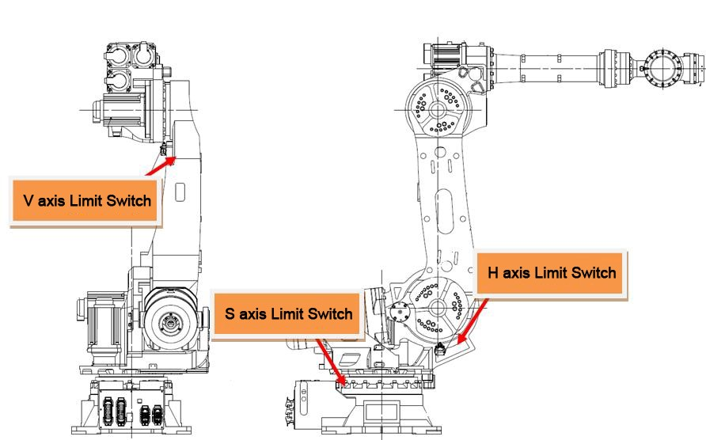
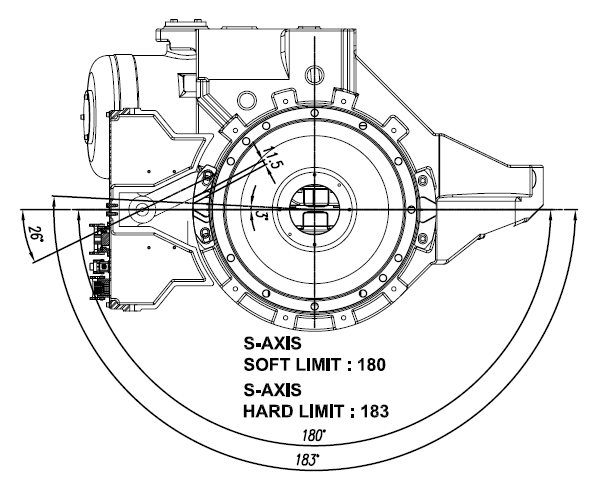
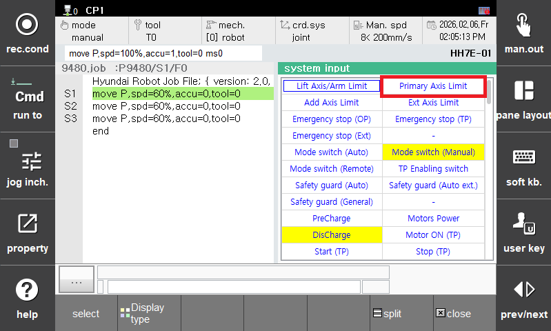
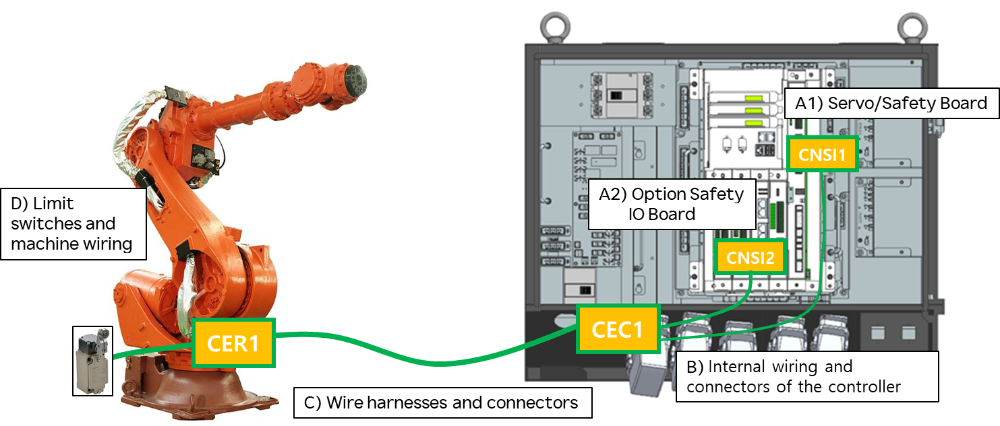
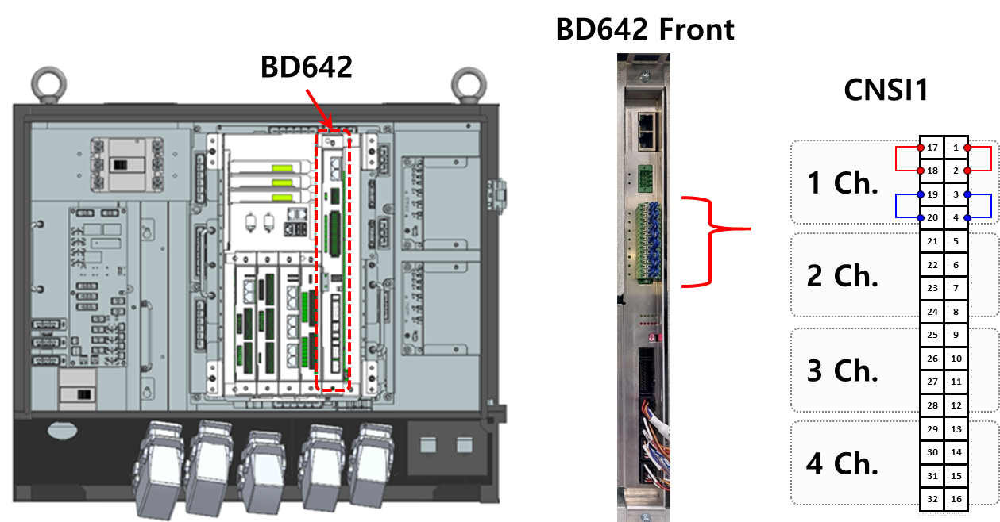
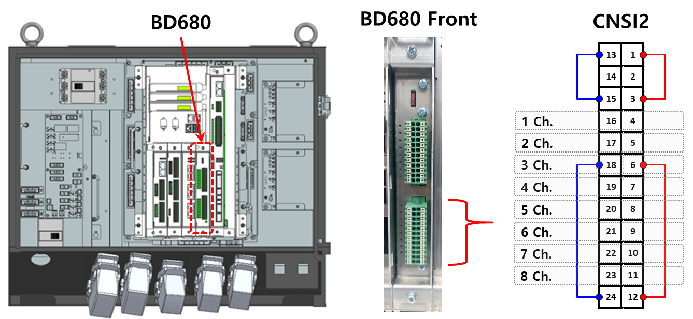
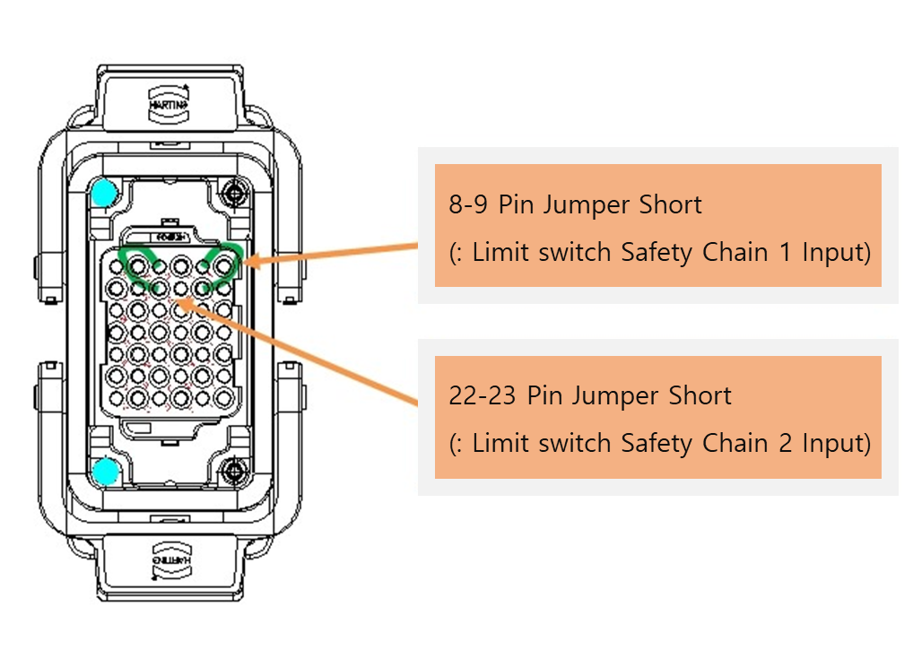

## 3.2. E00002 Primary Axis Limit Switch Activated

### 1. Overview

The limit switch installed at the end of the travel range for each robot axis has been triggered. For safety, the robot immediately stops and cannot operate normally until it is moved back to a safe operating range using the proper procedure.

### 2. Cause and Inspection


(1) Verify whether the robot has actually moved outside the operating range. 
* Recovery procedure when the operating range is exceeded 

(2) If the error occurs even though the operating range has not been exceeded 
* Check at the system board connector (CNLS) 
* Inspect the wire harness (C(M)ER1 or C(M)EC1) 
* Check the limit switch and internal wiring of the main body 
* Inspect the safety board (BD632) 

(3) If there is an abnormality in the wiring or contacts of the Primary Axis limit switch circuit 

(4) If the safety input assignment for the Primary Axis limit switch has not been configured 


### (1) Verify Whether the Robot Has Actually Exceeded the Operating Range

Check whether the robot has moved outside its designated operating range. If a soft limit error occurs simultaneously, the robot has indeed exceeded the operating range. Move the robot back into the operating range using proper operation procedures. The operating range varies depending on the robot model, so the installation position of the limit switches may also differ. Refer to the “Operating Range Limits” section in the maintenance manual of the respective robot.

 
Figure 3.2.1. Example of Hardware Limit Switch Installation Position

 
Figure 3.2.2. Example of Hardware Limit Switch Operating Range

#### [Recovery Procedure When the Operating Range Is Exceeded]

To move the robot while a hardware limit switch is triggered, follow the conditions and sequence below:

A) Enter **System Mode** from **Manual Mode**.  
B) Hold the **Enabling Switch** on the teach pendant.  

『Manual Mode』 + 『System』 + 『TP Enabling Switch ON』  

C) Turn **Motor ON** in this state.  
D) Use the **Jog Keys** to move the robot back into the operating range.

### (2) Error Occurs Even When the Operating Range Is Not Exceeded

First, check on the teach pendant’s dedicated input signal window whether the **Limit (Over-Travel)** item is continuously active. You can view this window by selecting **『Window Layout』 → 『Select』 → 『System Input』**. If the **Limit (Over-Travel)** item is highlighted in yellow, it indicates an error occurrence.

### [Caution]
- In **Manual Mode**, the **Enabling Switch** on the teach pendant must be ON for monitoring.  
- In **Automatic Mode**, monitoring occurs regardless of the enabling switch status.

 
Figure 3.2.3. Over-Travel Monitoring in the System Input Window

In such cases, the cause can be traced to components related to the limit switch. The limit switch is connected to the controller’s servo safety system via the **CEC1 – CER1** cable from the robot body, as shown in the following figure.

 
Figure 3.2.4. Hardware Limit Switch Wiring Structure

The main inspection points and sequence are as follows:  
A1) Servo Safety Board (CNSI1) **or**  
A2) Optional Safety IO Board (CNSI2)  
B) Internal wiring and connectors of the controller  
C) Wire harness and connectors  
D) Limit switch and robot body wiring  

At the appropriate location, jumper the input line of the limit switch and check whether the **Limit (Over-Travel)** item in the monitoring window changes to white.  
Proceed according to the following sequence.

### [How to Check from the Servo Safety Board Connector (CNSI1) or Optional Safety IO Board Connector (CNSI2)]


Always perform cable connection or disconnection **with the controller powered OFF**. Electrical hazards can cause personal injury or property damage. 


#### * How to Check the Servo Safety Board Connector (CNSI1)
This step determines whether the fault originates from the servo safety board via the CNSI1 connector. Jumper the pins related to the assigned input channel. Then, check the **Limit (Over-Travel)** item in the dedicated input signal monitoring window.

1. If the indicator changes to **white**, the servo safety board is faulty. Replace the board.
2. If it remains **yellow** (error state), check for faults along the path from the servo safety board to the hardware limit switch on the robot.

The figure below shows an example of jumper shorting when the limit switch is assigned to channel 1. Perform the test by connecting the jumper to the actually assigned channel.

 
Figure 3.2.5. Servo Safety Board Connector (CNSI1)

#### * How to Check the Option Safety IO Board Connector (CNSI2)
This step determines whether the fault originates from the option safety IO board via the CNSI2 connector. Jumper the pins related to the assigned input channel. Then, check the **Limit (Over-Travel)** item in the dedicated input signal monitoring window.

1. If the indicator changes to **white**, the option safety IO board is faulty. Replace the board.
2. If it remains **yellow** (error state), check for faults along the path from the option safety IO board to the hardware limit switch on the robot.

The figure below shows an example of jumper shorting when the limit switch is assigned to channel 3. Perform the test by connecting the jumper to the actually assigned channel.

 
Figure 3.2.6. Hardware Limit Switch Wiring Structure

### [How to Check the Wire Harness (C(M)ER1 or C(M)EC1)]

 
Always turn off the controller power before connecting or disconnecting cables. Electrical hazards may cause personal injury or property damage. 


This step determines whether the fault originates from the wire harness via the C(M)ER1 or C(M)EC1 connector. First, remove the C(M)EC1 wire harness from the controller. Then, jumper the pins related to the limit switch on the C(M)EC1 connector attached to the controller. Check the **Limit (Over-Travel)** item in the dedicated input signal monitoring window to verify the signal.

① If the color changes to **white**,  
the fault lies in the cable or connector between the C(M)EC1 connector inside the controller and the system board. Inspect or replace the cable/connector as needed.  

② If the color remains **yellow**,  
check for faults in the area from the C(M)EC1 connector to the hardware limit switch on the robot body.  

Reconnect the C(M)EC1 wire harness and remove the C(M)ER1 wire harness from the robot body. Then, jumper the pins related to the limit switch on the C(M)ER1 connector of the wire harness.  
Check the **Limit (Over-Travel)** item in the dedicated input signal monitoring window.  

① If the color changes to **white**,  
the fault lies in the wire harness cable or connectors between the C(M)ER1 and C(M)EC1 connectors. Inspect or replace as necessary.  

② If the color remains **yellow**,  
check for faults in the area from the C(M)ER1 connector on the robot body to the limit switch.

### [How to Inspect the Limit Switch (SW) and Internal Wiring of the Robot Body]

 
Always ensure the controller power is **OFF** before connecting or disconnecting any cables. Electrical hazards can cause personal injury or property damage. 


After disconnecting the CER1 wire harness from the robot body, use a multimeter to perform a continuity test on the lines related to the limit switch at the CER1 connector on the robot body.

① If the resistance measures **open**,  
there is a fault in the limit switch or the connector/cable between the limit switch and CER1. Inspect or replace as needed.  

② If the resistance measures **short**,  
check other sections for faults. Contact the manufacturer for further guidance.

 
Figure 3.2.7. Hardware Limit Switch (SW) Harness C(M)ER Structure

### (3) If there is a fault in the Primary Axis limit switch circuit wiring or contacts

To inspect the Primary Axis limit switch wiring, first check which input channel the Primary Axis limit switch is assigned to via the **Safety I/O Assignment** function.  
By default, the Primary Axis limit switch is **disabled**, so inspection is not required.  
If use is needed, you can assign it through the **Safety I/O Assignment** function by selecting one of the following: 1) Basic Safety, 2) Additional Safety, or 3) Safety Communication.

#### 3-1) Assigned to Basic Safety Input

If the Primary Axis limit switch input is assigned to the **Basic Safety Input**, it is connected to the **CNSI1 connector (4 channels) on the Servo Safety Board**.  
Check which channel is assigned on the CNSI1 connector as described in item (1). For detailed pin mapping of this connector, refer to section 4.3.2.6 of the Hi7 Controller Maintenance Manual.

#### 3-2) Assigned to Additional Safety Input

If the Primary Axis limit switch input is assigned to the **Additional Safety Input**, it is connected to the **CNSI2 connector (8 channels) on the Optional Safety I/O Board**.  
Check which channel is assigned on the CNSI2 connector as described in item (1). For detailed pin mapping of this connector, refer to section 5.4.6 of the Hi7 Controller Maintenance Manual.

#### 3-3) Assigned to Safety Communication Input

If the Primary Axis limit switch input is assigned to the **Safety Communication Input**, refer to the **Hi7 Robot Controller Function Manual – Industrial Communication** for details.

### (4) If the Primary Axis Limit Switch Safety Input Assignment is Not Configured

If the external emergency stop input is not selected in the safety input assignment, activate the external E-Stop function by selecting one of the following options:

- **Basic Safety Input**  
- **Extended Safety Input**  
- **Safety Communication Input**  

The Safety Input Assignment can be configured via the following menu:

`System -> 8: Safety System -> 2: Parameter Setting -> 3: Safety I/O -> 1: Input/Output Assignment`  

  
Figure 3.2.8. T/P screen: Safety Input/Output Assignment

