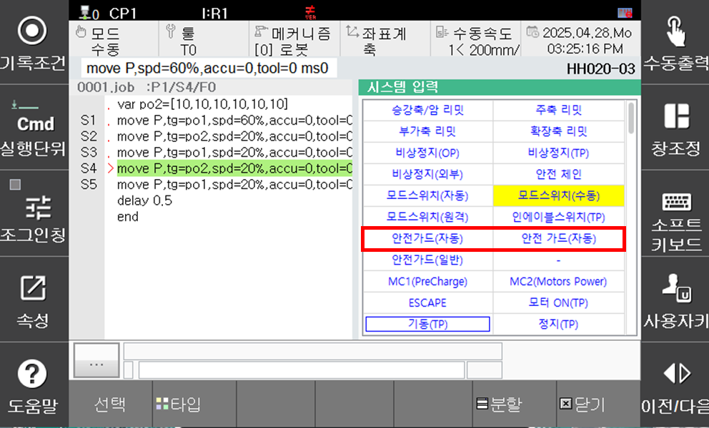
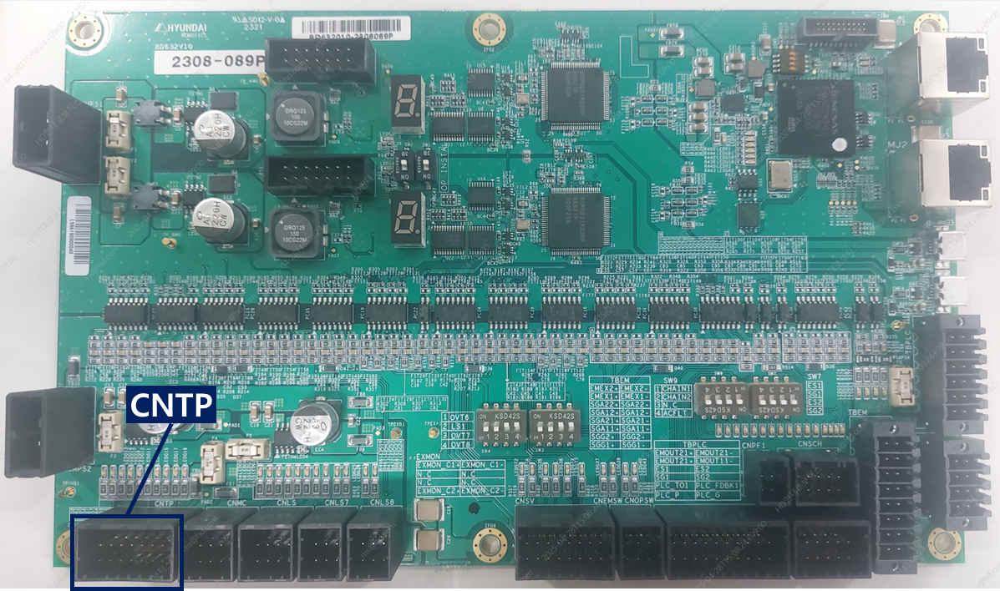

# E0043. 자동모드 안전가드(Auto Guard) 스위치 접속 이상

## 1. 개요

자동(Auto)모드에서 안전플러그(Auto Guard) 스위치 접속 이상이 발생하였습니다. 자동모드에서는 모터온 상태를 유지 할 수 없습니다.

## 2. 원인 및 점검 방법



(1)	자동 모드 안전가드 스위치 (SGA1, SGA2)가 입력이 불안정한 경우
* 자동 모드 안전가드 스위치(SGA1, SGA2)입력 상태를 점검하는 방법

(2)	자동 모드 안전가드 스위치 (SGA1, SGA2)가 입력과 상관 없이 에러가 발생하는 경우
* 안전보드(BD632)를 점검하는 방법
* 티칭팬던트(TP630)와의 연결상태를 점검하는 방법



(1)	자동 모드 안전가드 스위치 (SGA1, SGA2)가 입력이 불안정한 경우

* 자동 모드 안전가드 스위치(SGA1, SGA2)입력 상태를 점검하는 방법
 

1)	TP의 시스템 입력 화면을 통해 안전가드(자동) 신호 입력 상태를 확인하여 현재 어떤 안전가드(자동) 신호가 입력 되고 있는지 파악 (왼쪽 SGA1, 오른쪽 SGA2)
2)	TBEM 단자에서 SGA1, SGA2의 단자의 연결 상태, 케이블의 상태, 입력 스위치의 이상 여부 등을 확인 한다.
 

(2)	자동 모드 안전가드 스위치 (SGA1, SGA2)가 입력과 상관 없이 에러가 발생하는 경우

* 안전보드(BD632)를 점검하는 방법
 

1)	IO 전원 상태를 확인하는 방법
A.	위 그림의 두개의 LED가 녹색 점등 상태 인지를 확인
B.	IO 전원 LED가 적색 또는 소등인 경우 표시된 퓨즈가 정상 상태인지를 확인한다.
C.	퓨즈가 끊겼다면 퓨즈를 교체하여 준다.

2)	모터온시 IO전원이 불안정한 상태인지 확인
A.	모터온시에 IO 전원 LED가 녹색 점등 상태 인지를 확인한다. 
B.	모터온 순간 적색으로 변하거나 소등되다면 모터온시 IO 전원이 불안정한 상태 임

3)	IO 전원 상태가 불안정한 경우
A.	IO 전원 커넥터 체결 상태 확인
B.	IO 전원 케이블 점검
C.	안전보드(BD632) 접지 상태 점검 (접지 케이블, 접지 단자 체결 상태)

* 티칭팬던트(TP630)와의 연결상태를 점검하는 방법
 

1)	CNTP 커넥터 체결 상태 확인
2)	CNTP케이블 점검 (케이블의 손상여부, 길이(40M 이하), 인증된 케이블의 사용 여부 등)
3)	안전보드(BD632) 접지 상태 점검 (접지 케이블, 접지 단자 체결 상태)
