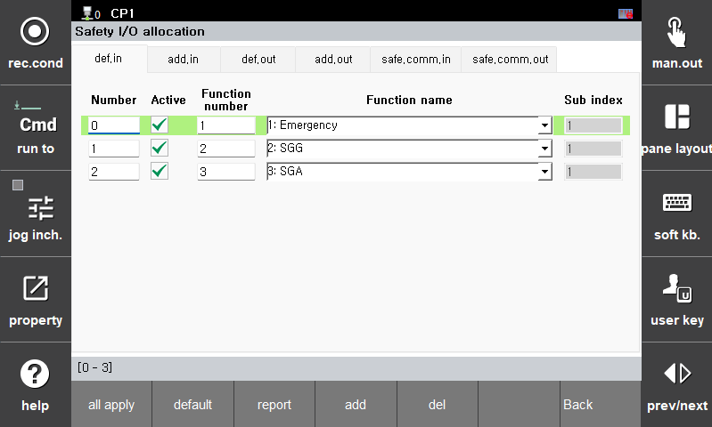
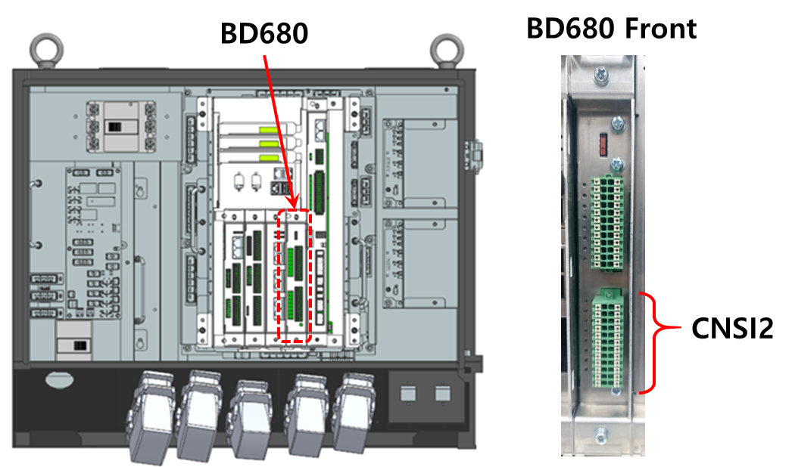

## 3.3. E02310 自动模式安全保护开关已激活

### 1. 概述
在自动模式下检测到安全保护信号。 
在自动模式下，为确保安全，所有机器人动作立即停止，伺服电机切换到电机关闭状态。 

### 2. 原因和检查
 
(1) 自动模式安全保护信号实际上已被激活。 
(2) 在自动模式安全保护电路中发生了接线或接触问题。 
(3) 自动模式安全保护信号的安全输入分配未配置。 


### (1) 当自动模式安全保护信号实际上被激活时
检查自动模式安全保护（SGA）开关是否实际上被触发。  
其他操作员或监督员可能已激活自动模式安全保护（SGA）开关。 
同时，确认没有人员在安全围栏内，并检查机器人周围的潜在危险（工具、夹具等）。  
如果确定可以安全重新启动机器人，释放外部紧急停止按钮，并首先在手动模式下操作机器人。

### (2) 如果在自动模式安全保护电路中存在接线或接触问题
要检查与自动模式安全保护相关的接线，首先检查自动模式安全保护输入分配到哪个输入通道，通过[安全 I/O 分配]功能。  
默认情况下，自动模式安全保护输入分配给基本安全输入的通道2。

系统 -> 8: 安全系统 -> 2: 参数设置 -> 3: 安全 I/O -> 1: 安全 I/O 分配 
 
图 3.3.1. 显示安全 I/O 分配的 T/P 屏幕

#### 2-1) 如果分配给基本安全输入
如果自动模式安全保护输入分配给基本安全输入，它连接到伺服安全板 CNSI1 接头（4 通道）。有关此接头的详细引脚图，请参阅 Hi7 控制器维护手册第 4.3.2.6 节。  
 
图 3.3.2. Hi7-N 控制器上伺服安全板 CNSI1 的位置

检查自动模式安全保护输入分配到哪个通道。输入通道分配可以在上面安全 I/O 分配部分的 T/P 屏幕上确认。  
确认分配的输入通道后，请参阅现场电气图或接线图以验证接线是否正确。在检查实际接线时，还需确认连接器和组件条件。  

在查看电气图或接线图时，请参阅 Hi7 控制器维护手册第 4.3.2.6 节，以获取伺服安全板 CNSI1 的标准接线。

#### 2-2) 如果分配给扩展安全输入  
如果自动模式安全保护输入分配给扩展安全输入，它连接到选项安全 I/O 板的 CNSI2 接头（8 通道）。有关此接头的详细引脚映射，请参阅 Hi7 控制器维护手册第 5.4.6 节。

 
图 3.3.3. Hi7-N 控制器选项安全 I/O 板上 CNSI2 接头的位置

检查自动模式安全保护输入分配到哪个通道。输入通道分配可以在上面的安全 I/O 分配视图的 T/P 屏幕上确认。 
确认分配的输入通道后，请参阅现场电气原理图或接线图以确保接线正确。此外，检查实际接线以验证连接和组件是否正确。 
在检查电气原理图或接线图时，请参阅 Hi7 控制器维护手册第 5.4.6 节，以获取选项安全 I/O 板 CNSI2 的标准接线。

#### 2-3) 如果分配给安全通信输入  
如果外部紧急停止输入分配给安全通信输入，请参考《Hi7 机器人控制器功能手册 - 工业通信》以获取详细信息。

### (3) 如果自动模式安全保护信号的安全输入分配未配置
如果自动模式安全保护输入未在安全输入分配中选择，通过选择以下选项之一来激活自动模式安全保护功能： 
- 基本安全输入  
- 扩展安全输入  
- 安全通信输入 

安全输入分配可以通过以下菜单配置：

系统 -> 8: 安全系统 -> 2: 参数设置 -> 3: 安全 I/O -> 1: 输入/输出分配  
 
图 3.3.4. T/P 屏幕 - 安全输入/输出分配