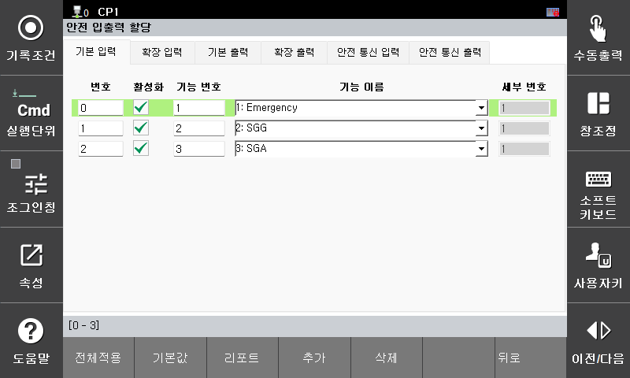

# E02320 일반안전가드 스위치 동작중

## 1. 개요

일반안전가드 신호가 입력되었습니다. 
안전을 확보하기 위해 로봇의 모든 모션은 즉시 정지되며,서보 모터는 모터 오프(Motor OFF) 상태로 전환됩니다.

## 2. 원인 및 점검



(1)	실제로 일반안전가드 신호가 입력된 경우

(2) 일반안전가드 회로의 배선 또는 접점에 이상이 발생한 경우

(3) 일반안전가드 신호에 대한 안전 입력 할당이 설정되지 않은 경우



 
 
 

### (1)	실제로 일반안전가드 신호가 입력된 경우

일반안전가드(SGG) 스위치가 실제로 작동했는지 확인하십시오.
다른 작업자 또는 관리자가 일반안전가드(SGG) 스위치을 작동시켰을 수 있습니다.

또한, 안전 펜스 내부에서 작업자가 작업 중일 가능성이 있으므로
로봇 주변에 인원이 있는지, 또는 위험 요소(공구, 지그 등)가 존재하는지 확인하십시오.

로봇을 재가동해도 안전하다고 판단되는 경우,
외부 비상정지 버튼을 해지한 후 수동 운전 모드에서 로봇을 먼저 동작시키십시오.

 
 
 

### (2) 일반안전가드 회로의 배선 또는 접점에 이상이 발생한 경우

일반안전가드 관련 배선을 점검하기 위해서는,먼저 일반안전가드 입력이 [안전 입출력 할당] 기능을 통해 어떤 입력 채널에 할당되어 있는지 확인하십시오.

기본 설정의 경우, 자동모드 안전가드 입력은 기본 안전 입력의 1번 채널에 할당되어 있습니다.

#### 2-1) 기본 안전 입력에 할당 되어 있을 경우

#### 2-2) 부가 안전 입력에 할당 되어 있는 경우 

#### 2-3) 안전 통신 입력에 할당 되어 있는 경우

 
 
 

### (3) 일반안전가드 신호에 대한 안전 입력 할당이 설정되지 않은 경우

일반안전가드 입력이 안전 입력 할당에서 선택되지 않은 경우,
다음 항목 중 하나를 선택하여 일반안전가드 기능을 활성화하십시오.

- 기본 안전 입력 (Basic Safety Input) 
- 부가 안전 입력 (Extended Safety Input)
- 안전 통신 입력 (Safety Communication Input)

안전 입력 할당 기능은 아래의 메뉴를 통해 설정할 수 있습니다.

시스템 -> 8: 안전시스템 -> 2: 파라미터 설정 -> 3: 안전 IO -> 1:입출력 할당 
 