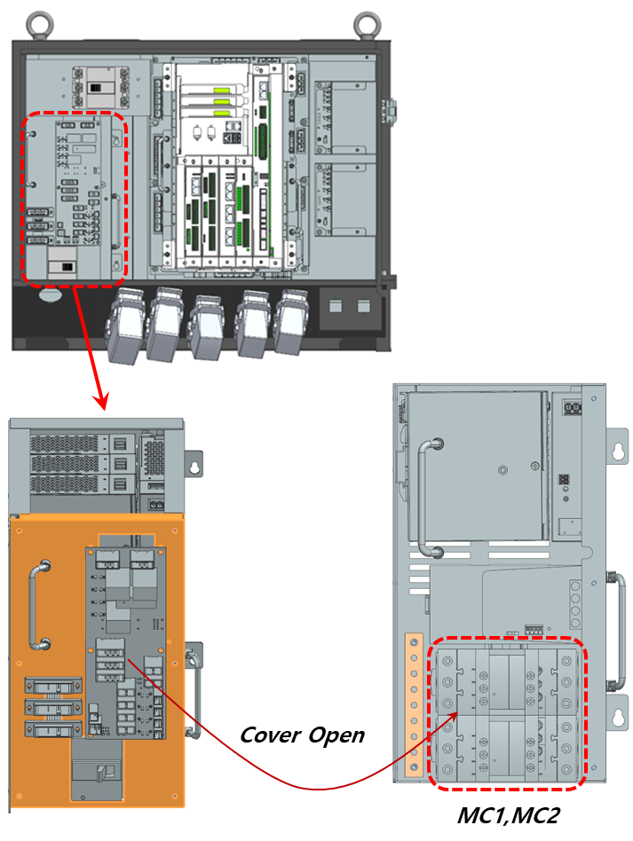
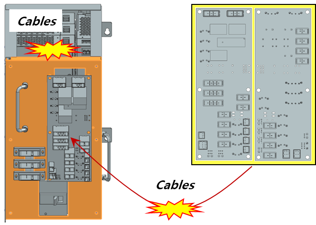
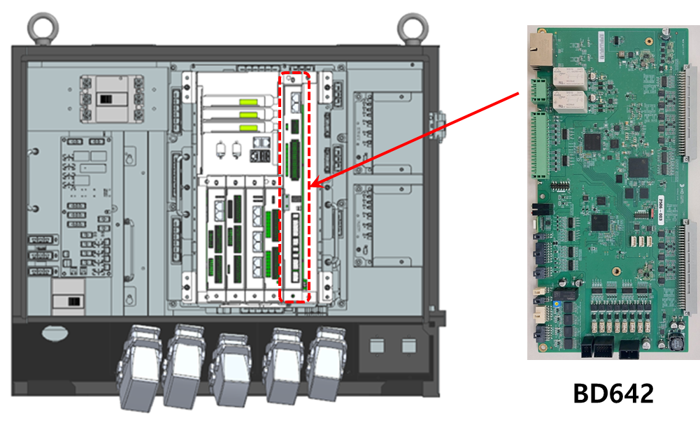

# E51431 (A ch) 전자접촉기 피드백 이상

## 1. 개요

전자접촉기(Magnetic contactor)가 동작하지 않았습니다.

## 2. 원인 및 점검 방법



(1)	모니터링 계통을 점검하십시오. 
(2)	마그네트 MC를 점검하십시오. 
(3)	전장보드를 점검하십시오. 
(4)	전원공급모듈(H6PSM30)를 점검하십시오. 
(5)	서보앰프를 점검하십시오. 



### (1)	모니터링 계통을 점검하십시오.
전자접촉기가 설치되어 있는 전장모듈(PSM or PDM)과 모니터링 신호를 수집하는 서보안전 보드 간의 케이블링을 확인합니다. 케이블 이름은 CNPRC, CNPRC1이며 서보안전 보드의 신호가 백플레인 보드를 통하여 전장모듈로 들어 갑니다. 이 케이블의 커넥터 접속상태를 점검하십시오.

 
그림 3.5.1 Hi7-N제어기

### (2)	마그네트 MC를 점검하십시오.
전장모듈 내부에 있는 마그네트 MC1, MC2가 정상적으로 동작하는지 점검하십시오.

 
그림 3.5.2 Hi7-N제어기(전장모듈의 내부에 설치된 마그네트 MC1, MC2)

### (3)	전장보드를 점검하십시오.

서보안전 보드와 마그네트를 중계하는 전장보드, 케이블 배선에 문제가 있을 수 있으므로 점검 또는 교체하십시오.

 
그림 3.5.3 Hi7-N제어기(전장모듈의 내부에 설치된 전장보드)

### (4)	서보안전 보드를 교체 시험하십시오.

서보안전 보드를 교체한 후 에러가 발생하지 않으면 서보안전 보드의 전자접촉기 제어 및 피드백 부분의 고장으로 판단할 수 있습니다.

 
그림 3.5.4 Hi7-N제어기 서보안전보드 교체

