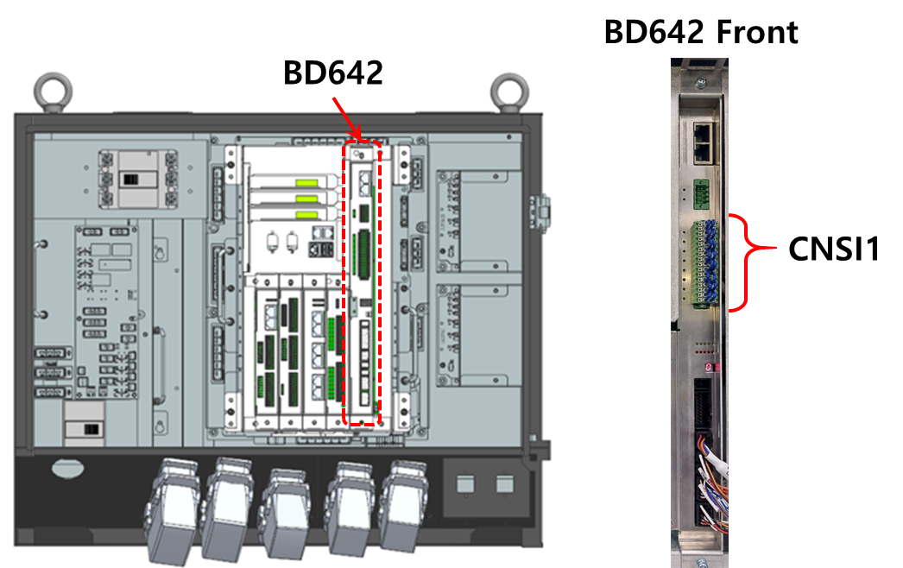
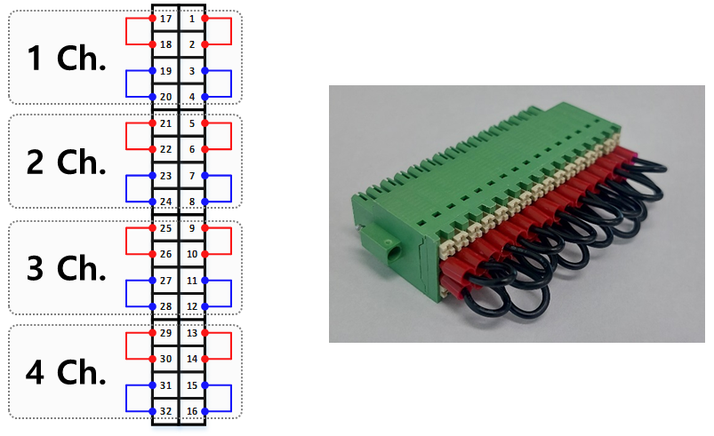
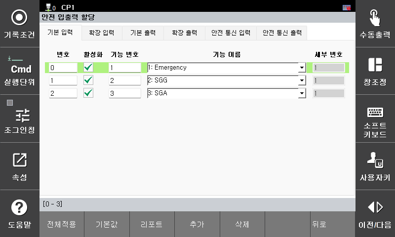
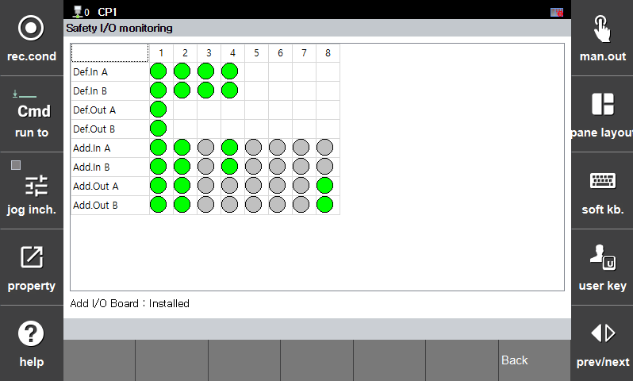
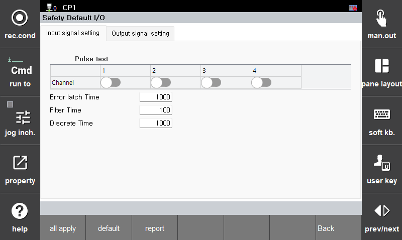

## 3.6. E52042 (0 ch) Safety Input Signal Mismatch


When checking the safety input wiring, always ensure that the controller power is **OFF** before performing the inspection.


### 1. Overview

A mismatch has been detected between the redundant safety input signals on the basic safety input channel.  
To ensure safety, the affected input signal is treated as **Fail-Safe (Open or 0)**.

### 2. Causes and Inspection


(1) Signal differences caused by wiring errors or disconnections  
(2) Noise caused by terminal blocks or cable conditions  
(3) Incorrect safety signal parameters (filter settings, allowed mismatch time)


### (1) Signal Differences Caused by Wiring Errors or Disconnections

A safety input signal mismatch indicates a discrepancy between the safety input signals connected to the Servo Safety Board CNSI1 connector (total 4 channels).  
For detailed pin mapping of this connector, refer to **Hi7 Controller Maintenance Manual, Section 4.3.2.6**.

 
Figure 3.6.1. Hi7-N Controller Servo Safety Board CNSI1 Position

1) When the safety input signal is not used  
If the error occurs on a channel that is not in use, verify that the external wiring is as shown below. Also, check that the connector and wires are properly assembled and making good contact.

 
Figure 3.6.2. Wiring Diagram for Unused Servo Safety Board CNSI1 Channel
 

2) When the safety input signal is in use  
If the error occurs on a channel that is being used, first check which input channel the signal is assigned to. Input channel assignments can be verified through the following menu:

 
System -> 8: Safety System -> 2: Parameter Settings -> 3: Safety IO -> 1: Input/Output Assignment

 
Figure 3.6.3. T/P Screen – Safety Input Assignment

Once the input channel assignment is confirmed, refer to the site’s electrical schematics or wiring diagrams to ensure proper wiring. Also, inspect the actual wiring for correct connections and assembly.  
For wiring standards of the Servo Safety Board CNSI1, refer to **Hi7 Controller Maintenance Manual, Section 4.3.2.6**.

### (2) Noise caused by terminal blocks or cable condition

#### Safety Input Signal Monitoring Function  
A monitoring screen for safety input signals is available on the T/P. It can monitor at 0.5-second intervals, allowing for basic verification.

System -> 8: Safety System -> 3: Monitoring -> 3: Safety IO Status  
 
Figure 3.6.4. T/P Screen – Safety IO Monitoring

### (3) Safety Signal Parameter Setting Error (Filter, Mismatch Allow Time)

If the filter time for the safety input signal is too short, or the allowed mismatch time is set excessively short, safety input signal mismatch alarms may occur frequently.  
The recommended default settings for safety input signals are as follows. These values can be adjusted according to the field environment and application conditions.

- Filter Time: 100 (msec)  
- Allowed Mismatch Time: 1000 (msec)  

System -> 8: Safety System -> 2: Parameter Setting -> 3: Safety IO -> 2: Basic IO  
 
Figure 3.6.5. T/P Screen – Basic IO Settings
