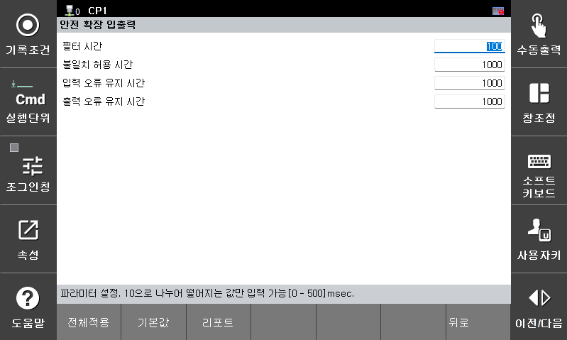

# E52043 (0 ch) 부가 안전 입력 신호의 불일치

## 1. 개요

부가 안전 입력 채널에서 이중화된 안전 입력 신호 간 불일치가 감지되었습니다. 
안전을 확보하기 위해 해당 입력 신호는 **Fail-Safe 상태(Open 또는 0)**로 처리됩니다.

## 2. 원인 및 점검



(1) 배선의 오류 or 단선에 의한 신호 차이 발생

(2) 단자대 및 케이블 상태에 의한 노이즈 발생

(3) 안전 신호 파라미터의 설정 오류 (필터, 불일치 허용 시간)



 
 
 

### (1) 배선의 오류 or 단선에 의한 신호 차이 발생

 
 
 

### (2) 단자대 및 케이블 상태에 의한 노이즈 발생

#### 안전 입력 신호의 모니터링 기능
시스템 -> 8: 안전시스템 -> 3: 모니터링 -> 3: 안전 IO 상태 
 

 
 
 

### (3) 안전 신호 파라미터의 설정 오류 (필터, 불일치 허용 시간)

입력 신호의 필터 시간이 너무 짧거나, 불일치 허용 시간이 과도하게 짧게 설정된 경우, 안전 입력 신호 불일치 알람이 빈번하게 발생할 수 있습니다.

기본적으로 권장하는 안전 입력 신호의 설정 값은 아래와 같습니다.
해당 값은 현장 환경 및 적용 조건에 따라 조정하여 사용할 수 있습니다.

- 필터 시간 : 100 (msec)
- 불일치 허용 시간 : 1000 (msec)

시스템 -> 8: 안전시스템 -> 2: 파라미터 설정 -> 3: 안전 IO -> 3:확장 입출력 
 