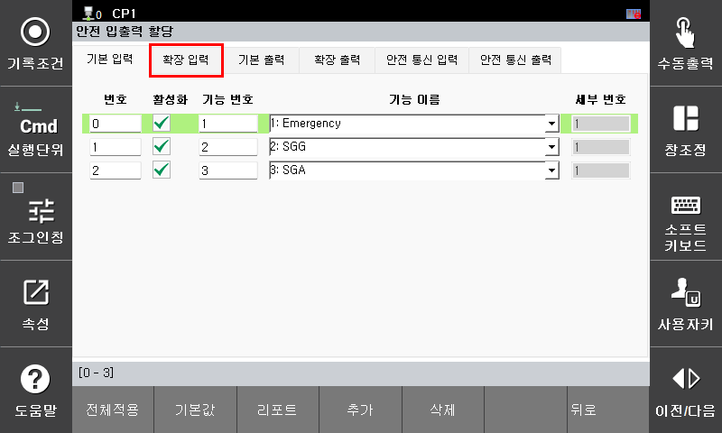
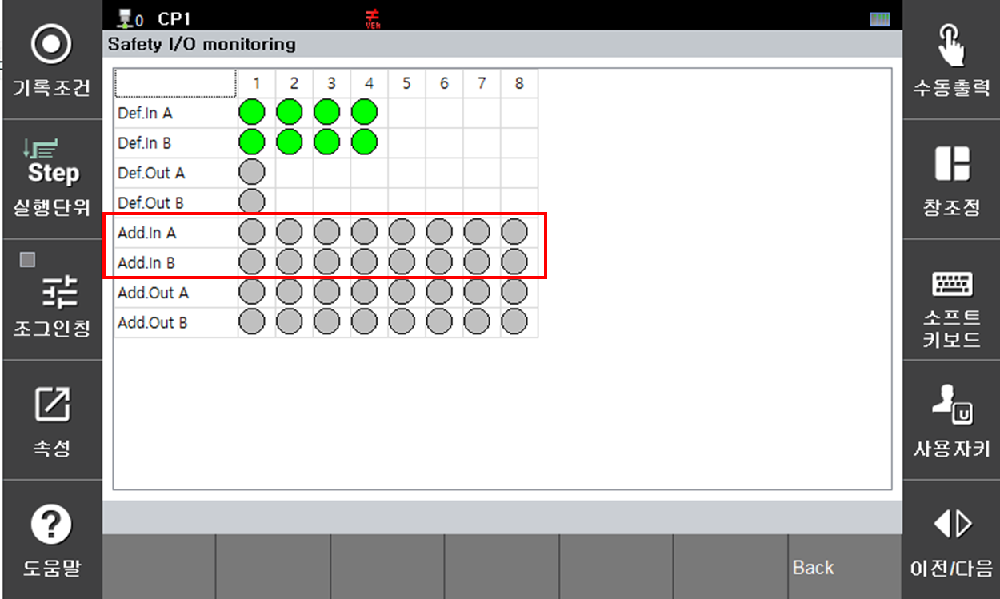
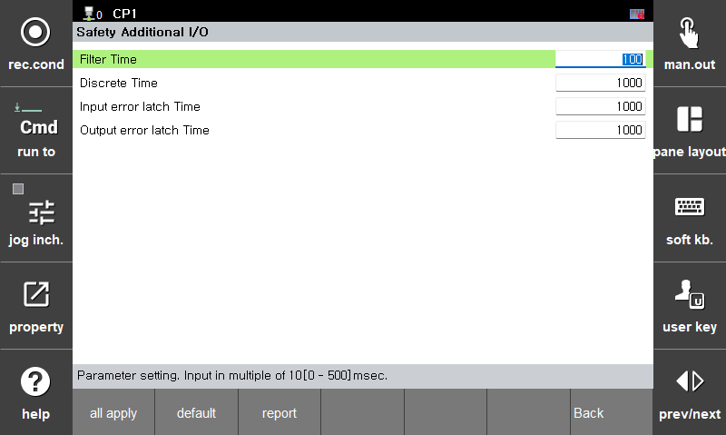

## 3.7. E52043 (0 ch) 부가 안전 입력 신호의 불일치


부가 안전입력 결선 확인작업 시, 반드시 제어기 전원을 OFF한 상태에서 확인작업 하시기 바랍니다.


### 1. 개요

부가 안전입력 채널에서 이중화된 안전 입력신호 간 불일치가 감지되었습니다. 
안전을 확보하기 위해 해당 입력 신호는 **Fail-Safe 상태(Open 또는 0)**로 처리됩니다.

### 2. 원인 및 점검


(1) 배선의 오류 또는 단선에 의한 신호 차이 발생
(2) 단자대 및 케이블 상태에 의한 노이즈 발생
(3) 안전 신호 파라미터의 설정 오류(필터, 불일치 허용 시간)


### (1) 배선의 오류 또는 단선에 의한 신호 차이 발생
부가 안전입력 신호 불일치는 옵션 안전IO 보드 CNSI2 커넥터(총 8채널)에 연결된 부가 안전입력 신호의 불일치를 나타냅니다. 해당 커넥터의 자세한 핀맵은 Hi7 제어기 보수 설명서 5.4.6.절을 참고하세요.

 
그림 3.7.1. Hi7-N제어기 옵션 안전IO 보드 CNSI2 위치 

1) 부가 안전입력 신호를 사용하는 경우 
해당 에러가 발생된 채널이 사용되는 경우, 해당 입력채널이 어떤 입력채널에 할당되어 있는지 확인하십시오. 부가 안전입력 채널의 할당은 아래 메뉴를 통해 확인 가능합니다.
 
시스템 -> 8: 안전시스템 -> 2: 파라미터 설정 -> 3: 안전 IO -> 1:안전 입출력 할당 -> 확장 입력 
 
그림 3.7.2. T/P 화면 부가 안전 입출력 할당 화면 
 
해당 부가 안전입력 채널 할당된 것이 확인되면 해당 현장의 전기도면 또는 배선도면을 참조하여 도면과 실제 배선이 제대로 되어 있는지 확인합니다. 또한, 실제 배선을 확인하면서 연결 또는 조립 상태를 확인합니다. 
전기도면 또는 배선도면 확인 시, 옵션 안전 IO 보드 CNSI2의 결선 표준은 Hi7 제어기 보수 설명서 5.4.6.절을 참고하세요.

### (2) 단자대 및 케이블 상태에 의한 노이즈 발생

#### 부가 안전입력 신호의 모니터링 기능 
부가 안전입력 신호에 대한 모니터링 화면이 T/P에 구성되어 있습니다. 0.5초 주기로 모니터링이 가능하므로 기본적인 확인은 가능합니다.

시스템 -> 8: 안전시스템 -> 3: 모니터링 -> 3: 안전 IO 상태 
 
그림 3.7.3. T/P 화면 안전 IO 모니터링 화면 

### (3) 안전 신호 파라미터의 설정 오류 (필터, 불일치 허용 시간)

부가 안전입력 신호의 필터 시간이 너무 짧거나, 불일치 허용 시간이 과도하게 짧게 설정된 경우, 부가 안전입력 신호 불일치 알람이 빈번하게 발생할 수 있습니다. 
기본적으로 권장하는 부가 안전입력 신호의 설정 값은 아래와 같습니다. 해당 값은 현장 환경 및 적용 조건에 따라 조정하여 사용할 수 있습니다. 
- 필터 시간 : 100 (msec)
- 불일치 허용 시간 : 1000 (msec)

시스템 -> 8: 안전시스템 -> 2: 파라미터 설정 -> 3: 안전 IO -> 3:확장 입출력 
 
그림 3.7.4. T/P 화면 부가 안전 입출력 설정 화면 
