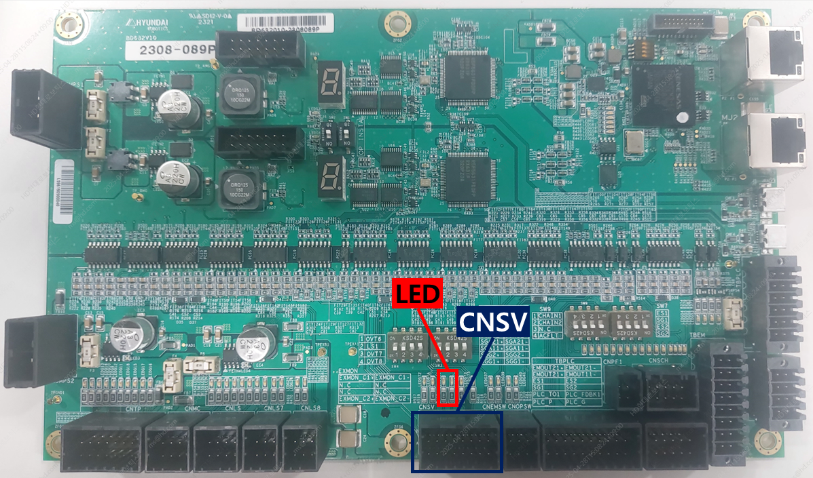

# E64003 서보보드(BD640) 상태 입력 에러

## 1. 개요

안전보드(BD632)가 서보보드(BD640)상태 입력 신호가 비정상 상태로 입력 되고 있다고 확인 하였습니다. 서보보드(BD640)의 점검이 필요합니다.

## 2. 원인 및 점검



(1)	CNSV커넥터, 배선의 상태를 점검하십시오. 
(2)	서보보드(BD640)를 점검하시오. 
(3)	안전보드(BD632)를 점검하십시오. 



(1)	CNSV커넥터, 배선의 상태를 점검하십시오.

* 서보보드(BD640)와의 연결상태를 점검하는 방법
 

1)	LED 점멸 상태 확인 (H6COM-T가 완전히 부팅이 된후 (전원투입 후 약 50초) 관찰)
2개의 LED가 약 0.5초 간격으로 점멸해야 정상
2)	CNSV 커넥터 체결 상태 확인
3)	CNSV케이블 점검 
4)	안전보드(BD632) 접지 상태 점검 (접지 케이블, 접지 단자 체결 상태)

(2)	서보보드(BD640)를 점검하시오.
* 서보보드(BD640)를 점검하는 방법
 

1)	순차적으로 값이 변경되는 FND 상태를 확인 (H6COM-T가 완전히 부팅이 된후 (전원투입 후 약 50초) 관찰)
FND 동작 안할 시 : 24V 전원 확인, 보드 교체
FND 값 P.001 : 초기화 진행 중. P.002로 변경 되지 않을 시 EtherCAT 연결상태 점검. BD632 부팅 상태 및 메인 컴 부팅 상태 점검
FND 값 P.002 : 초기화 완료

2)	초기화 완료 시에도 서보 보드 에러 발생 시 main com, 서보 보드(BD640), 안전 보드(BD632)의 버전 호환성을 점검 하십시오.

3)	버전 호환성을 맞춰도 에러가 지속해서 발생한다면 서보 보드(BD640) 교체 필요

 
(3)	안전보드(BD632)를 점검하십시오.

* 안전보드(BD632)를 점검하는 방법
 
 

1)	IO 전원 상태를 확인하는 방법 
A.	위 그림의 두개의 LED가 녹색 점등 상태 인지를 확인 
B.	IO 전원 LED가 적색 또는 소등인 경우 표시된 퓨즈가 정상 상태인지를 확인한다. 
C.	퓨즈가 끊겼다면 퓨즈를 교체하여 준다. 

2)	모터온시 IO전원이 불안정한 상태인지 확인 
A.	모터온시에 IO 전원 LED가 녹색 점등 상태 인지를 확인한다.  
B.	모터온 순간 적색으로 변하거나 소등되다면 모터온시 IO 전원이 불안정한 상태 임 

3)	IO 전원 상태가 불안정한 경우 
A.	IO 전원 커넥터 체결 상태 확인 
B.	IO 전원 케이블 점검 
C.	안전보드(BD632) 접지 상태 점검 (접지 케이블, 접지 단자 체결 상태) 
