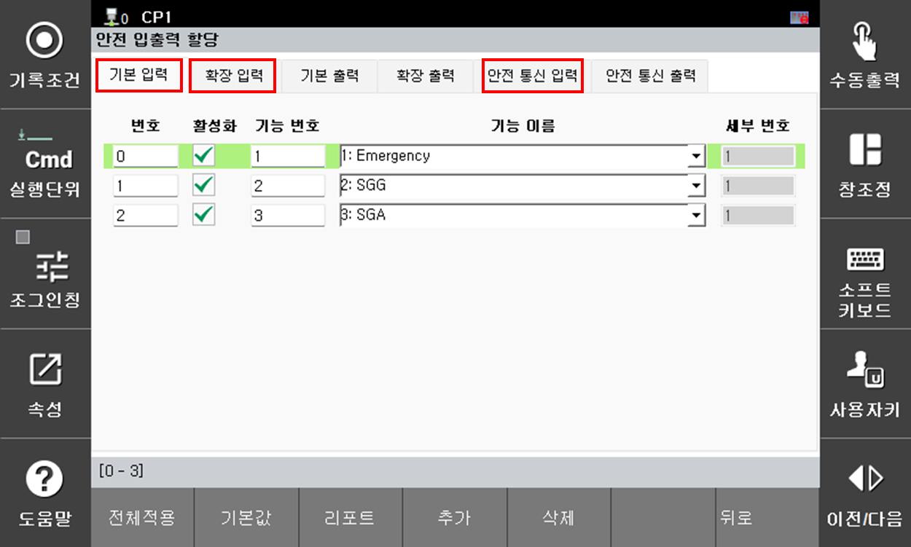

## 3.1. N00088 외부비상정지 입력
### 1. 개요
외부 비상정지(E-Stop) 신호가 입력되었습니다. 
안전을 확보하기 위해 로봇의 모든 모션은 즉시 정지되며,서보 모터는 모터 오프(Motor OFF) 상태로 전환됩니다.

### 2. 원인 및 점검

(1) 실제 외부 비상정지(E-Stop) 버튼이 작동한 경우 
(2) 외부 비상정지 회로의 배선 또는 접점에 이상이 발생한 경우 
(3) 외부 비상정지 신호에 대한 안전 입력 할당이 설정되지 않은 경우 
 

### (1) 실제 외부 비상정지 버튼이 작동한 경우
외부 비상정지(E-Stop) 버튼이 실제로 작동했는지 확인하십시오. 다른 작업자 또는 관리자가 외부 비상정지 버튼을 작동시켰을 수 있습니다. 
또한, 안전 펜스 내부에서 작업자가 작업 중일 가능성이 있으므로 로봇 주변에 인원이 있는지, 또는 위험 요소(공구, 지그 등)가 존재하는지 확인하십시오. 
로봇을 재가동해도 안전하다고 판단되는 경우, 외부 비상정지 버튼을 해지한 후 수동 운전 모드에서 로봇을 먼저 동작시키십시오. 

### (2)	외부 비상정지 회로의 배선 또는 접점에 이상이 발생한 경우
외부 비상정지 관련 배선을 점검하기 위해서는 외부 비상정지 입력이 [안전 입출력 할당] 기능을 통해 어떤 입력 채널에 할당되어 있는지 확인하십시오. 
기본 설정의 경우(공장출하 시), 외부 비상정지 입력은 기본 안전입력 0번 채널에 할당되어 있습니다.

시스템 -> 8: 안전시스템 -> 2: 파라미터 설정 -> 3: 안전 IO -> 1:안전 입출력 할당 
 
그림 3.1.1. T/P 화면 안전 입출력 할당 화면 

#### 2-1) 기본 안전입력에 할당되어 있는 경우
외부 비상정지 입력이 기본 안전입력에 할당되어 있는 경우, 서보안전 보드 CNSI1 커넥터(4채널)에 연결되어 있습니다. 해당 커넥터의 자세한 핀맵은 Hi7 제어기 보수 설명서 4.3.2.6.절을 참고하세요.

 
그림 3.1.2. Hi7-N제어기 서보안전 보드 CNSI1 위치 

외부 비상정지 입력이 어떤 채널에 할당되어 있는지 확인하십시오. 입력채널의 할당은 그림 3.1.1.을 통해 확인 가능합니다. 
해당 입력채널 할당된 것이 확인되면 해당 현장의 전기도면 또는 배선도면을 참조하여 제대로 배선되어 있는지 확인합니다. 또한, 실제 배선을 확인하면서 연결 또는 조립 상태를 확인합니다. 
전기도면 또는 배선도면 확인 시, 서보안전 보드 CNSI1의 결선 표준은 Hi7 제어기 보수 설명서 4.3.2.6.절을 참고하세요.

#### 2-2) 부가 안전입력에 할당되어 있는 경우 
외부 비상정지 입력이 부가 안전입력에 할당되어 있는 경우, 옵션 안전IO 보드 CNSI2 커넥터(8채널)에 연결되어 있습니다. 해당 커넥터의 자세한 핀맵은 'Hi7 제어기 보수 설명서' 5.4.6.절을 참고하세요.

 
그림 3.1.3. Hi7-N제어기 옵션 안전IO 보드 CNSI2 위치 

외부 비상정지 입력이 어떤 채널에 할당되어 있는지 확인하십시오. 입력채널의 할당은 그림 3.1.1.을 통해 확인 가능합니다. 
해당 입력채널 할당된 것이 확인되면 해당 현장의 전기도면 또는 배선도면을 참조하여 제대로 배선되어 있는지 확인합니다. 또한, 실제 배선을 확인하면서 연결 또는 조립 상태를 확인합니다. 
전기도면 또는 배선도면 확인 시, 옵션 안전 IO 보드 CNSI2의 결선 표준은 'Hi7 제어기 보수 설명서' 5.4.6.절을 참고하세요.

#### 2-3) 안전 통신입력에 할당되어 있는 경우
외부 비상정지 입력이 안전 통신입력에 할당되어 있는 경우, 'Hi7 로봇제어기 기능설명서-산업용 통신'메뉴얼을 참고하세요.

### (3) 외부 비상정지 신호에 대한 안전입력 할당이 설정되지 않은 경우
외부 비상정지 입력이 안전입력 할당에서 선택되지 않은 경우, 다음 항목 중 하나를 선택하여 외부 비상정지 기능을 활성화하십시오. 

- 기본 안전 입력 (Basic Safety Input) 
- 부가 안전 입력 (Extended Safety Input) 
- 안전 통신 입력 (Safety Communication Input) 

안전 입력 할당 기능은 아래의 메뉴를 통해 설정할 수 있습니다.

시스템 -> 8: 안전시스템 -> 2: 파라미터 설정 -> 3: 안전 IO -> 1:안전 입출력 할당 
 
그림 3.1.4. T/P 화면 안전 입출력 할당 화면 

