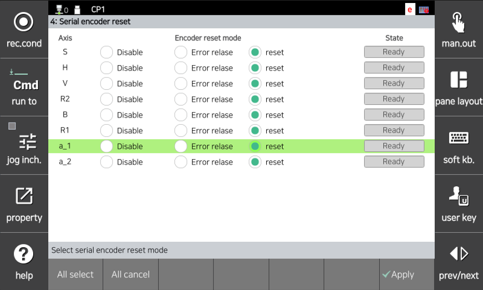

## 4.1. E02470. (O 轴) 编码器错误：需要重置

### 1. 概述

为了使编码器能够保存电机的位置数据，必须始终为编码器提供电源。

通过保持控制器电源开启或通过编码器备用电池为编码器供电。如果在编码器备用电池放电时关闭控制器电源，将发生错误，因为编码器失去了其位置信息。

类似地，当更换电机时，发生相同的错误，因为新电机的编码器已处于未供电的状态。

由于重置编码器会改变相应轴的参考位置信息，您必须通过手动操作轴坐标系统将机器人移动到参考姿势，并重新执行该轴的编码器校准。

### 2. 原因和检验



(1) 检查编码器电池电压。 
(2) 检查编码器电池接线状态。 
(3) 执行电机更换测试。 
(4) 重置编码器后，必须在机器人的参考位置重新执行编码器校准。 



(1) 检查编码器电池电压。 
编码器电池为3.6V。如果电压降至3.0V~3.2V，将显示为"W0104 ○ 轴编码器电池电压低。" 当出现此警告时，应更换编码器电池。更换编码器电池时，控制器电源必须保持开启。如果在这种状态下更换为正常的编码器电池，机器人可以继续无故障使用。

如果超过了编码器电池更换的时间且电池电压降至2.5V~3.0V，则会发生错误"E2470 轴 ○ 编码器异常：需要重置编码器"。当发生此错误时，编码器的位置数据已丢失。更换编码器电池并重置编码器后，您必须通过手动操作轴坐标系统将机器人移动到参考姿势，并重新执行该轴的编码器校准。

 
图 4.1.1 编码器电池更换位置

编码器重置在以下菜单中执行。

    系统 -> 5. 初始化 -> 4. 串行编码器重置

 
图 4.1.2 串行编码器重置

(2) 检查编码器电池接线状态。 
检查连接从编码器电池位置到电机的电池接线状态。

(3) 执行电机更换测试。 
如果上述措施不能解决问题，编码器本身很可能出现故障。执行电机更换测试。