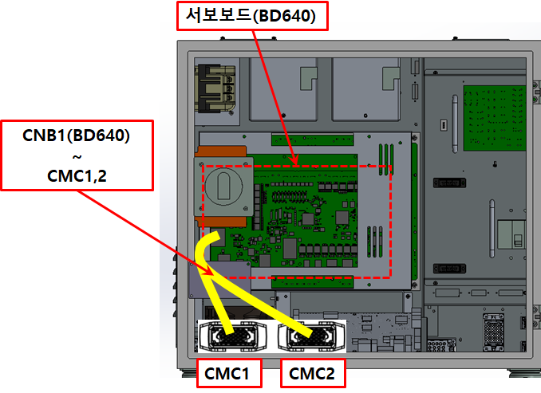
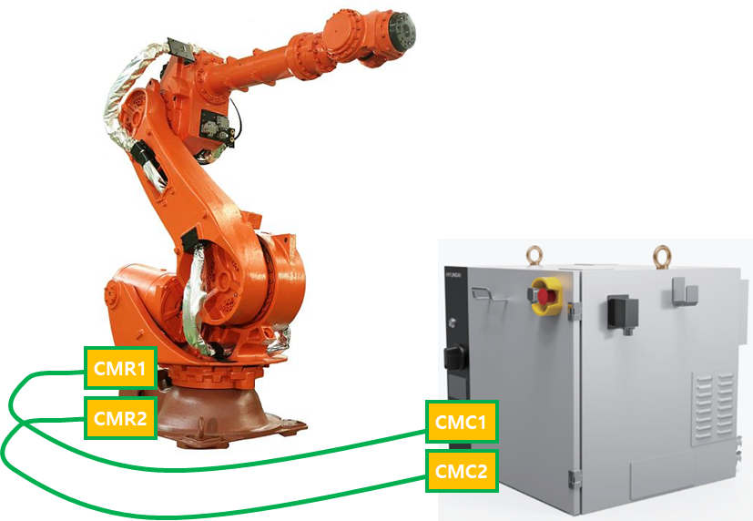
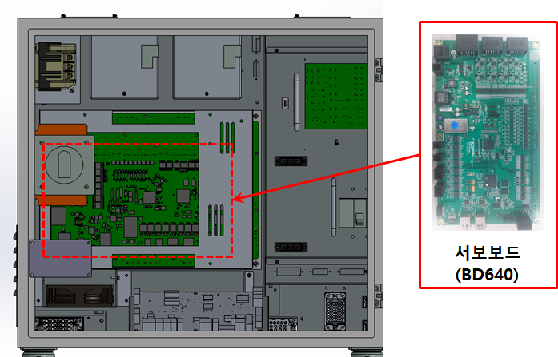

# E02564. (O축) 브레이크 출력 과전류 검지

## 1. 개요

서보안전 보드(BD642)에서는 브레이크 출력 회로의 과전류 상태를 감시하고 있으며, 출력 회로에 연결된 보호 회로(IC)로부터 Fault 신호가 감지되면 과전류 상황으로 판단하여 에러를 발생시킵니다. 이러한 이상 상태가 발생하면 브레이크 제어의 신뢰성을 보장할 수 없기 때문에, 서보 보드는 즉시 이를 감지하고 로봇을 안전하게 정지시킵니다.

## 2. 원인 및 점검



(1)	브레이크 배선을 점검하십시오. 
(2)	서보안전 보드(BD642)를 점검 하십시오. 



(1)	브레이크 배선을 점검하십시오. 
브레이크 배선점검 순서는 다음과 같습니다. 
1차: 브레이크 배선에 관련된 커넥터들의 접촉 불량여부를 점검하십시오. 
2차: 브레이크 배선의 단락 유무를 점검하십시오. 멀티미터(테스터기)와 같은 장비를 이용하여 각 축의 배선을 1:1로 체크하십시오. 
3차: 브레이크 배선을 교체시험 하십시오. 

브레이크 배선이 단선되지 않고 접촉불량, 브레이크 파워선과 타 전력선 또는 로봇 본체 금속부위와의 접촉 등의 현상이 있을 경우에는 단락유무 검사로는 검사할 수 없으므로 배선 교체시험을 하여 주십시요.

* 제어기 내부 배선을 점검하십시오. 
Hi7-N 제어기의 경우, CNB1(BD640) 커넥터와 CMC1, CMC2 간의 배선을 점검하십시오.

 
그림 4.48 N제어기 브레이크 출력 배선

* 제어기와 로봇간의 배선을 점검하십시오. 
Hi7-N제어기의 경우, CMC1과 CMR1 그리고 CMC2와 CMR2 간의 배선을 점검하십시오.

 
그림 4.50 N제어기 브레이크 출력 배선

(2)	서보안전 보드를 교체 시험하십시오. 
서보안전 보드를 교체한 후 에러가 발생하지 않으면 서보 보드의 엔코더 데이터 수신부의 고장으로 판단할 수 있습니다.

 
그림 4.52 N제어기 서보보드 교체

