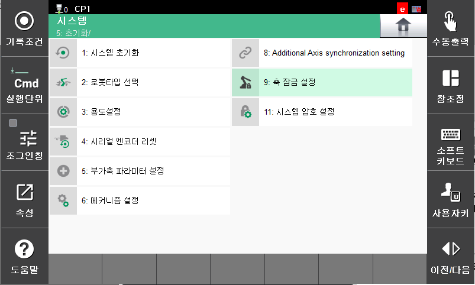
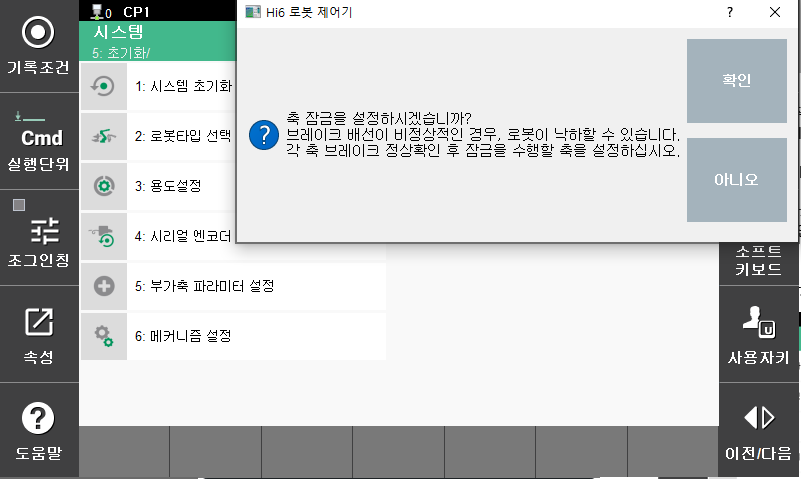
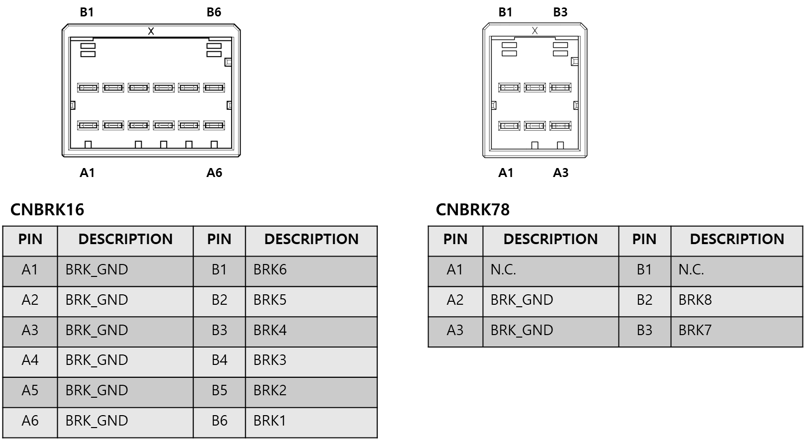
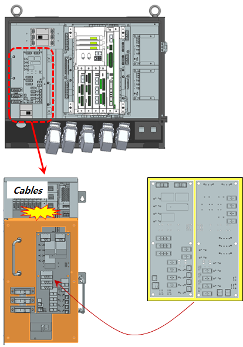
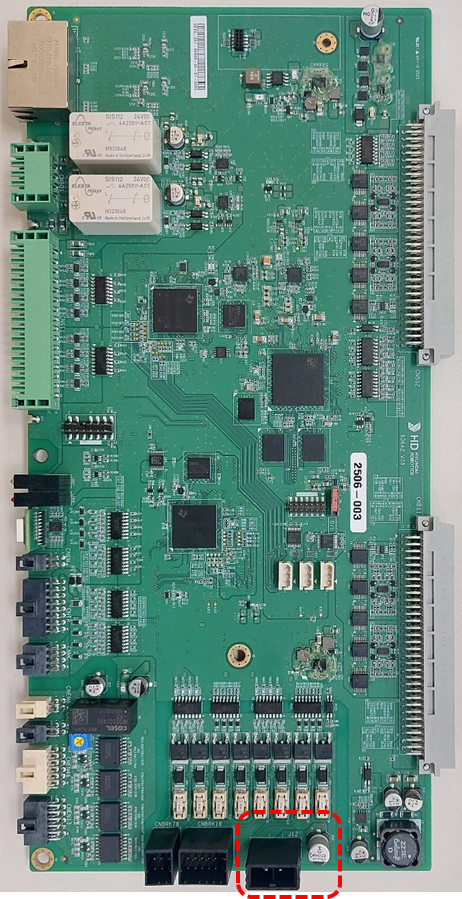

# E02632. (O축) 위치편차초과 - 브레이크전압 저하

## 1. 개요

위치편차가 설정치 보다 큽니다. 서보제어에 의한 로봇 동작 중 이동명령위치와 실제위치와의 차이가 너무 큰 경우, 서보안전 보드는 서보연산 중 에러를 감지하고 로봇을 정지시킵니다.
이 에러는 위치편차가 크면서 브레이크전압 저하가 검지되었을 때 발생합니다.

## 2. 원인 및 점검



(1)	브레이크 해제가 정상적으로 작동되는지 확인하십시오.
* 개별 축 브레이크 해제 이상 점검
* 브레이크용 전원이상 점검



(1)	브레이크 해제가 정상적으로 작동되는지 확인하십시오. 
해당 축 브레이크의 해제기능에 문제가 있거나 브레이크 해제전압의 이상일 수 있습니다.
 * 개별 축 브레이크 해제 이상 점검 
축 잠금 기능을 사용하여 해당 축 브레이크 해제 기능 작동을 확인하십시오.
확인 하려는 축을 제외하고 축 잠금을 한 뒤 모터 온/오프를 반복하여 기구부의 모터에서 브레이크 해제 소리(“딸깍”)가 들리는지 확인하십시오.

축 잠금 기능을 사용하는 방법은 아래와 같습니다. 

        시스템 -> 5. 초기화 -> 9. 축 잠금 설정 -> 확인 -> 개별 축 축잠금

 
그림 4.16.1 축 잠금 설정화면1

 
그림 4.16.2 축 잠금 설정화면2

 
그림 4.16.3 축 잠금 설정화면3

해당 축의 브레이크가 해제되지 않는다면 서보안전 보드의 브레이크 출력상태를 확인해야 합니다. 브레이크 배선(CNBRK16, CNBRK78 커넥터)를 제거하고 브레이크 전압을 출력하십시오. CNBRK16, CNBRK78 커넥터에서 해당 축의 브레이크 전압이 20V 이상으로 출력되는지 측정하십시오. 20V 이하의 전압으로 출력되는 축이 있다면 서보안전 보드(BD642)의 고장이므로 고체하십시오.

 
그림 4.16.4 CNBRK16, CNBRK78 커넥터의 핀배치

 * 브레이크용 전원이상 점검 
    브레이크 전원 배선점검 순서는 다음과 같습니다. 
    1차: 브레이크 전원 배선에 관련된 커넥터들의 접촉 불량여부를 점거하십시오. 
    2차: 브레이크 전원 배선의 단락 유무를 점검하십시오. 멀티미터(테스터기)와 같은 장비를 이용하여 1:1로 체크하십시오. 

    파워전장모듈 내부 배선을 점검하십시오.

 
그림 4.16.5 전장모듈 및 전장보드

* 서보안전 보드(BD642)를 점검 하십시오. 
파워전장모듈이 정상이라면 서보안전 보드에서 브레이크 전원(DC24V)을 측정하십시오. 아래 그림의 빨간색 구역에 캐패시터 양단(EC9) 또는 커넥터(J12) 양단의 측정 값이 DC24V 이상 되어야 정상입니다. 만약 20V 미만이라면 브레이크 전원을 생성하는 전원 장치의 이상입니다. 전장모듈을 교체하십시오.

 
그림 4.16.6 서보보드 브레이크 전원

    
