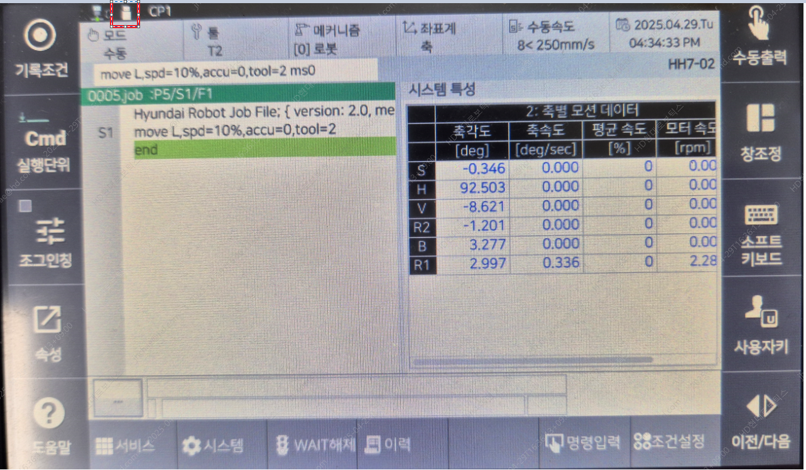

# E02670. (O축) 지령치 이상

## 1. 개요

메인보드와 서보안전 보드 간 통신이상이나 급격한 모션변화에 의해서 에러가 발생할 수 있습니다.  
보드간 통신 문제가 발생하면 정상적인 지령이 메인보드에서 서보안전 보드로 전달되지 못하며, 이때 잘못된 지령으로 로봇이 이상 동작을 할 수 있으므로 에러를 발생시키고 로봇을 정지시킵니다. 
또한, 급격한 모션의 경우 구동장치가 위치 지령을 추종하지 못하는 경우가 발생되므로 에러를 발생시키고 로봇을 정지시킵니다.

## 2. 원인 및 점검



(1)	메인보드와 서보보드가 올바로 설치되어 있는지 점검하십시오. 
* 보드가 올바르게 설치되어 있는지 점검하십시오. 
* 보드 이상여부를 점검하십시오. 

(2)	로봇이 급격하게 동작하는 작업 프로그램이 있는지 점검하십시오. 



(1)	메인보드와 서보안전 보드가 올바르게 설치되어 있는지 점검하십시오.

메인보드와 서보안전 보드가 랙에 올바로 설치되어 있지 않거나 보드에 문제가 있으면 통신에 문제가 되어 에러가 발생할 수 있습니다.

---

### ⚠️ 경고(Warning)

**이전 작업 프로그램을 보호하기 위해서 보드를 랙에서 제거하기 전에 반드시 메인보드의 모든 파일을 USB 메모리를 이용하여 백업하시기 바랍니다.**

---

USB 메모리에 메인보드 파일을 백업하는 방법은 다음과 같습니다.

 
그림 4.23.1 TP USB 연결

USB가 TP에서 인식되면 화면 위에 다음과 같은 아이콘으로 표시됩니다.

 
그림 4.23.2 TP USB 인식

파일을 백업하기 위해서 아래의 경로로 진입합니다.

            서비스 -> 5. 파일관리

 
그림 4.23.3 백업 단계1

 
그림 4.23.4 백업 단계2

Project 폴더를 USB에 복사합니다.

* 보드가 올바르게 설치되어 있는지 점검하십시오. 
보드 간 인터페이스인 EtherCAT 케이블 연결 상태를 점검하십시오. 제거 후 다시 설치하시기 바랍니다.

 
그림 4.23.5 N제어기 EtherCAT 케이블 연결

* 보드 이상여부를 점검하십시오. 
보드 이상 여부를 판단하기 위해서 보드 교체를 하시기 바랍니다.

(2)	로봇이 급격하게 동작하는 작업 프로그램이 있는지 점검하십시오. 
로봇 동작 중 급격하게 모션이 변하는 구간에서 에러가 발생하는지 확인하십시오.
만약, 급격한 모션 중에 에러가 발생한다면 작업 프로그램의 수정이 필요합니다. 
급격한 모션에서 에러가 발생하는 원인은 다음과 같습니다. 작업 프로그램을 수행할 때 짧은 구간을 이동하면서 불가피하게 로봇의 자세가 많이 틀어지는 경우가 있습니다. 이 때, 로봇의 축 속도가 갑자기 높아지게 되고 이를 서보보드에서 추종하지 못할 경우 에러가 발생하게 됩니다. 해결하는 방법은 자세가 급격히 변하는 지점의 티칭 포인트를 수정하거나 로봇 자세를 바꾸어 주면 됩니다. 

