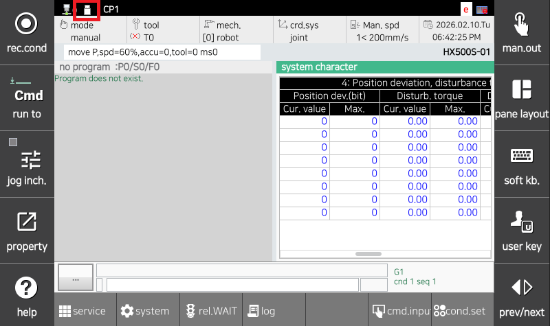
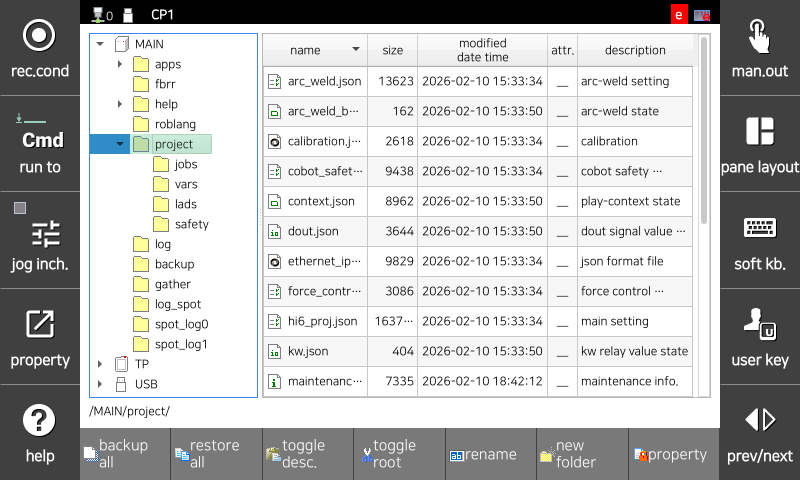

## 4.2. E02670. (O轴) 命令值异常

### 1. 概述

由于主板和伺服安全板之间的通信异常或由于突然的运动变化，可能会发生错误。  
如果板之间发生通信问题，正常命令无法从主板传输到伺服安全板。在此情况下，由于指令错误，机器人可能会异常运行，从而产生错误并停止机器人。 
此外，遇到突然运动时，驱动单元可能无法跟随位置命令，因此会产生错误并停止机器人。

### 2. 原因和检查



(1)	检查主板和伺服安全板是否正确安装。 
* 检查板是否安装正确。 
* 检查板是否存在异常。 

(2)	检查是否有机器人突然移动的作业程序。 



(1)	检查主板和伺服安全板是否正确安装。

如果主板和伺服安全板在机架中未正确安装，或板存在问题，则可能会发生通信问题，从而导致错误。

---



为了保护以前的作业程序，请在从机架上拆除板之前，确保使用USB存储器备份主板上的所有文件。



---

备份主板文件到USB存储器的方法如下。

 
图 4.2.1 TP USB 连接

当USB被TP识别时，它将在屏幕顶部显示如下图标。

 
图 4.2.2 TP USB 识别

输入以下路径以备份文件。

    Service -> 5. 文件管理器

 
图 4.2.3 备份步骤 1

 
图 4.2.4 备份步骤 2

将项目文件夹复制到USB。

* 检查板是否安装正确。 
检查以太网缆线的连接状态，该缆线是板之间的接口。请将其拆卸并重新安装。

 
图 4.2.5 N 控制器以太网缆线连接

* 检查板是否存在异常。 
请更换板以确定板是否故障。

(2)	检查是否有机器人突然移动的作业程序。 
检查在机器人操作过程中，错误是否发生在运动突然变化的部分。
如果错误发生在突然运动期间，则需要修改作业程序。 
在突然运动期间发生错误的原因如下。在执行作业程序时，有时机器人在不可避免地短距离移动时，姿态会发生显著变化。此时，机器人的轴速度会突然增加，如果伺服板未能跟随此速度，就会发生错误。解决方案是在姿态突然变化的地方修改教学点或改变机器人的姿态。