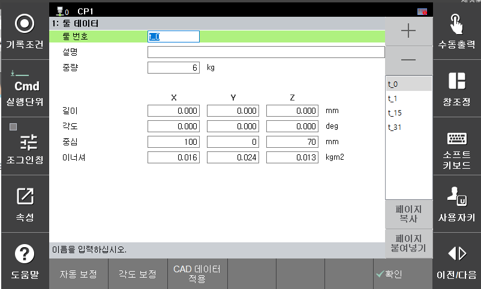
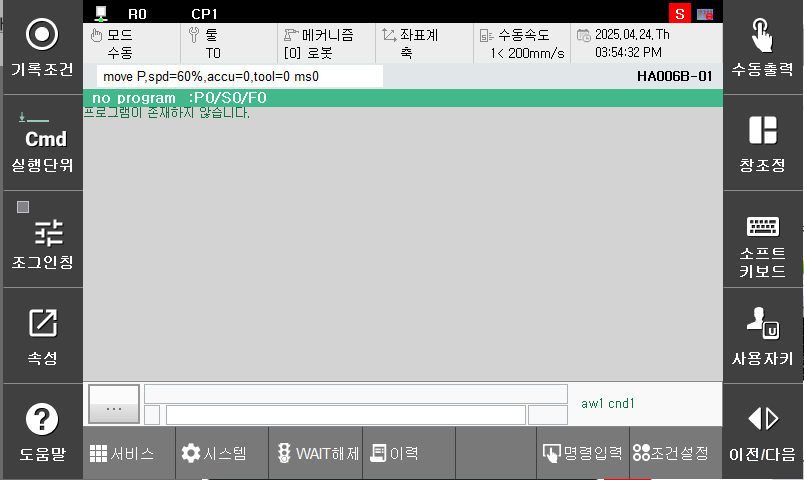
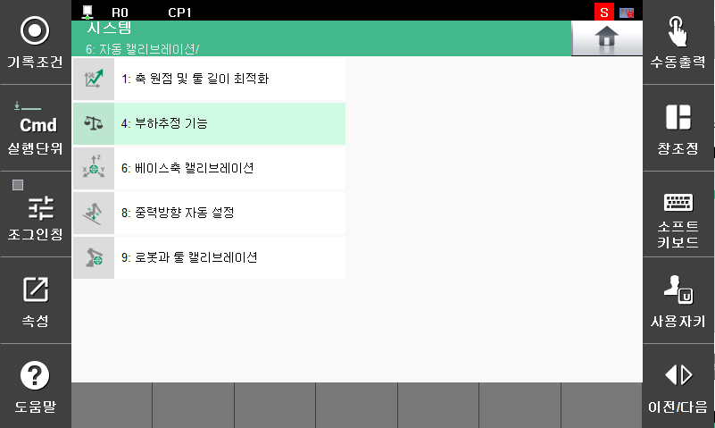
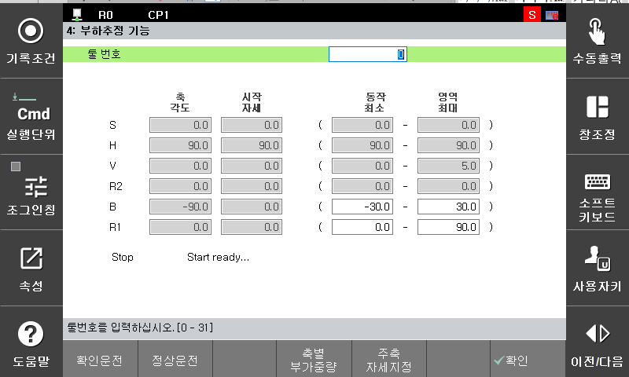

# E02680. (O축) 최고속 초과

## 1. 개요

로봇 축의 속도가 최고속을 초과하여 동작하였습니다. 로봇이 정상적으로 제어되지 않는 상태이므로 에러로 처리하여 로봇을 정지시킵니다.

메인보드에서 서보안전 보드로 지령을 보낼 때에는 최고속을 초과하지 않도록 제한된 지령을 보냅니다. 이렇게 만들어진 지령을 로봇이 쫓아가지 못하다가 속도에 overshoot가 발생할 때 최고속 초과 에러가 발생할 수 있습니다.

## 2. 원인 및 점검



(1)	툴 데이터가 정확히 입력되어 있는지 확인하십시오. 
(2)	로봇 기종이 맞게 설정되어 있는지 확인하십시오. 
(3)	서보 보드(BD640)와 main com의 버전을 확인하십시오. 
(4)	로봇 자세가 특이점 근방인지 확인하십시오. 
(5)	부가축은 가감속 파라미터 설정값과 동작중 부하율을 확인하십시오. 
(6)	작업 프로그램을 조정하십시오. 



(1)	툴 데이터가 정확히 입력되어 있는지 확인하십시오. 
툴 중량이나 이너셔가 제어기에 등록되어 있는 값과 크게 다르면 로봇 제어 성능이 악화되면서 최고속 초과에러가 발생할 수 있습니다. 툴중량과 이너셔는 아래 메뉴에서 툴 번호에 따라 등록할 수 있습니다.

                시스템 -> 3. 로봇파라미터 -> 툴 데이터

 
그림 4.3.1 툴 데이터 확인

툴 중량이나 이너셔를 자동으로 설정하기 위해서는 아래의 메뉴에서 부하추정 기능을 사용할 수 있습니다. 

* 부하추정 기능으로 들어갑니다.

        시스템 -> 6. 자동 캘리브레이션 -> 4. 부하추정 기능

 
그림 4.3.2 부하 추정 기능1

 
그림 4.3.3 부하 추정 기능2

 
그림 4.3.4 부하 추정 기능3

* 부하추정 기능을 사용하여 부하 추정 후 저장할 툴 번호를 선택합니다.

 
그림 4.3.5 부하 추정 기능4

* 정상 운전을 클릭하여 수행합니다. 
모터 On 스위치를 누르고 데드맨을 잡은 후 정상운전을 클릭합니다.

 
그림 4.3.6 부하 추정 기능5

* 부하 추정 운전이 완료되면 추정 결과가 화면에 보여집니다.

 
그림 4.3.7 부하 추정 기능6

(2)	로봇 기종이 맞게 설정되어 있는지 확인하십시오.

 
그림 4.3.8 로봇 모델 확인

TP화면상의 등록된 로봇기종과 실제 설치된 로봇이 일치하는지 확인하십시오.

(3)	서보안전 보드(BD642)와 main com의 버전을 확인하십시오. 
서보안전 보드(BD642)와 main com버전의 호환성이 깨져 발생할 수 있습니다. 특히 모듈을 교체한 상황이라면 버전업을 진행하여 각 모듈의 버전을 현재 메인 com 버전에 맞춰주십시오.

각 모듈의 버전은 아래 경로에서 확인할 수 있습니다.

                서비스 -> 7. 시스템 진단 -> 1. 시스템 버전

 
그림 4.3.9 모듈 버전 확인

(4)	로봇 자세가 특이점 근방인지 확인하십시오. 
특이점 근방의 자세에서 PtP 보간이 아닌 L 보간이나 C 보간을 실행하면 에러가 발생할 수 있습니다. 특이점은 B축이 0deg에 가까운 경우와 손목부 중심이 S축 회전 중심축과 가까울 때 발생합니다. 특이점 근방을 지나야 할 때에는 해당 스텝을 PtP 보간으로 변경하여 주십시오.

 
그림 4.3.10 특이점 자세 확인

(5)	부가축은 가감속 파라미터 설정값과 동작중 부하율을 확인하십시오. 
부가축 가감속 파라미터의 최고속이 너무 높거나 가속시간이 너무 짧아서 모터토크가 부족할 수 있습니다. 로봇 동작중 부하율을 관찰하면서 I/Ip 최고속을 낮추거나 가속시간을 크게 조정해야 합니다.

                시스템 -> 3. 로봇 파라미터 -> 34. 가감속 파라미터

 
그림 4.3.11 부가축 가감속 확인

(6)	작업 프로그램을 조정하십시오. 
작업 프로그램의 해당 스텝 혹은 직전 스텝의 스텝 조건을 변경하십시오. 첫 번째로 “Acc=0”으로 변경해 보고, 두 번째는 스텝의 속도를 낮춰 보고, 세 번째는 이동 경로에 스텝을 하나 추가해 보는 방식으로 프로그램의 조건을 변경하십시오.

