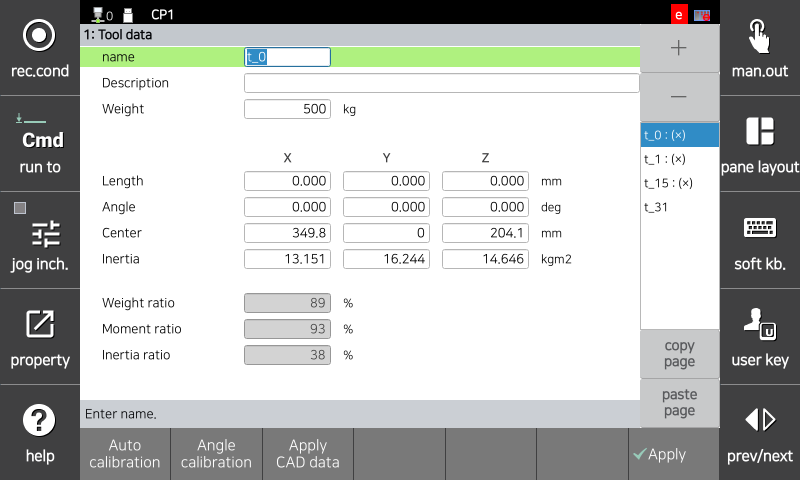
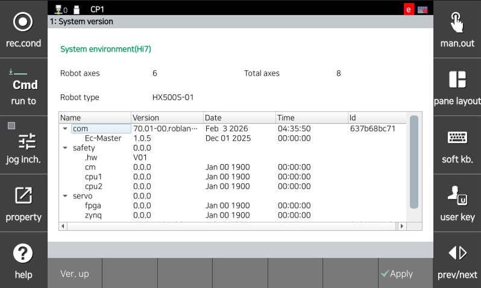

## 4.3. E02680. (O 轴) 超过最大速度

### 1. 概述

机器人轴的操作速度超过了最大速度。由于机器人处于无法正常控制的状态，因此将其视为错误，并停止机器人。

当从主板发送命令到伺服安全板时，会发送有限的命令以确保不超过最大速度。当机器人未能遵循这些生成的命令而发生速度超调时，可能会发生超过最大速度的错误。

### 2. 原因和检查



(1)	检查工具数据是否正确输入。 
(2)	检查机器人型号是否正确设置。 
(3)	检查伺服板(BD640)和主通讯的版本。 
(4)	检查机器人姿态是否接近奇异点。 
(5)	对于外部轴，检查运行期间的加速度/减速度参数设置和负载因子。 
(6)	调整作业程序。 



(1)	检查工具数据是否正确输入。 
如果工具重量或惯性与控制器中注册的值差异明显，机器人控制性能可能会下降，并可能出现超过最大速度的错误。工具重量和惯性可以按照下面菜单中的工具编号进行注册。

        System -> 3. Robot Parameter -> Tool Data

 
图 4.3.1 检查工具数据

要自动设置工具重量或惯性，您可以使用下面菜单中的负载估计功能。

* 输入负载估计功能。

        System -> 6. Auto Calibration -> 4. Load Estimation Function

 
图 4.3.2 负载估计功能 1

 
图 4.3.3 负载估计功能 2

 
图 4.3.4 负载估计功能 3

* 在使用负载估计功能估计负载后，选择工具编号以进行保存。

 
图 4.3.5 负载估计功能 4

* 点击正常操作以执行。 
按下电机开启开关，保持死人开关，然后点击正常操作。

 
图 4.3.6 负载估计功能 5

* 当负载估计操作完成时，估计结果将在屏幕上显示。

 
图 4.3.7 负载估计功能 6

(2)	检查机器人型号是否正确设置。

 
图 4.3.8 检查机器人型号

检查TP屏幕上注册的机器人型号是否与实际安装的机器人相匹配。

(3)	检查伺服安全板(BD642)和主通讯的版本。 
这可能是由于伺服安全板(BD642)与主通讯版本之间的兼容性破裂而导致的。特别是如果模块被替换，需进行版本更新以使每个模块与当前的主通讯版本相匹配。

每个模块的版本可以在以下路径中检查。

        Service -> 7. System Diagnosis -> 1. System Version

 
图 4.3.9 模块版本检查

(4)	检查机器人姿态是否接近奇异点。 
如果在接近奇异点的姿态下执行L插补或C插补，而不是PtP插补，可能会发生错误。奇异点发生在B轴接近0度时，以及手腕中心接近S轴旋转中心轴时。经过接近奇异点时，请将相应步骤更改为PtP插补。

 
图 4.3.10 奇异姿态检查

(5)	对于外部轴，检查运行期间的加速度/减速度参数设置和负载因子。 
由于外部轴加速度/减速度参数的最大速度过高或加速度时间过短，电机扭矩可能不足。在观察机器人运行期间的负载因子时，必须降低I/Ip最大速度或显著增加加速度时间。

        System -> 3. Robot Parameter -> 34. Acc/Dec Parameter

 
图 4.3.11 外部轴加/减速度检查

(6)	调整作业程序。 
更改作业程序中相应步骤或紧接着的步骤的步骤条件。首先尝试将其更改为“Acc=0”，其次尝试降低步骤的速度，第三，尝试在运动路径中添加一个步骤以更改程序条件。