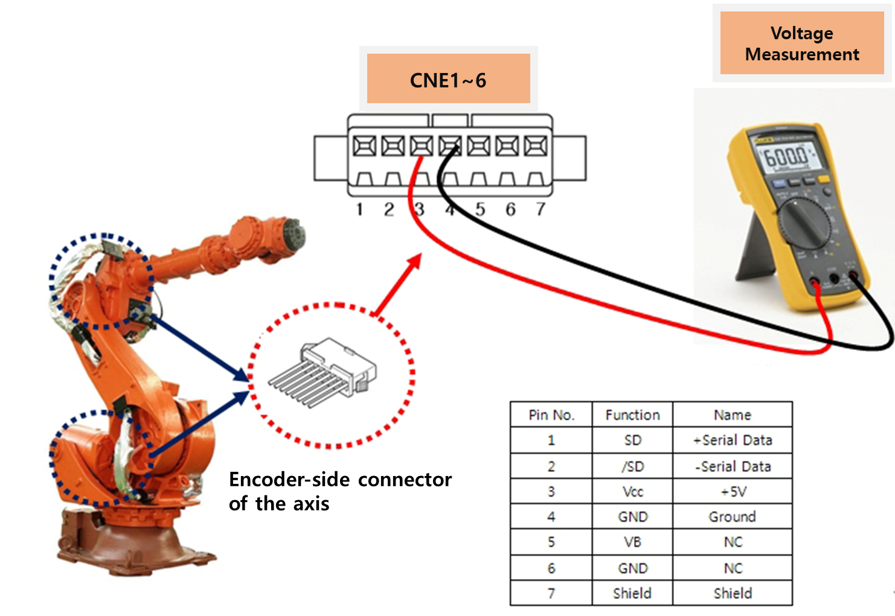
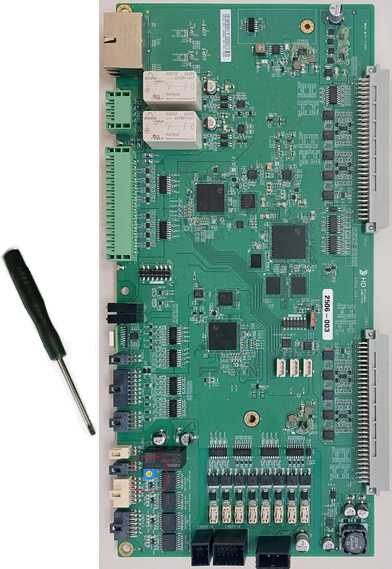
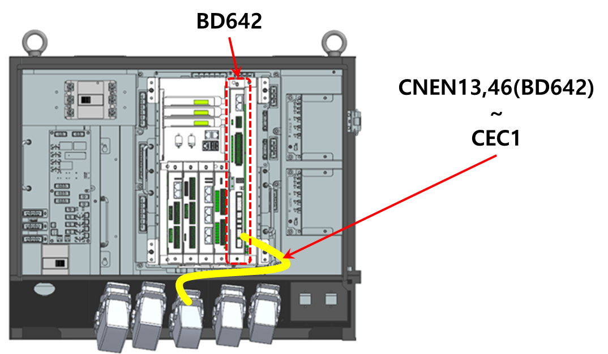
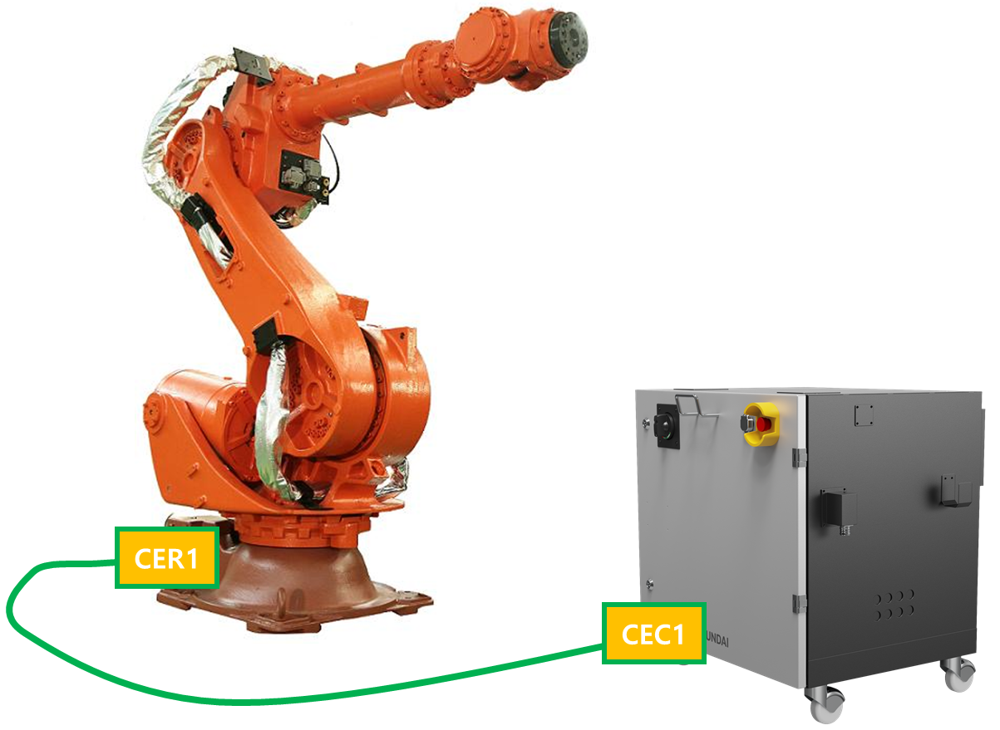
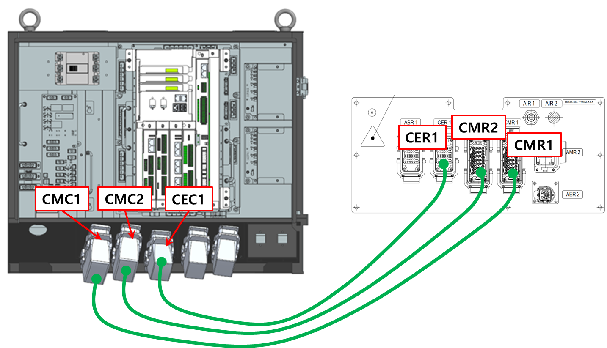

## 4.4. E50101. (O Axis) Invalid encoder command field setting

### 1. Overview

The servo safety board performs serial communication with the encoder for servo motor control and receives encoder data periodically. 
This error occurs when the data received from the encoder does not comply with the specified communication standard. 

The above error may occur due to failure of components related to encoder data transmission and reception, wiring defects, or problems with encoder shield line processing.

### 2. Cause and Inspection



(1)	Check the encoder supply voltage. 
(2)	Inspect the encoder wiring. 
(3)	Perform a servo board replacement test. 
(4)	Perform a motor (encoder) replacement test. 
(5)	After completing the measures, check the communication status of the wiring. 



(1)	Check the encoder supply voltage. 
The power voltage supplied to the encoder must be within the range of 5.0V±5% (4.75V ~ 5.25V) at the encoder-side connector. If the encoder-side connector voltage drops below 4.75V, the encoder will not operate normally, and there is a possibility that the above error may occur.

Measure the voltage of the encoder-side connector pins (3-4).

 
Figure 4.4.1 Encoder Connector Pin Information

If the measured voltage is lower than the reference voltage, turn the VR1 variable resistor on the servo safety board (BD642) to adjust the encoder-side connector voltage so that it falls within the reference voltage range.

 
Figure 4.4.2 BD642 Encoder Voltage Variable Resistor

(2)	Inspect the encoder wiring.
The inspection sequence for encoder wiring is as follows. 
1st: Check for poor contact in the connectors related to the encoder wiring. 
2nd: Check for short circuits in the encoder wiring. Check the wiring of each phase 1:1 using equipment such as a multimeter (tester). 
3rd: Perform an encoder wiring replacement test. 

If there is no disconnection in the encoder wiring but issues such as poor contact of the shield wire or contact between the encoder signal wire and other power lines or metal parts of the robot body exist, these cannot be detected by a short circuit check. Therefore, perform a wiring replacement test.

* Check the internal wiring of the controller. 
Check the wiring between the CNEN13,46 (BD642) connector and CEC1.

 
Figure 4.4.3 Hi7-N Controller Encoder Wiring Inspection

* Check the wiring between the controller and the robot. 
In the case of the Hi7-N controller, check the wiring between CEC1 and CER1.

 
Figure 4.4.4 Basic Installation Configuration Diagram between Hi7-N Controller and Robot

 
Figure 4.4.5 Detail of Basic Installation Configuration Diagram between Hi7-N Controller and Robot

* Check the internal wiring of the robot body. 
Check the wiring between CER1 and the encoder-side connector.
For wiring inspection, please refer to the wiring connection diagram in the robot maintenance manual.

 
Figure 4.4.6 Robot Internal Wiring

(3)	Perform a servo safety board replacement test. 
If the error does not occur after replacing the servo safety board, the encoder receiving section of the servo safety board is faulty. Please replace the servo safety board with a normal unit.

 
Figure 4.4.7 Hi7-N Controller Servo Board Replacement

(4)	Perform a motor (encoder) replacement test. 
If the error does not occur after replacing the servo motor, the servo motor is faulty. Please replace the servo motor with a normal unit. The figure below shows the positions of motors for each axis of the HS165 robot. For other robots, please refer to the corresponding mechanical maintenance manual for replacement.

 
Figure 4.4.8 Motor Positions for Each Axis of HS165 Robot

(5)	Check the communication status of the wiring after completing the measures. 
After the measures for the problematic part are completed, check the communication status by referring to the 『Encoder Communication Failure Count Display Function Manual』.

Figure 4.4.9 Encoder Communication Failure Monitoring

