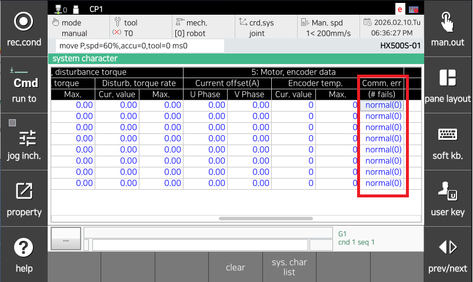

## 4.5. E50102. (O Axis) Encoder Received Data Length Abnormality

### 1. Overview

The servo safety board performs serial communication with the encoder for servo motor control and receives encoder data periodically. 
This error occurs when the length of the data received from the encoder does not comply with the specified value. 

Cases where the length of data received from the encoder does not match can occur mainly when noise enters the encoder signal line due to wiring defects or problems with encoder shield line processing.

### 2. Cause and Inspection



(1)	Inspect the encoder wiring. 
(2) Perform a motor (encoder) replacement test. 
(3)	Perform a servo safety board replacement test. 
(4)	Check the communication status of the wiring after completing the measures. 



(1)	Inspect the encoder wiring. 
The inspection sequence for encoder wiring is as follows. 
1st: Check for poor contact in the connectors related to the encoder wiring. 
2nd: Check for short circuits in the encoder wiring. Check the wiring of each phase 1:1 using equipment such as a multimeter (tester). 
3rd: Perform an encoder wiring replacement test. 

If there is no disconnection in the encoder wiring but issues such as poor contact of the shield wire or contact between the encoder signal wire and other power lines or metal parts of the robot body exist, these cannot be detected by a short circuit check. Therefore, perform a wiring replacement test.

* Check the internal wiring of the controller. 
Check the wiring between the CNEN13,46 (BD642) connector and CEC1.

 
Figure 4.5.1 Hi7-N Controller Encoder Wiring Inspection

* Check the wiring between the controller and the robot. 
In the case of the Hi7-N controller, check the wiring between CEC1 and CER1.

 
Figure 4.5.2 Basic Installation Configuration Diagram between Hi7-N Controller and Robot

 
Figure 4.5.3 Detail of Basic Installation Configuration Diagram between Hi7-N Controller and Robot

* Check the internal wiring of the robot body. 
Check the wiring between CER1 and the encoder-side connector. For wiring inspection, please refer to the wiring connection diagram in the robot maintenance manual.

 
Figure 4.5.4 Robot Internal Wiring

(2)	Perform a motor (encoder) replacement test. 
If the error does not occur after replacing the servo motor, the servo motor is faulty. Please replace the servo motor with a normal unit. The figure below shows the positions of motors for each axis of the robot. For other robots, please refer to the corresponding mechanical maintenance manual for replacement.

 
Figure 4.5.5 Motor Positions for Each Axis of Robot

(3)	Perform a servo safety board replacement test. 
If the error does not occur after replacing the servo safety board, the servo safety board is faulty. Please replace the servo safety board with a normal unit.

 
Figure 4.5.6 N Controller Servo Safety Board Replacement

(4)	Check the communication status of the wiring after completing the measures. 
After the measures for the problematic part are completed, check the communication status by referring to the 『Encoder Communication Failure Count Display Function Manual』.

 
Figure 4.5.7 Encoder Communication Failure Monitoring

