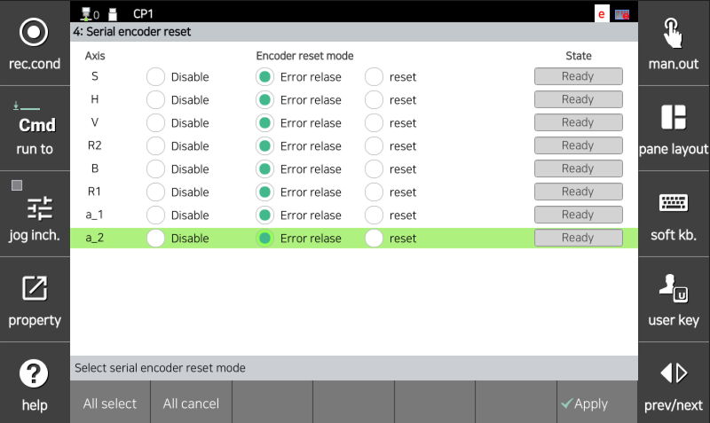

## 4.11. E50108. (O 轴) 编码器计数错误 (检测到 CE 位)

### 1. 概述

伺服安全板与编码器进行串行通信以控制伺服电机，并定期接收编码器数据。 
当编码器内部发生旋转值计算错误并且 CE (计数错误) 位被设置时，会发生此错误。 
当从编码器本身接收到的数据正常，但编码器内部状态监控结果将其确定为错误状态 (CE) 时，也可能发生此错误。 

**CE (计数错误)**: 当主电源施加到编码器时，由于故障或失效导致单圈数据发生位置失配时设置。

### 2. 原因与检查



(1) 检查编码器供电电压。 
(2) 重置串行编码器错误后，重新打开和关闭控制器电源。 
(3) 如果错误仍然存在，请进行电机 (编码器) 更换测试。 



(1) 检查编码器供电电压。 
施加到编码器的电源电压必须在编码器侧连接器的范围内为 5.0V±5% (4.75V ~ 5.25V)。如果编码器侧连接器的电压降到 4.75V 以下，编码器将无法正常工作，并且可能会出现上述错误。

测量编码器侧连接器引脚 (3-4) 的电压。

 
图 4.11.1 编码器连接器引脚信息

如果测量的电压低于参考电压，请调节伺服安全板 (BD642) 上的 VR1 可变电阻，以确保编码器侧连接器电压落在参考电压范围内。

 
图 4.11.2 BD642 编码器电压可变电阻

(2) 重置串行编码器错误后，重新打开和关闭控制器电源。 
如果在重置错误后主电源 OFF/ON 时错误仍然存在，请进行电机 (编码器) 更换测试。
错误重置在以下菜单中执行。

        系统 -> 5. 初始化 -> 4. 串行编码器重置 - 错误释放

 
图 4.11.3 串行编码器错误释放

(3) 如果错误仍然存在，请进行电机 (编码器) 更换测试。 
如果更换伺服电机后错误不再发生，则伺服电机是故障的。请用正常单元更换伺服电机。下图显示了 HS165 机器人每个轴的电机位置。对于其他机器人，请参考相应的机械维护手册进行更换。

 
图 4.11.4 HS165 机器人每个轴的电机位置