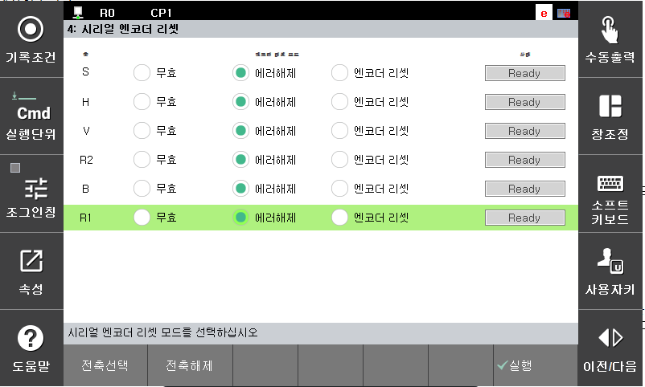
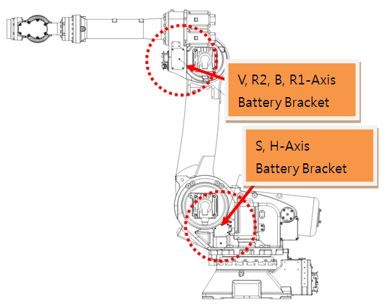
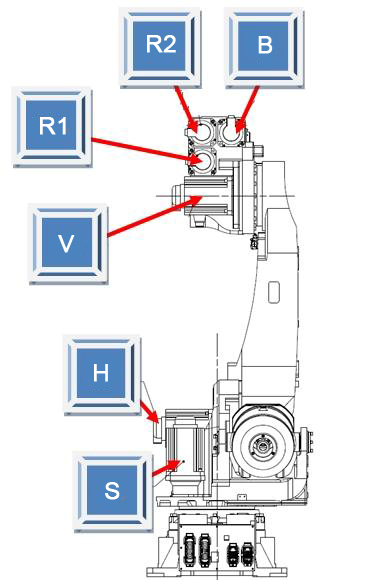

# E50112. (O축) 엔코더 배터리 이상 (BE 비트 감지)

## 1. 개요

서보 안전 보드는 서보 모터 제어를 위해 엔코더와 시리얼 통신을 수행하며, 주기적으로 엔코더 데이터를 수신합니다. 
해당 에러는 엔코더에 연결된 배터리 전압이 기준치 이하로 저하되거나 배터리 연결에 문제가 발생하여 BE(Battery Error) 비트가 세트되었을 때 발생합니다. 
본 에러는 엔코더로부터 수신된 데이터 자체는 정상이나, 엔코더 내부 상태 감시 결과 에러 상태(BE)로 판단된 경우에 발생할 수 있습니다.

**BE(Battery Error)** : 엔코더 주전원 Off 상태에서 외부 배터리 전압이 3.1V 이하로 저하된 경우 세트됩니다.

## 2. 원인 및 점검



(1) 시리얼 엔코더 에러해제 후, 제어기 전원을 껏다카 다시 켜십시오. 
(2) 엔코더 백업용 배터리 전압 확인하십시오. 
(3) 엔코더 배터리 결선상태를 점검하십시오. 
(4) 모터(엔코더)를 교체 시험하십시오. 



(1) 시리얼 엔코더 에러해제 후, 제어기 전원을 껏다카 다시 켜십시오. 
에러해제 후, 주전원 OFF/ON시 계속 에러가 발생하면 모터(엔코더)교체 시험하십시오.
에러해제는 아래의 메뉴에서 실행합니다.
        
        시스템 -> 5.초기화 -> 4. 시리얼 엔코더 리셋 - 에러해제

 
그림 4.15.1 엔코더 에러 해제

(2) 엔코더 배터리 전압을 확인하십시오. 
엔코더용 배터리는 3.6V 입니다. 이 전압이 3.0V~3.2V 로 저하되면 “W0104 ○축 엔코더Battery 전압저하입니다” 로 표시 됩니다. 이 경고가 발생할 때 엔코더용 배터리를 교환해야 합니다. 엔코더 배터리 교환은 반드시 제어기 전원이 ON되어 있는 상태에서 배터리를 교체해야 합니다. 이 상태에서 정상적인 엔코더 배터리로 교체하면 문제 없이 로봇을 계속 사용할 수 있습니다.

엔코더 배터리 교체시기를 지나서 엔코더용 배터리 전압이 2.5V~3.0V 가 되면 제어기 전원 ON시 “E2470 ○축 엔코더 이상 : 엔코더 리셋 필요” 에러가 발생합니다. 이 에러가 발생하면 이미 엔코더의 위치데이터를 잃어버린 상태입니다. 엔코더 배터리를 교체하고 엔코더를 리셋 시킨 후에 축좌표계 수동 조작으로 로봇을 기준자세로 이동하여 해당 축의 엔코더 보정을 재실시 해야 합니다.

 
그림 4.15.2 엔코더 배터리 교환 위치

엔코더 리셋은 아래의 메뉴에서 실행합니다.

        시스템 -> 5. 초기화 -> 4. 시리얼 엔코더 리셋 - 엔코더 리셋

 
그림 4.15.3 엔코더 리셋

(3) 엔코더 배터리 결선 상태를 점검하십시오. 
엔코더 배터리 위치부터 모터까지 연결되는 배터리 결선 상태를 확인하십시오.

(4) 모터(엔코더)를 교체 시험하십시오. 
에러 리셋 후, 주전원 OFF/ON시 계속 에러가 발생하면 모터(엔코더)교체 시험하십시오. 교체한 후 에러가 발생하지 않으면 서보모터의 불량입니다. 서보 모터를 정상품으로 교체하여 주십시오. 아래 그림은 HS165 로봇의 각 축 모터의 위치를 나타내고 있으며 다른 로봇은 해당 기구 보수설명서를 참고하여 교체하시기 바랍니다.

 
그림 4.15.4 HS165 로봇의 각 축 모터 위치

