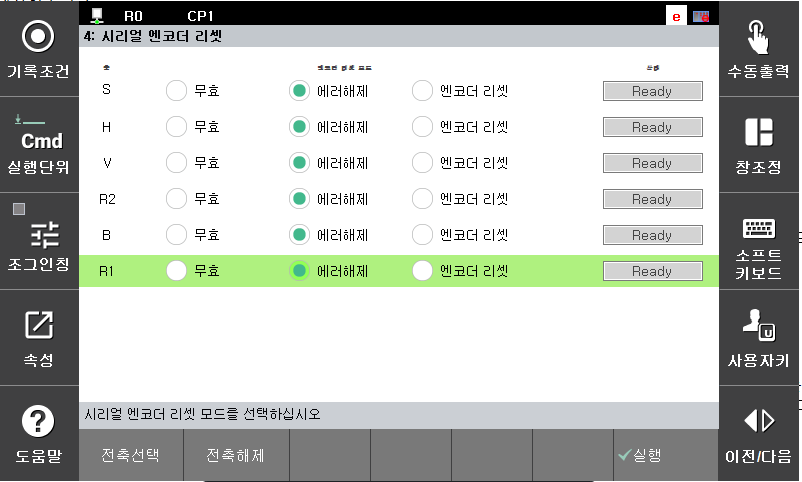
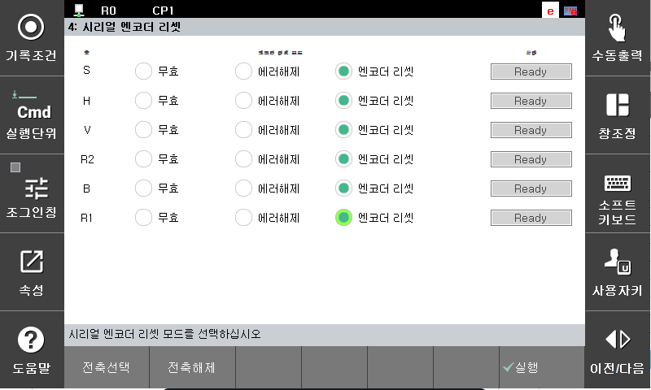

## 4.15. E50112. (O Axis) Encoder Battery error

### 1. Overview

The servo safety board performs serial communication with the encoder for servo motor control and receives encoder data periodically. 
This error occurs when the BE (Battery Error) bit is set because the voltage of the battery connected to the encoder drops below the standard value or a problem occurs with the battery connection. 
This error may occur when the data received from the encoder itself is normal, but the encoder internal status monitoring result determines it as an error state (BE).

**BE (Battery Error)**: Set when the external battery voltage drops to 3.1V or lower while the encoder main power is Off.

### 2. Cause and Inspection



(1) After resetting the serial encoder error, turn the controller power off and on again. 
(2) Check the encoder backup battery voltage. 
(3) Inspect the encoder battery connection status. 
(4) Perform a motor (encoder) replacement test. 



(1) After resetting the serial encoder error, turn the controller power off and on again. 
If the error persists upon main power OFF/ON after resetting the error, perform a motor (encoder) replacement test.
Error reset is performed in the menu below.

        System -> 5. Initialization -> 4. Serial Encoder Reset - Error Release

 
Figure 4.15.1 Encoder Error Release

(2) Check the encoder battery voltage. 
The encoder battery is 3.6V. If this voltage drops to 3.0V~3.2V, “W0104 ○ Axis Encoder Battery Voltage Low” is displayed. When this warning occurs, the encoder battery must be replaced. Encoder battery replacement must be performed while the controller power is ON. If you replace it with a normal encoder battery in this state, you can continue to use the robot without any problems.

If the encoder battery replacement time is passed and the voltage drops to 2.5V~3.0V, the error “E2470 ○ Axis Encoder Abnormal: Encoder Reset Required” occurs when the controller power is turned ON. If this error occurs, the encoder position data has already been lost. After replacing the encoder battery and resetting the encoder, you must move the robot to the reference posture using manual operation in the axis coordinate system and perform encoder calibration for the corresponding axis again.

 
Figure 4.15.2 Encoder Battery Replacement Position

Encoder reset is performed in the menu below.

        System -> 5. Initialization -> 4. Serial Encoder Reset - Encoder Reset

 
Figure 4.15.3 Encoder Reset

(3) Check the encoder battery connection status. 
Check the status of the battery wiring connecting from the encoder battery location to the motor.

(4) Perform a motor (encoder) replacement test. 
If the error persists upon main power OFF/ON after resetting the error, perform a motor (encoder) replacement test. If the error does not occur after replacement, the servo motor is faulty. Please replace the servo motor with a normal unit. The figure below shows the positions of motors for each axis of the HS165 robot. For other robots, please refer to the corresponding mechanical maintenance manual for replacement.

 
Figure 4.15.4 Motor Positions for Each Axis of HS165 Robot

