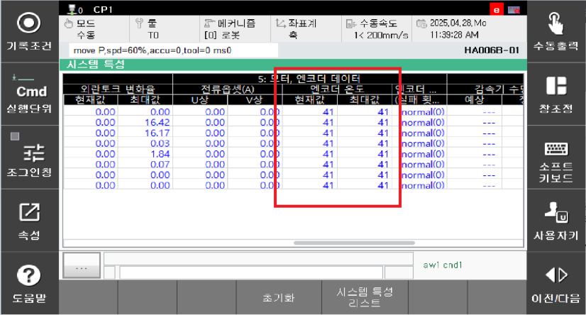

# E50113. (O축) 엔코더 과열 검지 (OH 비트 감지)

## 1. 개요

서보 안전 보드는 서보 모터 제어를 위해 엔코더와 시리얼 통신을 수행하며, 주기적으로 엔코더 데이터를 수신합니다.
해당 에러는 엔코더로부터 OH 비트가 감지되었을 때 발생합니다. 
OH 비트는 엔코더 내부 온도가 허용 범위를 초과한 경우 세트됩니다. 임계 온도는 약 90 ℃에서 100 ℃ 수준이며, 엔코더 모델에 따라 사양이 상이하므로 해당 제조사의 매뉴얼을 확인하시기 바랍니다.

## 2. 원인 및 점검



(1)	모터(엔코더)를 교체 시험하십시오. 
(2)	운전 조건(속도, 부하 등)을 확인하십시오. 
(3)	엔코더 주변 환경 온도를 점검하십시오. 
(4)	서보안전 보드(BD642)를 교체하십시오.



(1)	모터(엔코더)를 교체 시험하십시오. 
서보 모터를 교체한 후, 에러가 발생하지 않으면 서보모터의 불량입니다. 서보 모터를 정상품으로 교체하여 주십시오. 아래 그림은 HS165 로봇의 각 축 모터의 위치를 나타내고 있으며 다른 로봇은 해당 기구 보수설명서를 참고하여 교체하시기 바랍니다.

 
그림 4.27.1 모터(엔코더) 교체 위치

(2)	운전 조건(속도, 부하 등)을 확인하십시오. 
Job 프로그램을 동작시키면서 포화되는 엔코더 온도를 확인하십시오. 엔코더 온도는 아래와 같이 확인할 수 있습니다.

            엔지니어링 모드 -> 창조정 -> 시스템 특성 -> 시스템 특성 리스트 - 모터/엔코더

 
그림 4.27.2 엔코더 온도 확인

(3)	엔코더 주변 환경 온도를 점검하십시오. 
외부 온도로 인하여 엔코더 내부 온도가 증가하여 에러가 발생할 수 있습니다.

(4)	서보안전 보드를 교체 시험하십시오. 
서보안전 보드를 교체한 후 에러가 발생하지 않으면 서보 보드의 엔코더 데이터 수신부의 고장으로 판단할 수 있습니다.

 
그림 4.27.3 N제어기 서보보드 교체

