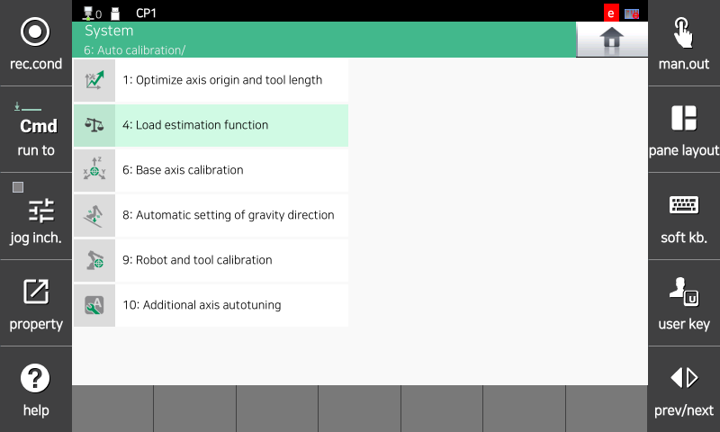
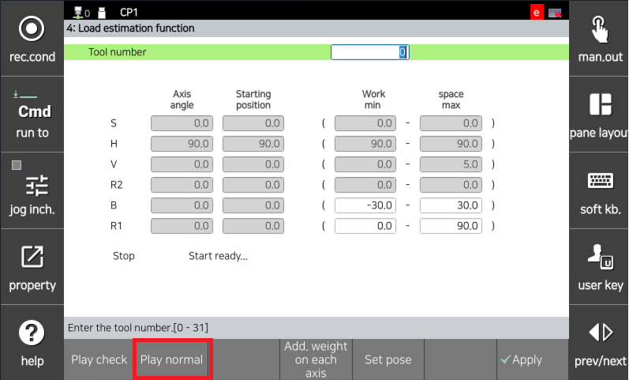
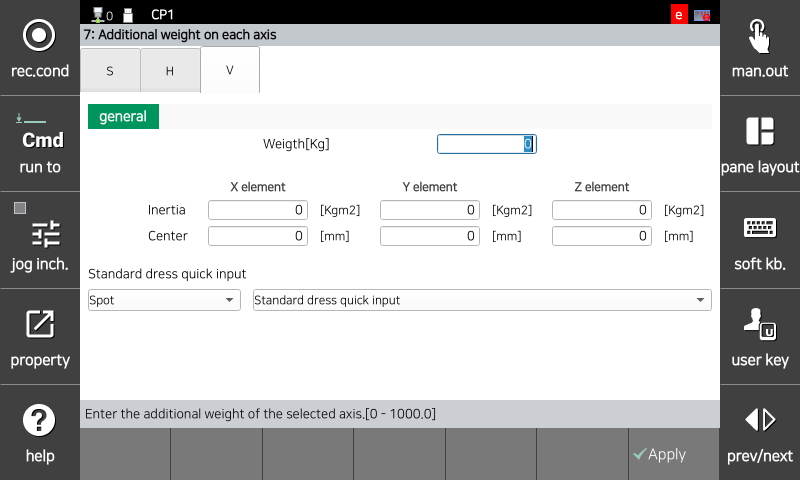
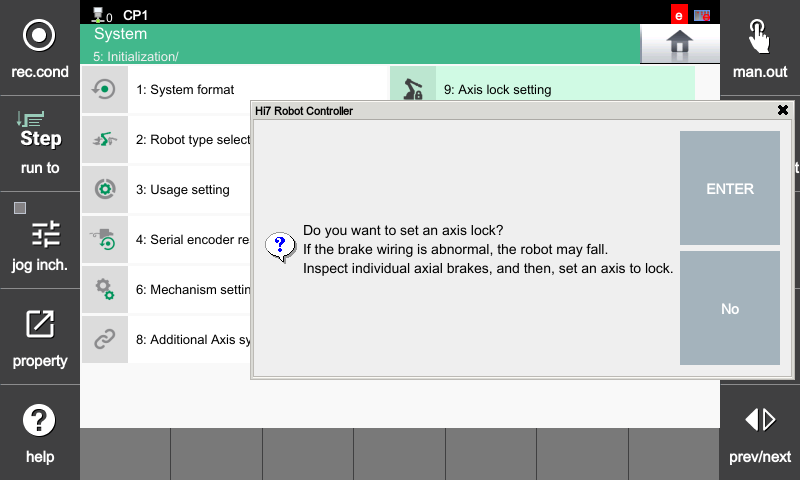
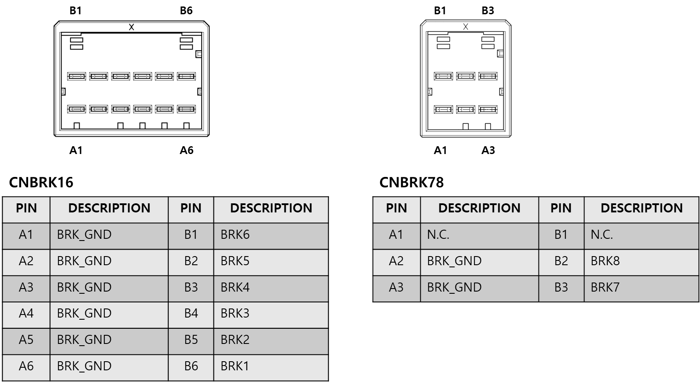
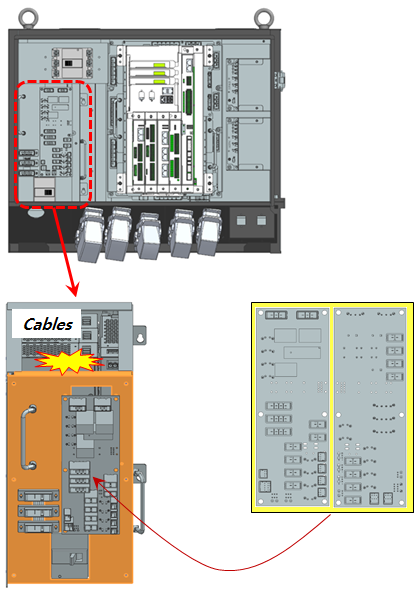
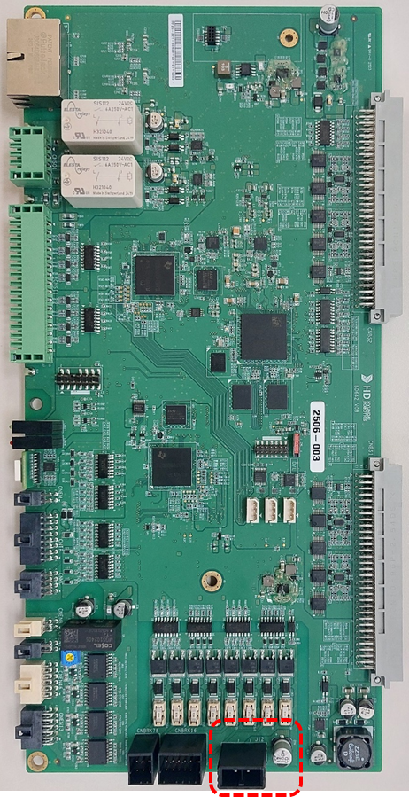
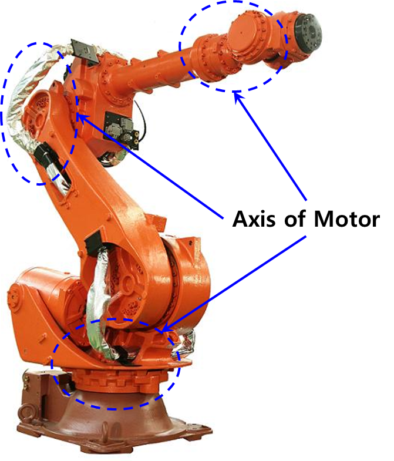

## 4.17. E50200. (O Axis) Motor overload

### 1. Overview

This occurs when the motor current accumulates exceeding the set continuous rated current or overload judgment criteria during servo control. 
This can occur when excessive torque is required from the motor due to causes such as mechanical overload, increased friction, or excessive acceleration/deceleration conditions. The servo safety board detects this and stops the robot.

### 2. Cause and Inspection



(1) Check if the installed load is within the robot's rating. 
(2) Check if there are any collision factors during robot operation. 
(3) Check if the axis brake is operating normally. 
(4) Inspect the connection status of the motor cable and connector. 
(5) Replace the servo board to check for abnormalities. 
(6) Check if the drive unit is operating normally. 



(1) Check if the installed load is within the robot's rating. 
Confirm that the installed load is within the robot's maximum specifications. If the specifications are exceeded, an error may occur (here, "load" includes not only the tool installed at the robot end but also cables and all other parts attached to the robot mechanism). 
The most accurate way to check the load is to use a measuring instrument, but if that is not feasible, you can check using the load estimation function among the controller functions. The load estimation function can only estimate the tool installed at the robot end.

The load estimation method is as follows.

* Enter the load estimation function.

        System -> 6. Auto Calibration -> 4. Load Estimation Function

 
Figure 4.17.1 Load Estimation Function 1

 
Figure 4.17.2 Load Estimation Function 2

 
Figure 4.17.3 Load Estimation Function 3

* Select the tool number to save after estimating the load using the load estimation function.

 
Figure 4.17.4 Load Estimation Function 4

* Click Normal Operation to execute.
Press the Motor On switch, hold the deadman switch, and then click Normal Operation.

 
Figure 4.17.5 Load Estimation Function 5

* When the load estimation operation is completed, the estimation result is displayed on the screen.

 
Figure 4.17.6 Load Estimation Function 6

(2) Check if there are any collision factors during robot operation. 
Check if there is any interference or collision with the robot in the robot's workspace. If interference occurs between the robot and other mechanisms, an error may occur. In this case, modify the work program to prevent interference.

(3) Check if the brake release is operating normally. 
There may be a problem with the release function of the brake for the corresponding axis or an abnormality in the brake release voltage.
 * Inspection of individual axis brake release anomalies 
Use the Axis Lock function to verify the operation of the brake release function for the corresponding axis.
Lock the axes except for the axis you want to verify, then repeat Motor ON/OFF to check if the brake release sound ("click") is heard from the motor of the mechanical unit.

The method to use the Axis Lock function is as follows. 
        System -> 5. Initialization -> 9. Axis Lock Setting -> Confirm -> Individual Axis Lock

 
Figure 4.17.7 Axis Lock Setting Screen 1

 
Figure 4.17.8 Axis Lock Setting Screen 2

 
Figure 4.17.9 Axis Lock Setting Screen 3

If the brake of the corresponding axis is not released, the brake output status of the servo board must be checked. Disconnect the brake wiring (CNBRK16, CNBRK78 connectors) and output the brake voltage. Measure whether the brake voltage of the corresponding axis is output as 20V or higher at the CNBRK16 and CNBRK78 connectors. If there is an axis outputting a voltage of 20V or lower, it is a failure of the servo safety board (BD642), so replace it.

 
Figure 4.17.10 Pin Layout of CNBRK16, CNBRK78 Connectors

* Inspection of Brake Power Supply Abnormalities 
The sequence for inspecting brake power wiring is as follows. 
1st: Check for poor contact in connectors related to brake power wiring. 
2nd: Check for short circuits in the brake power wiring. Check 1:1 using equipment such as a multimeter (tester). 
Inspect the internal wiring of the power electric module. 

 
Figure 4.17.11 Power Electric Module and Power Board

* Check the servo safety board (BD642). 
If the power electric module is normal, measure the brake power (DC24V) on the servo safety board. It is normal if the measured value across the capacitor (EC9) or across the connector (J12) in the red area of the figure below is DC24V or higher. If it is less than 20V, there is a malfunction in the power supply device generating the brake power. Replace the electric module.

 
Figure 4.17.12 Servo Safety Board Brake Power

(4) Inspect the connection status of the motor cable and connector. 
* Inspect the internal wiring of the controller.
* Inspect the wiring between the controller and the robot.
* Inspect the internal wiring of the robot.

(5) Replace the servo safety board to check for abnormalities. 
An error may occur if there is an abnormality in the servo safety board. Replace the board to verify.

 
Figure 4.17.13 N Controller Servo Board Replacement

(6) Check if the drive unit is operating normally. 
Check if the drive unit (motor, reducer) of the corresponding axis is operating normally.

 
Figure 4.17.14 Verification of Normal Drive Unit Operation
