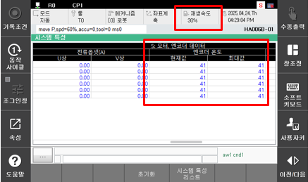

# E50201. (O축) 모터 과부하 - 저온 마찰 증가

## 1. 개요

모터 또는 구동 장치에 흐르는 전류가 설정된 연속 정격 전류 기준을 초과하여 과부하 상태로 판단될 경우 발생합니다. 
서보 제어 중 모터에 과도한 부하가 인가되면 서보 안전 보드는 이를 에러로 감지하고 로봇을 정지시킵니다.

본 에러는 과부하 상태이면서 엔코더 온도가 저온일 때 주로 발생합니다. 
일반적으로 저온 환경(엔코더 온도 5 ℃ 이하)에서는 그리스 점성 증가로 인해 마찰 성분이 커지며, 정상 상태보다 더 큰 구동 토크가 요구됩니다. 이 상태에서 로봇을 고속으로 동작시킬 경우 본 에러가 발생할 수 있습니다.

## 2. 원인 및 점검



(1)	엔코더 온도가 정상치(약 15℃ 이상)가 될 때까지 저속구동(재생속도 30% 이하) 시킨 후, 정상속도로 재 가동하십시오 



(1)	엔코더 온도가 정상치(약 15℃ 이상)가 될 때까지 저속구동(재생속도 30% 이하) 시킨 후, 정상속도로 재 가동하십시오

 
그림 4.18.1 엔코더 온도 확인 화면

