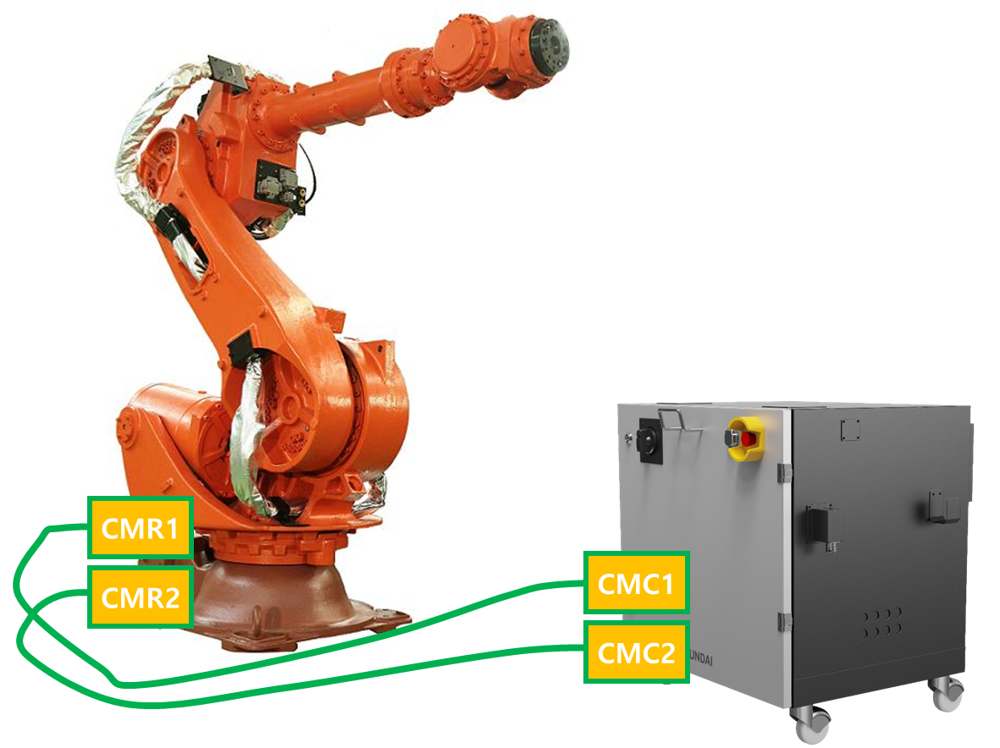
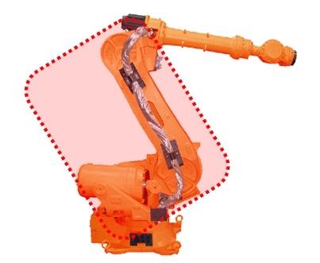
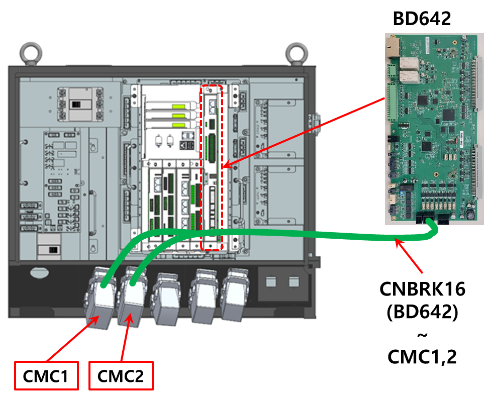
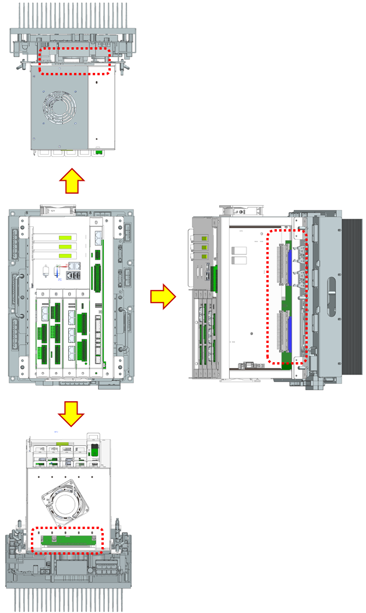

# E50205. (O축) 서보락 유지 불가 - 전류 생성 이상

## 1. 개요

모터 또는 구동 장치에 필요한 전류가 정상적으로 인가되지 않을 경우 발생합니다. 
모터와 제어기 간의 배선 불량, 전류 명령 및 피드백 회로의 고장 등의 원인으로 발생할 수 있습니다. 
또한 로봇 기종 등록 오류로 인하여 모터 제어에 필요한 파라미터(게인, 최대전류 등)가 실제 모터 사양과 일치하지 않는 경우에도 발생할 수 있습니다.

## 2. 원인 및 점검



(1)	로봇 기종이 맞게 설정되어 있는지 확인하십시오. 
(2)	모터 파워 라인 및 엔코더 통신 라인을 점검하십시오. 
* 로봇과 제어기를 연결하는 배선을 확인하십시오.
* 로봇 기내 배선을 확인하십시오.
* 제어기 내부 배선을 확인하십시오.

(3) 제어기 내부 서보안전 보드와 앰프보드 간의 케이블 또는 연결 커넥터를 점검하십시오. 
(4) 기타의 부품을 교체하십시오. 



(1)	로봇 기종이 맞게 설정되어 있는지 확인하십시오. 
TP화면상의 등록된 로봇기종과 실제 설치된 로봇이 일치하는지 확인하십시오.

 
그림 4.19.1 로봇 모델 확인

(2)	모터 파워 및 엔코더 통신 라인을 점검하십시오. 
제어기 전원을 Off하고 해당축 구동장치의 U, V, W를 분리하여 각 상의 단락 및 단선 유무를 점검하십시오. 멀티미터(테스터기)와 같은 장비를 이용하여 각 상의 배선을 1:1로 체크하십시오. 엔코더 통신 선의 단선 여부를 확인하십시오.

---

### ⚠️ 경고(Warning)

**전원이 투입된 상태에서 점검시 감전의 위험이 있으므로 주의하십시오**

---

* 로봇과 제어기를 연결하는 배선을 확인하십시오
제어기와 로봇 또는 구동장치를 연결하는 배선을 제거하여 각 상(U상, V상, W상)이 서로 또는 접지와 단락된 곳이 있는지 확인하시고, 단락된 곳이 있으면 해당하는 배선을 교체하셔야 합니다.

 
그림 4.19.2 N제어기 로봇 간 배선

* 로봇 내부의 기내배선을 점검하십시오. 
로봇 내부에 모터와 연결되어 있는 배선에 단락 또는 잘못 배선된 곳이 있는지 점검이 필요합니다.

 
그림 4.19.3 로봇 기내 배선

* 제어기 내부 배선을 점검하십시오. 
제어기 내부에 앰프와 설치되어 있는 배선 점검이 필요합니다.

 
그림 4.19.4 N제어기 내부 배선 점검

(2)	제어기 내부 서보안전 보드와 앰프보드 간의 커넥터(Board to Board)을 점검하십시오. 
서보안전 보드와 앰프보드 간의 연결 및 체결되는 커넥터(보드 to 보드)의 설치가 올바른지 점검하십시오. 체결 상태가 불량일 경우 해당 에러가 발생할 수 있습니다.

 
그림 4.19.5 Hi7-N제어기 서보 보드와 앰프보드의 연결

(3)	기타의 부품을 교체하십시오. 
서보안전 보드(BD642) → 앰프 보드 → 와이어 하네스 → 모터 → PSM의 순으로 교체하여 에러발생 여부를 확인하십시오.

 
그림 4.19.6 N제어기 구동 부품
