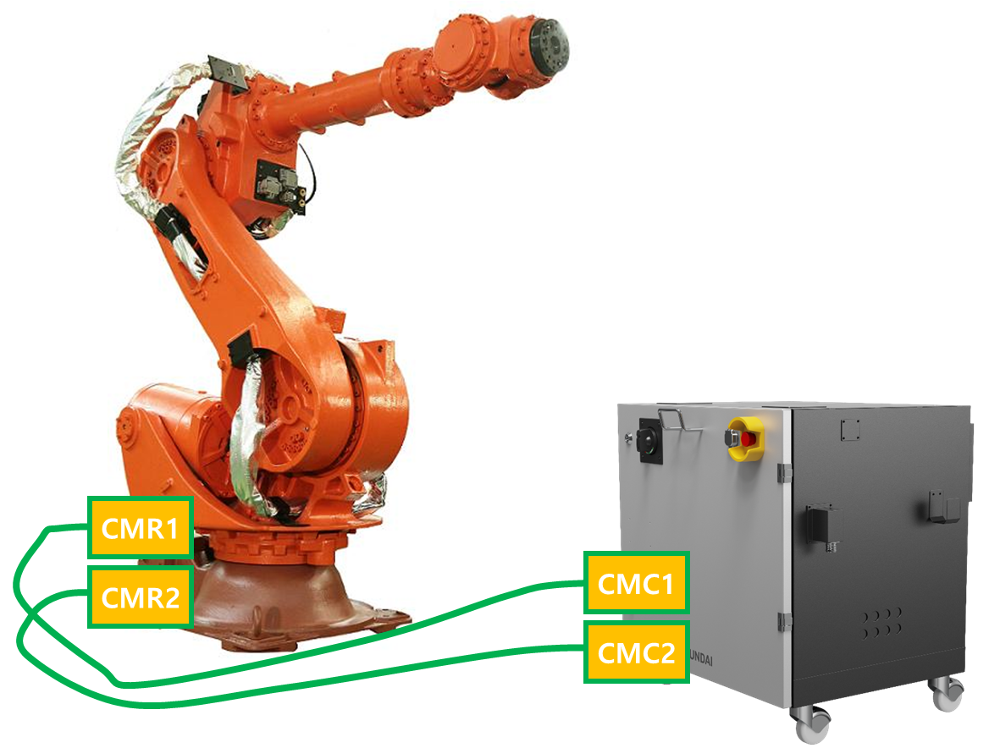
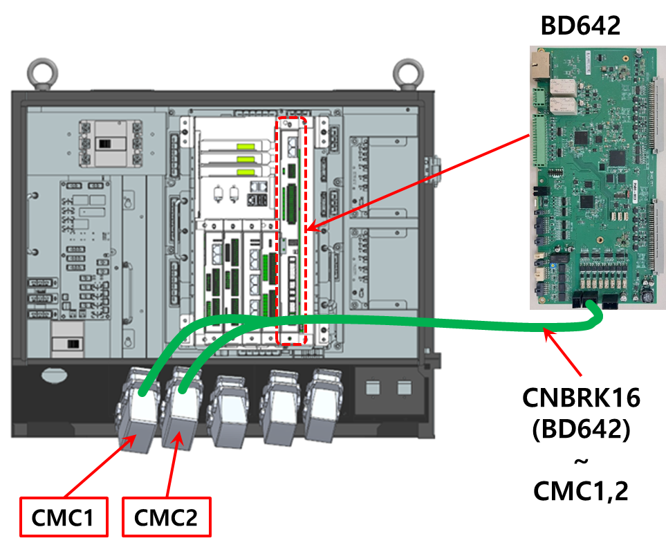
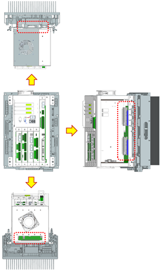
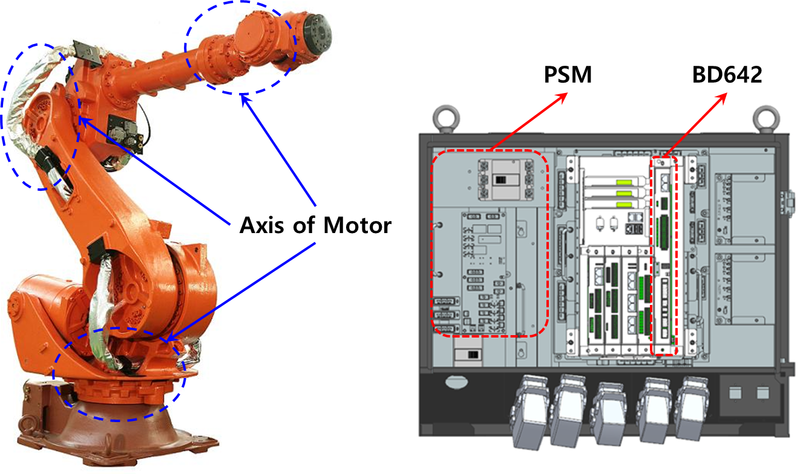

## 4.20. E50206. (O Axis) Unable to sustain servo lock - abnormal parameter

### 1. Overview

This occurs when the current required for the motor or drive unit is not applied normally. 
It can be caused by poor wiring between the motor and the controller, or failures in the current command and feedback circuits. 
It can also occur when parameters required for motor control (gain, maximum current, etc.) do not match the actual motor specifications due to a robot model registration error.

### 2. Cause and Inspection



(1)	Check if the robot model is set correctly. 
(2)	Inspect the motor power line and encoder communication line. 
* Check the wiring connecting the robot and the controller.
* Check the internal wiring of the robot.
* Check the internal wiring of the controller.

(3) Inspect the cable between the servo board and the amplifier board inside the controller. 
(4) Replace other components. 



(1)	Check if the robot model is set correctly. 
Check if the registered robot model on the TP screen matches the actually installed robot.

 
Figure 4.20.1 Robot Model Check

(2)	Inspect the motor power and encoder communication lines. 
Turn off the controller power, disconnect U, V, W of the corresponding axis drive unit, and check for short circuits or open circuits in each phase. Check the wiring of each phase 1:1 using equipment such as a multimeter (tester). Check for disconnection of the encoder communication line.

---



Be careful as there is a risk of electric shock when inspecting while the power is on.



---

* Check the wiring connecting the robot and the controller. 
Disconnect the wiring connecting the controller and the robot or drive unit, and check if each phase (U phase, V phase, W phase) is shorted to each other or to ground. If any short circuit is found, the corresponding wiring must be replaced.

 
Figure 4.20.2 Wiring between N Controller and Robot

* Inspect the internal wiring of the robot. 
It is necessary to check if there are any short circuits or incorrect wiring in the wiring connected to the motor inside the robot.

 
Figure 4.20.3 Robot Internal Wiring

* Inspect the internal wiring of the controller. 
It is necessary to inspect the wiring installed with the amplifier inside the controller.

 
Figure 4.20.4 Hi7-N Controller Internal Wiring Inspection

(2)	Inspect the connector (Board to Board) between the servo board and the amplifier board inside the controller. 
Check if the installation of the connector (Board to Board) connecting and fastening the servo safety board and the amplifier board is correct. If the fastening status is poor, this error may occur.

 
Figure 4.20.5 Connection between N Controller Servo Board and Amplifier Board

(3)	Replace other components. 
Replace components in the order of Servo Safety Board (BD642) → Amplifier Board → Wire Harness → Motor → PSM to check for error occurrence.

 
Figure 4.20.6 Hi7-N Controller Drive Components

