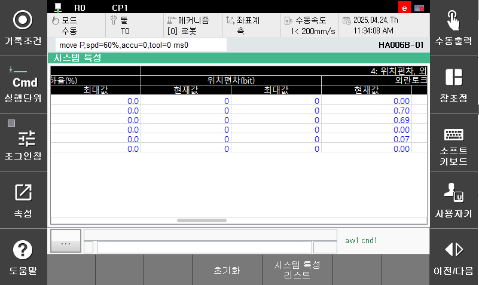
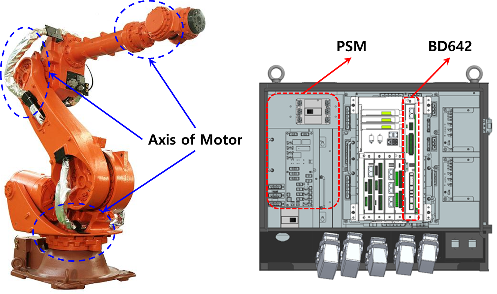

# E02630. (O축) 위치편차 초과

## 1. 개요

로봇 구동 중, 위치편차가 설정값을 초과할 경우 발생합니다. 서보제어에 의해 로봇 동작하는 중, 이동명령위치와 실제위치와의 차이가 너무 클 경우 서보보드는 이를 에러를 감지하고 로봇을 정지시킵니다.

## 2. 원인 및 점검



(1)	에러가 발생한 축이 다른 설비와 기계적 간섭이 있는지 확인하십시오. 
(2)	로봇 기종이 맞게 설정되어 있는지 확인하십시오. 
(3)	브레이크 해제가 정상적으로 작동되는지 확인하십시오. 
* 개별 축 브레이크 해제 이상 점검.
* 브레이크용 전원이상 점검.

(4)	배선상태를 점검하십시오. 
(5)	정격부하를 사용하지는 확인하십시오. 
(6)	위치편차 설정 레벨을 확인하십시오. 
(7)	서보안전 보드(BD642)와 main com의 버전을 확인하십시오. 
(8)	기타의 부품을 교체하십시오. 



(1) 에러가 발생한 축이 다른 설비와 기계적 간섭이 있는지 확인하십시오. 
로봇의 기구적 간섭 혹은 충돌이 있을 경우 이 에러가 발생할 수 있습니다. 제한영역을 벗어나 있을 경우에는 수동조작하여 안전영역으로 로봇을 이동시켜야 합니다.

(2) 로봇 기종이 맞게 설정되어 있는지 확인하십시오. 

 
그림 4.14.1 TP 로봇 모델 확인

TP화면 상의 등록된 로봇기종과 실제 설치된 로봇이 일치하는지 확인하십시오.

(3)	브레이크 해제가 정상적으로 작동되는지 확인하십시오. 
해당 축 브레이크의 해제기능에 문제가 있거나 브레이크 해제전압의 이상일 수 있습니다.

* 개별 축 브레이크 해제 이상 점검 
축 잠금 기능을 사용하여 해당 축 브레이크 해제 기능 작동을 확인하십시오.
확인 하려는 축을 제외하고 축 잠금을 한 뒤 모터 온/오프를 반복하여 기구부의 모터에서 브레이크 해제 소리(“딸깍”)가 들리는지 확인하십시오. 
축 잠금 기능을 사용하는 방법은 아래와 같습니다.

        시스템 -> 5. 초기화 -> 9. 축 잠금 설정 -> 확인 -> 개별 축 축잠금

 
그림 4.14.2 축 잠금 설정화면1

 
그림 4.14.3 축 잠금 설정화면2

 
그림 4.14.4 축 잠금 설정화면3

해당 축의 브레이크가 해제되지 않는다면 서보안전 보드의 브레이크 출력상태를 확인해야 합니다. 브레이크 배선(CNBRK16,CNBRK78 커넥터)를 제거하고 브레이크 전압을 출력하십시오. CNBRK16,CNBRK78 커넥터에서 해당 축의 브레이크 전압이 20.0V 이상으로 출력되는지 측정하십시오. 20.0V 이하의 전압으로 출력되는 축이 있다면 서보안전 보드(BD642)의 고장이므로 교체하십시오.

 
그림 4.14.5 CNBRK16,CNBRK78 커넥터 핀배치

* 브레이크용 전원이상 점검 
브레이크 전원 배선점검 순서는 다음과 같습니다. 
1차: 브레이크 전원 배선에 관련된 커넥터들의 접촉 불량여부를 점거하십시오. 
2차: 브레이크 전원 배선의 단락 유무를 점검하십시오. 멀티미터(테스터기)와 같은 장비를 이용하여 1:1로 체크하십시오. 
파워전장모듈 내부 배선을 점검하십시오. 

 
그림 4.14.6 전장모듈 및 전장보드

* 서보안전 보드(BD642)를 점검 하십시오. 
파워전장모듈이 정상이라면 서보안전 보드에서 브레이크 전원(DC24V)을 측정하십시오. 아래 그림의 빨간색 구역에 캐패시터 양단(EC9) 또는 커넥터(J12) 양단의 측정 값이 DC24V 이상 되어야 정상입니다. 만약 20V 미만이라면 브레이크 전원을 생성하는 전원 장치의 이상입니다. 전장모듈을 교체하십시오.

 
그림 4.14.7 서보보드 브레이크 전원

(4) 배선상태를 점검하십시오. 
모터배선(U, V, W상)이 올바르게 연결되어 있는지 확인하십시오.
또한 모터 배선이 다른 배선 또는 접지선(FG)과 단락되어 있는지 확인하십시오.

(5) 정격부하를 사용하는지 확인하십시오. 
작업물을 포함하여 전체 무게가 정격부하를 초과하고 있다면 해당 로봇의 사양서를 참조하여 정격 이내로 부하를 조정하십시오.

(6) 위치편차 설정 레벨 오류 
위치편차 설정치가 다음의 측정최대치 보다 작으면 설정치를 상향조정 하십시오.

             싸이클 이상 동작시킨 후의 위치편차 측정최대치x1.5

 
그림 4.14.8 위치편차 측정최대치 모니터링 화면 

 
그림 4.14.9 위치편차 설정 변경 화면

(7) 서보안전 보드(BD642)와 main com의 버전을 확인하십시오. 
서보안전 보드(BD642)와 main com버전의 호환성이 깨져 발생할 수 있습니다. 특히, 모듈을 교체한 상황이라면 버전업을 진행하여 각 모듈의 버전을 현재 main com 버전에 맞춰주십시오. 각 모듈의 버전은 아래의 경로에서 확인할 수 있습니다.

                서비스 -> 7.시스템 진단 -> 1.시스템 버전

 
그림 4.14.10 TP의 각 모듈 버전 확인 창

(8) 기타의 부품을 교체하십시오. 
서보안전 보드(BD642) → 서보구동장치 → 파워전장모듈 → 모터 순으로 교체하여 에러발생 여부를 확인하십시오.

 
그림 4.14.11 Hi7-N제어기 모터 및 구동 모듈

