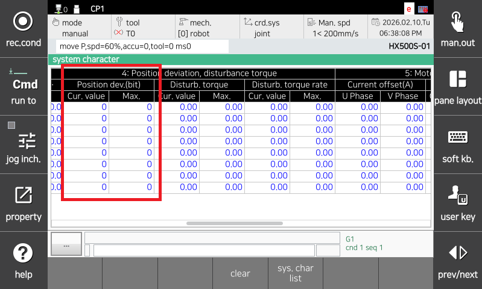
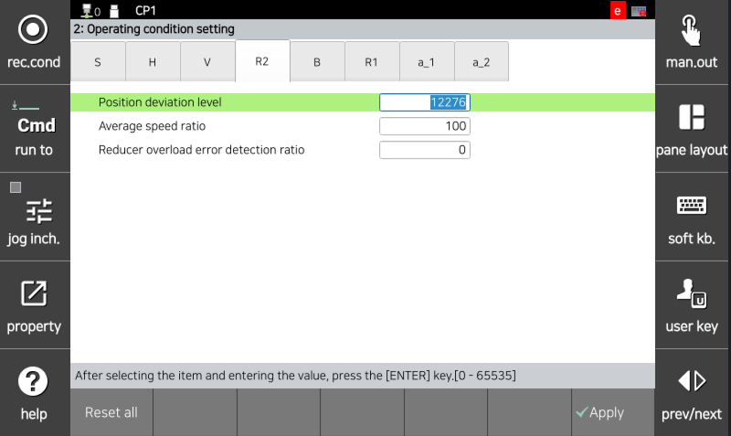

## 4.21. E50400. (O轴) 位置偏差超出限制

### 1. 概述

当位置偏差在机器人操作过程中超出设定值时会发生此情况。 
在伺服控制下操作机器人时，如果运动指令位置与实际位置之间的差异超出允许范围，伺服板会将其检测为错误并停止机器人。

### 2. 原因与检查



(1) 检查发生错误的轴是否与其他设备有机械干涉。 
(2) 检查机器人型号是否已正确设置。 
(3) 检查制动释放是否正常操作。 
* 对各个轴制动释放异常的检查。
* 对制动电源供应异常的检查。

(4) 检查接线状态。 
(5) 检查是否使用额定负载。 
(6) 检查位置偏差设定水平。 
(7) 检查伺服安全板（BD642）和主 com 的版本。 
(8) 更换其他组件。 



(1) 检查发生错误的轴是否与其他设备有机械干涉。 
如果涉及机器人有机械干涉或碰撞，可能会发生此错误。如果机器人位于限制区域之外，必须手动将其移动到安全区域。

(2) 检查机器人型号是否已正确设置。 

 
图 4.21.1 TP 机器人型号检查

检查 TP 屏幕上注册的机器人型号是否与实际安装的机器人匹配。

(3) 检查制动释放是否正常操作。 
可能存在对应轴的制动释放功能问题或制动释放电压异常。

* 对各个轴制动释放异常的检查 
使用轴锁功能验证对应轴的制动释放功能是否正常。锁定除要验证的轴以外的轴，然后重复运动电机的开启/关闭，以检查机械单元的电机是否发出制动释放声（"咔嗒"）。 
使用轴锁功能的方法如下。

        System -> 5. Initialization -> 9. Axis Lock Setting -> Confirm -> Individual Axis Lock

 
图 4.21.2 轴锁设置界面 1

 
图 4.21.3 轴锁设置界面 2

 
图 4.21.4 轴锁设置界面 3

如果相应轴的制动未释放，则必须检查伺服安全板的制动输出状态。断开制动接线（CNBRK16，CNBRK78 连接器）并输出制动电压。测量相应轴在 CNBRK16，CNBRK78 连接器处的制动电压是否输出为 20.0V 或更高。如果有轴输出电压为 20.0V 或以下，则是伺服安全板（BD642）出现故障，应更换。

 
图 4.21.5 CNBRK16，CNBRK78 连接器引脚布局

* 对制动电源供应异常的检查 
检查制动电源接线的顺序如下。 
第1步：检查与制动电源接线相关的连接器是否接触不良。 
第2步：检查制动电源接线是否短路。使用万用表等设备进行 1:1 检查。 
检查电源电气模块的内部接线。 

 
图 4.21.6 电源电气模块和电源板

* 检查伺服安全板（BD642）。 
如果电源电气模块正常，测量伺服安全板上的制动电源（DC24V）。如果在下图的红色区域中跨越电容器（EC9）或连接器（J12）测得的值为 DC24V 或更高，则为正常。如果低于 20V，则生成制动电源的电源设备存在故障。更换电气模块。

 
图 4.21.7 伺服板制动电源

(4) 检查接线状态。 
检查电机接线（U、V、W相）是否正确连接。
还需检查电机接线是否与其他接线或接地线（FG）短路。

(5) 检查是否使用额定负载。 
如果包括工件的总重量超过额定负载，请参考机器人的规格说明书并将负载调整至额定范围内。

(6) 位置偏差设定水平错误 
如果位置偏差设定值小于以下最大测量值，请将设定值向上调整。

        操作超过一个周期后的最大测量位置偏差 × 1.5

 
图 4.21.8 位置偏差最大测量监控界面 

 
图 4.21.9 位置偏差设定变更界面

(7) 检查伺服安全板（BD642）和主 com 的版本。 
如果伺服安全板（BD642）与主 com 版本之间的兼容性丧失，则可能会出现此情况。尤其在更换模块时，请进行版本升级以使各模块的版本与当前主 com 版本匹配。可以在以下路径查看各模块的版本。 

        Service -> 7. System Diagnosis -> 1. System Version

 
图 4.21.10 TP 模块版本检查窗口

(8) 更换其他组件。 
按顺序更换 Servo Safety Board（BD642） → Servo Drive Unit → Power Electric Module → Motor，以检查错误是否发生。

 
图 4.21.11 Hi7-N 控制器电机和驱动模块