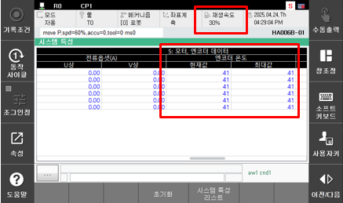
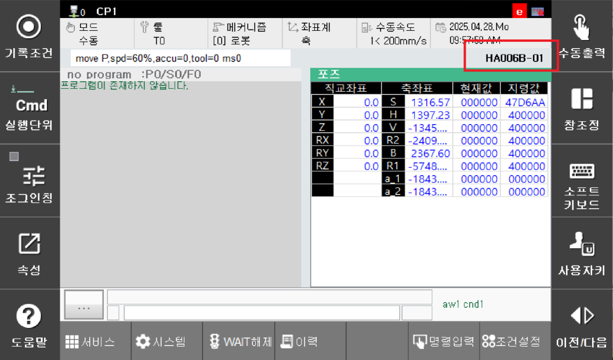

## 4.23. E50402. (O Axis) Position Deviation Exceeded (Cold Temperature Friction Increase)

### 1. Overview

This occurs when the position (speed) deviation exceeds the set value.
If the difference between the movement command position and the actual position is outside the allowable range while the robot is operating under servo control, the servo safety board detects this as an error during servo calculation and stops the robot. 
This error primarily occurs when the position deviation is large while the encoder temperature is low.

Generally, in a low-temperature environment (encoder temperature 5 ℃ or lower), friction components increase due to increased grease viscosity, requiring a larger driving torque than in the normal state. If the robot is operated at high speed in this state, this error may occur.

### 2. Cause and Inspection



(1)	Operate at low speed (playback speed 30% or less) until the encoder temperature reaches a normal level (approx. 15℃ or higher), then restart at normal speed. 
(2)	Check if the robot model is set correctly. \



(1)	Operate at low speed (playback speed 30% or less) until the encoder temperature reaches a normal level (approx. 15℃ or higher), then restart at normal speed.

 
Figure 4.23.1 Encoder Temperature Check Screen

(2)	Check if the robot model is set correctly.

 
Figure 4.23.2 Robot Model Check

Check if the registered robot model on the TP screen matches the actually installed robot.