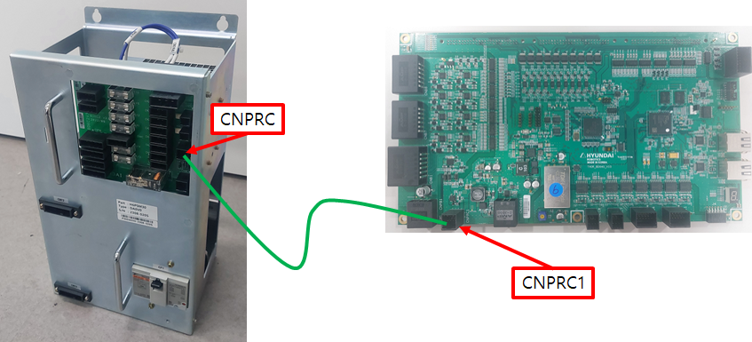
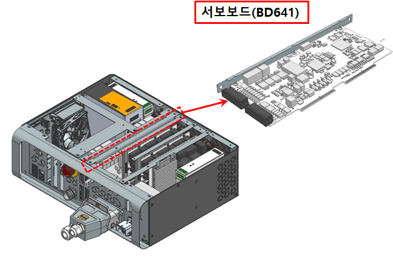

# E51429 초기충전 저항 릴레이 피드백 이상

## 1. 개요

서보 보드(BD640)에서는 모터 전원 인가 과정에서 초기 충전 릴레이를 동작시키고 초기 충전 릴레이의 동작상태를 감시하여 에러를 발생시킵니다. 초기 충전 릴레이는 돌입 전류를 억제하는 기능을 하므로, 릴레이 동작 이상 시 안전을 위하여 에러가 발생하고 모터 전원 인가를 차단합니다.

## 2. 원인 및 점검



(1)	모니터링 계통을 점검하십시오.

(2)	전장 보드를 점검 하십시오.

(3)	서보보드(BD640)을 점검 하십시오.



(1)	모니터링 계통을 점검하십시오.

초기 충전 저항과 릴레이가 설치되어 있는 전장모듈(PSM or PDM)과 모니터링 신호를 수집하는 서보보드(BD640) 간의 케이블링을 확인합니다. 케이블 이름은 CNPRC 이고 서보보드 하단 왼쪽면을 통하여 전장 모듈로 들어 갑니다. 이 케이블의 커넥터 접속상태를 점검하십시오. Hi6-T 제어기의 경우, 해당 케이블배선이 없으므로 해당 사항 없습니다.

                     (그림 4.40 CNPRC 케이블 연결)

(2)	전장보드를 점검하십시오

Hi6-N 제어기의 경우, 서보보드와 전장보드, 케이블 배선에 문제가 있을 수 있으므로 점검 또는 교체하십시오. Hi6-T 제어기의 경우, 해당 케이블배선이 없으므로 해당 사항 없습니다.

                    (그림 4.41 전장모듈 내부 전장보드)

(3)	서보보드를 교체 시험하십시오. 

서보 보드를 교체한 후 에러가 발생하지 않으면 서보 보드의 엔코더 데이터 수신부의 고장으로 판단할 수 있습니다.

                    (그림 4.42 N제어기 서보보드 교체)

                    (그림 4.43 T제어기 서보보드 교체)
    
