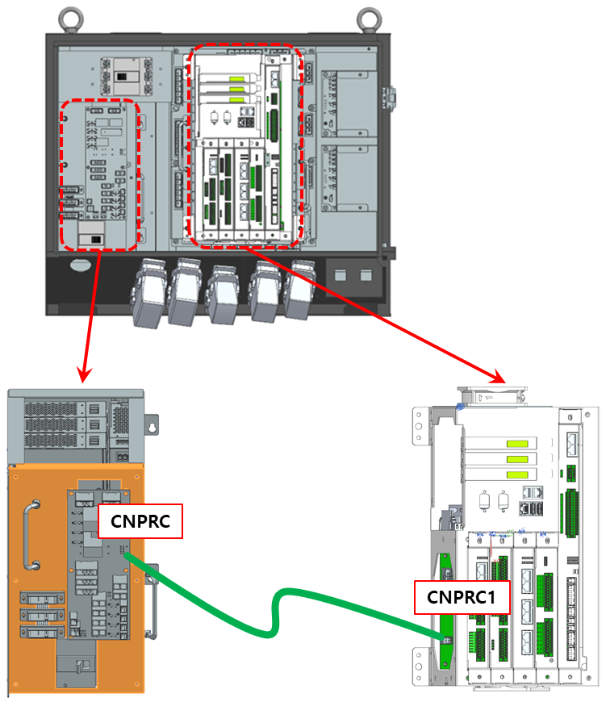

## 4.24. E51429 初始充电电阻继电器反馈错误

### 1. 概述

伺服安全板 (BD642) 在施加电机电源的过程中激活初始充电继电器，并监控初始充电继电器的操作状态以生成错误。由于初始充电继电器的功能是抑制冲击电流，因此如果继电器操作异常，出于安全原因会发生错误，并阻止电机电源的应用。

### 2. 原因和检查



(1) 检查监控系统。 
(2) 检查电源板。 
(3) 检查伺服安全板 (BD642)。 



(1) 检查监控系统。 
检查初始充电电阻和继电器安装的电源电气模块 (PSM 或 PDM) 与收集监控信号的伺服安全板 (BD642) 之间的接线。电缆名称为 CNPRC，它通过背板从伺服安全板进入电源电气模块。检查此电缆连接器的连接状态。

 
图 4.24.1 CNPRC 电缆连接

(2) 检查电源板。 
在 Hi7-N 控制器的情况下，伺服板、电源板或电缆接线可能存在问题，因此需要检查或更换它们。

 
图 4.24.2 电源电气模块内部的电源板

(3) 更换并测试伺服安全板。 
如果更换伺服安全板后不再发生错误，则可以确定为伺服板的编码器数据接收部分故障。

 
图 4.24.3 更换 Hi7-N 控制器伺服安全板